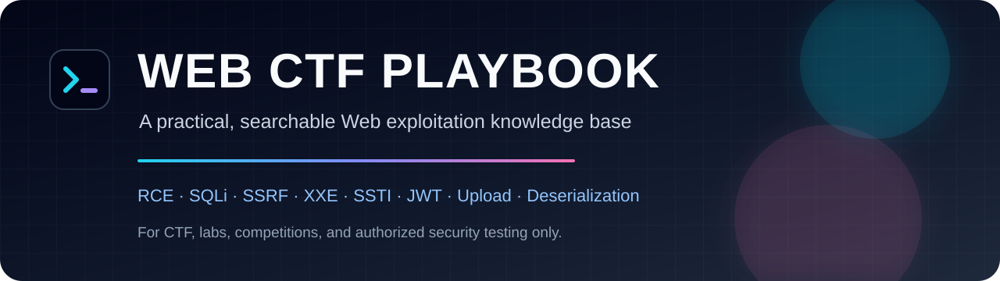

  
  <h1>Web CTF Playbook</h1>
  
<strong>A scenario-first navigation system for authorized Web CTF practice.</strong>

  

    
    
    
    =18" src="https://img.shields.io/badge/Node.js-%3E%3D18-339933?logo=node.js&logoColor=white">
  

  

    <a href="README.md">简体中文</a> ·
    <a href="README.en.md">English</a> ·
    <a href="docs/quickstart.md">Quick Start</a> ·
    <a href="docs/recipes.md">Recipes</a> ·
    <a href="docs/knowledge-map.md">Knowledge Map</a> ·
    <a href="docs/cheatsheet.md">Cheatsheet</a>
  

> [!IMPORTANT]
> This project is only for CTF, labs, competitions, or explicitly authorized security testing.

## Why this project exists

Web CTF notes often become a long list of payloads. The hard part is knowing which class of vulnerability to inspect first, which payload fits the current version and filter, and how to validate an exploit without wasting time.

**Web CTF Playbook** is a searchable, maintainable, scenario-first knowledge base. It routes you from the challenge entry point to the relevant vulnerability class, minimal validation, and full exploitation chain.

## Highlights

- **8 focused modules** covering recon, RCE/files, SQLi/SSRF/XXE, SSTI/XSS/Node.js, Python/deserialization, PHP, PHP functions, and comprehensive notes.
- **Scenario recipes** for file paths, uploads, SSRF, XML, JWT, SSTI, JSON body pollution, deserialization, blind output, and source leaks.
- **Progressive disclosure**: <code>SKILL.md</code> routes the task; details stay in <code>references/</code>.
- **Dependency-free search CLI**: search payloads, function names, protocols, and bypasses from the terminal.
- **Maintainable source flow**: one source note, generated references, and CI checks for section coverage and encoding.
- **Community-ready**: contribution guide, issue templates, PR template, note templates, and a launch kit.

## 30-second quick start

Requires Node.js 18 or newer.

~~~bash
git clone <your-repo-url>
cd web-ctf-playbook
node scripts/search-notes.mjs gopher
node scripts/search-notes.mjs deserialization --context 2
node scripts/search-notes.mjs --list
node scripts/search-notes.mjs --stats
~~~

Start here:

- [Quick Start](docs/quickstart.md)
- [Scenario Recipes](docs/recipes.md)
- [Knowledge Map](docs/knowledge-map.md)
- [Cheatsheet](docs/cheatsheet.md)
- [Reference Index](docs/reference-index.md)

## Scenario router

| Signal | First check | Reference |
|---|---|---|
| file / page / path parameter | Path concatenation, wrappers, log or session inclusion | [RCE and files](references/01-rce-and-files.md) |
| Upload returns a path | Extension, MIME, content checks, executable directory | [RCE and files](references/01-rce-and-files.md) |
| url / uri / target parameter | HTTP-only or file/dict/gopher support, internal reachability | [SQLi, SSRF, XXE](references/02-sqli-ssrf-and-protocols.md) |
| XML request body | External entities, file read, SSRF, error echo | [SQLi, SSRF, XXE](references/02-sqli-ssrf-and-protocols.md) |
| JWT cookie | Signature verification, none algorithm, weak key, kid | [SQLi, SSRF, XXE](references/02-sqli-ssrf-and-protocols.md) |
| Template expression is evaluated | Engine identification, sandbox, available objects | [SSTI, XSS, Node.js](references/03-ssti-xss-node.md) |
| JSON body changes object behavior | Prototype pollution, merge path, dangerous sink | [SSTI, XSS, Node.js](references/03-ssti-xss-node.md) |
| Deserialization entry point | Language, object format, magic method or gadget chain | [PHP and PEAR](references/05-php-and-pear.md) / [Python](references/04-python-and-deserialization.md) |
| No response difference | Baseline, timing, status, length, DNS or HTTP callback | [SQLi, SSRF, XXE](references/02-sqli-ssrf-and-protocols.md) |
| Source or Git leak | Routes, middleware, dependency versions, debug mode | [SQLi, SSRF, XXE](references/02-sqli-ssrf-and-protocols.md) |

Full Chinese scenario guide: [docs/recipes.md](docs/recipes.md).

## Reference routing

| Situation | Read |
|---|---|
| Recon, HTTP, common tricks, SSI, misc | [references/00-recon-and-tricks.md](references/00-recon-and-tricks.md) |
| RCE, code execution, file inclusion, upload, PHP versions | [references/01-rce-and-files.md](references/01-rce-and-files.md) |
| SQLi, SSRF, XXE, JWT, Git, Java | [references/02-sqli-ssrf-and-protocols.md](references/02-sqli-ssrf-and-protocols.md) |
| SSTI, XSS, Node.js | [references/03-ssti-xss-node.md](references/03-ssti-xss-node.md) |
| Flask, Python, Pickle, FastAPI, XPath | [references/04-python-and-deserialization.md](references/04-python-and-deserialization.md) |
| PHP tasks, PEAR, PHP deserialization | [references/05-php-and-pear.md](references/05-php-and-pear.md) |
| PHP function reference | [references/06-php-functions.md](references/06-php-functions.md) |
| Comprehensive examples, FAQ, SRC | [references/07-comprehensive-and-src.md](references/07-comprehensive-and-src.md) |

## Use as a Codex skill

Copy this repository into the target environment and keep <code>SKILL.md</code>, <code>agents/openai.yaml</code>, and <code>references/</code> together:

~~~text
<CODEX_HOME>/skills/web-ctf-playbook/
~~~

## Development

~~~bash
npm run check
~~~

## Contributing

Read [CONTRIBUTING.md](CONTRIBUTING.md) before opening a pull request. New techniques, corrections, and writeup templates are welcome.

## Safety

This project is only for CTF, labs, competitions, or explicitly authorized testing. Do not use its payloads or scripts against unauthorized targets.

## License

- Code (<code>scripts/</code>): MIT
- Documentation and notes: CC BY 4.0

See [LICENSE](LICENSE).

  <strong>If this playbook saves you time, please give it a star ⭐</strong>

