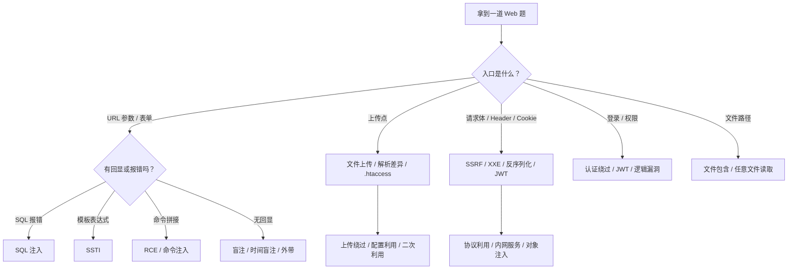

# 知识地图

这份决策树用于快速判断题目类型。它不替代具体 reference，只负责把你送到正确的入口。

## 总决策树

## 按入口判断

| 入口 | 先检查 | 优先 reference |
|---|---|---|
| URL 参数 | 类型转换、SQL、命令拼接、模板、路径 | `01` / `02` / `03` |
| 表单 / JSON | 反序列化、参数污染、原型链、SSTI | `03` / `04` |
| 上传点 | MIME、扩展名、内容检测、解析配置 | `01` |
| Header / Cookie | SSRF、JWT、XXE、Host 注入 | `02` |
| 文件路径 | 包含、伪协议、目录穿越、日志包含 | `01` |
| 登录 / 权限 | JWT、Session、越权、逻辑漏洞 | `02` |

## 按语言 / 框架判断

| 语言 / 框架 | 高频方向 | reference |
|---|---|---|
| PHP | 反序列化、变量覆盖、伪协议、函数绕过、RCE | `01` / `05` / `06` |
| Java | 命令执行、OQL、反序列化、表达式注入 | `01` / `02` |
| Python | Flask、Pickle、SSTI、FastAPI | `03` / `04` |
| Node.js | 原型链污染、eval、模板引擎 RCE | `03` |
| SQL | 联合、报错、布尔、时间、堆叠、Handler | `02` |

## 最小验证清单

- [ ] 我能复现一个稳定请求
- [ ] 我知道目标语言和大致版本
- [ ] 我知道回显方式：直接、报错、时间、外带、状态码
- [ ] 我知道至少一个过滤规则
- [ ] 我有一组“基线请求 vs payload 请求”的差异
- [ ] 我记录了 payload、响应和结论

## 何时停止

如果无法确认目标授权范围，停止测试。不要对未授权真实系统执行利用、扫描或破坏性操作。
